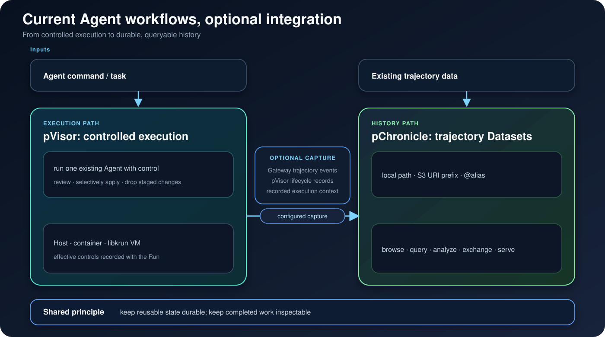

# Persisting

**Persistent infrastructure for the Agent era.**

[](https://github.com/DeepLink-org/Persisting/actions/workflows/ci.yml)
[](https://deeplink-org.github.io/Persisting/)
[](LICENSE)

Persisting connects durable model state—parameters and KV caches—with durable
Agent history—trajectories and execution records. The current product is the
path from execution to queryable history:

- **`pvisor`** is an executor that produces persistable, reviewable facts:
  staged Effects and execution records from one Agent Run;
- **`pchronicle`** browses, queries, exchanges, and serves trajectory Datasets.

Each command works on its own. Connected, they cover `pvisor run --safe` →
review/apply → configured capture → a queryable Dataset.



## Install

```bash
pip install persisting[lance]
pvisor --version
pchronicle --version
```

The rolling nightly build installs the same commands without a Rust toolchain:

```bash
curl -fsSL https://raw.githubusercontent.com/DeepLink-org/Persisting/main/scripts/install-nightly.sh | bash
```

See the [installation guide](https://deeplink-org.github.io/Persisting/installation/)
for platform requirements and executor setup.

## Run one Agent and review its changes

```bash
pvisor run --safe codex
pvisor review last
pvisor apply last --all   # or: pvisor drop last
```

`--safe` stages workspace changes; nothing enters your project tree before you
accept it. The exact boundary is platform-dependent and recorded with the
Run—consult the [execution guide](https://deeplink-org.github.io/Persisting/pvisor/guides/execution/)
before treating it as a security boundary.

## Query Agent trajectory history

```bash
pchronicle onboard
pchronicle onboard query
pchronicle agent codex ./trajectory-data --ask "Which tools fail most often?"
```

The onboarding flow creates a temporary example Dataset—no source checkout
required. `pchronicle import` accepts ATIF, ACTF, and OpenAI Messages;
`pchronicle serve` starts a loopback-only, read-only Dataset UI and API.

After capture is configured, selected pVisor Run events can enter a pChronicle
Dataset. See the [capture guide](https://deeplink-org.github.io/Persisting/pvisor/guides/capture/).

## Current maturity

| Capability | Status |
|---|---|
| pVisor host execution, review, checkpoints, and transactional workspace | Implemented |
| pChronicle local/S3 catalog, bounded SQL, analysis, find, import/export | Implemented |
| pChronicle loopback-only read API and embedded Web UI | Implemented |
| Gateway capture and cooperative proxy policy | Implemented |
| Container/libkrun executors and transparent network boundaries | Platform-dependent; see the pVisor and OverlayNet docs |
| Queue and document Search | Separate stable capabilities |
| Tensor Memory / TTAS | Experimental |

## Documentation

- [Choose a workflow](https://deeplink-org.github.io/Persisting/overview/) — pick the entry point that matches your task
- [Run your first Agent](https://deeplink-org.github.io/Persisting/pvisor/get-started/) — the run-review-apply loop
- [Explore durable history](https://deeplink-org.github.io/Persisting/pchronicle/get-started/) — browse and query a trajectory Dataset
- [Project architecture](https://deeplink-org.github.io/Persisting/system-design/) — ownership and delivery boundaries

Criterion.rs microbenchmarks and hyperfine lifecycle scenarios are compared
against `main` in CI; see the [benchmark contract](benchmark/pchronicle/README.md).

<!-- pchronicle-benchmark:start -->
Latest nightly pChronicle benchmark: `50ff34e1b032` on `linux/x86_64` (2026-09-02T12:22:34.678859+00:00).

| Case | Metric | Value |
|---|---:|---:|
| `criterion/atif_conversion/parse_corpus` | `latency_median_ns` | 5.579e+06 ns |
| `criterion/atif_conversion/roundtrip_corpus` | `latency_median_ns` | 7.968e+06 ns |
| `criterion/projection_cpu/events_to_storyline_corpus` | `latency_median_ns` | 3.351e+05 ns |
| `system/projection_pipeline/event_append` | `initial_append_ms` | 69.8 ms |
| `system/projection_pipeline/projection_build` | `build_ms` | 5538.75 ms |
| `system/projection_pipeline/projection_incremental` | `sync_ms` | 42.335 ms |
| `system/lance_vs_json/lifecycle` | `cold_query_ms` | 3494.808 ms |
| `system/lance_vs_json/lifecycle` | `get_storyline_full_ms` | 10.63 ms |
| `system/lance_vs_json/lifecycle` | `replace_storyline_ms` | 45.119 ms |
| `system/lance_vs_json/selective` | `lance_qps` | 309.8 ops/s |
| `system/lance_vs_json/group_by` | `lance_qps` | 430.3 ops/s |
| `system/lance_vs_json/summary` | `lance_over_json` | 0.244 ratio |
| `system/json_streaming_ndjson/json_streaming` | `p95_ms` | 14.157 ms |
| `system/json_streaming_ndjson/json_streaming` | `rows_s` | 2.889e+05 ops/s |
| `system/json_streaming_ndjson/json_streaming` | `process_peak_rss_mib` | 36.637 MiB |
| `hyperfine/projection_pipeline` | `wall_median_seconds` | 5.696 s |
| `hyperfine/lance_vs_json` | `wall_median_seconds` | 45.602 s |

[Open the complete benchmark run](https://github.com/DeepLink-org/Persisting/actions/runs/33629338336).
<!-- pchronicle-benchmark:end -->

## License

[Apache License 2.0](LICENSE). See [`NOTICE`](NOTICE) for third-party
attributions and separately licensed bundled components.
