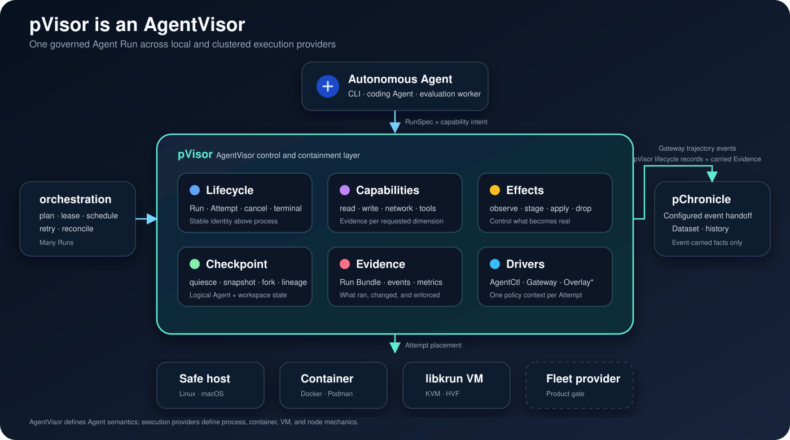

# pVisor

**pVisor is an AgentVisor: the control and containment layer between an
autonomous Agent and the infrastructure that executes it.**

It gives an Agent room to work inside an isolated Run while governing
capabilities, external effects, checkpoints, lineage, and which filesystem
results may be promoted into the real workspace. pVisor is not an Agent
framework, an OCI runtime, or an operating system. It can place Runs on host,
container, and libkrun VM executors while preserving one Agent-facing contract.

> Let Agents act freely inside. Control what becomes real.



The industry-level category definition is in
[What is an AgentVisor?](../../docs/src/design/agentvisor.md). The
[execution guide](../../docs/src/guide/pvisor-execution.md),
[isolation architecture](../../docs/src/design/pvisor-isolation.md), and
[command reference](../../docs/src/design/cli-pvisor.md) describe the current
implementation in detail.

## Replay an Agent trajectory

The default replay path assumes the caller already created a fresh sandbox.
It reconstructs and continues the Agent directly in that sandbox. OpenHands,
mini-swe-agent, and SWE-agent connect to the model endpoint already configured
in their environment; replay does not start pVisor Gateway for them.

Claude Code alone uses a temporary bridge owned by SandboxReplay. Before any
upstream model request, the bridge validates and removes the exact Resume
Transport envelope so the first continued request ends at the replayed
observation. The bridge performs no capture or audit and is stopped with the
continuation process.

```bash
pvisor replay \
  --agent claude-code \
  --trajectory /input/session.jsonl \
  --after-step 30 \
  --agent-entrypoint /usr/bin/claude \
  --boundary-user-prompt 'Review the fresh observation before continuing.'
```

The same request can be supplied as strict TOML:

```toml
[replay]
agent = "claude-code"
trajectory = "/input/session.jsonl"
after_step = 30
agent_entrypoint = "/usr/bin/claude"
disable_thinking = false
boundary_user_prompt = "Review the fresh observation before continuing."
```

`disable_thinking` is also available as `--disable-thinking`. It is applied by
the Claude replay bridge when protocol translation is required; it does not
enable Gateway capture.

`boundary_user_prompt` is also available as `--boundary-user-prompt`. When
configured, replay appends it once after the final fresh observation for the
first live model request. It does not replace the original task and is not
injected by prepare-only or replay-only execution. Omitting it preserves the
original request boundary exactly.

Runtime isolation is opt-in. Supplying `--safe`, `--executor`,
`--overlayfs-base`, another replay runtime flag, or the corresponding
`[run]`, `[overlayfs]`, or `[overlaynet]` TOML settings create an outer `pvisor run`; the inner command remains the same direct replay
operation. For example:

```bash
pvisor replay \
  --agent claude-code \
  --trajectory /input/session.jsonl \
  --after-step 30 \
  --agent-entrypoint /usr/bin/claude \
  --safe \
  --overlayfs-base /workspace
```

By default, replay's internal state, WAL, manifest, comparisons, and native
working files stay below `/tmp/pvisor-sandbox-replay` and disappear with the
sandbox. Replay does not enable pVisor Gateway, pChronicle, model-traffic
capture, or a Claude Resume Transport audit. Callers that explicitly select
`--state-dir` or `--output-dir` own the resulting files. The three execution
modes are: `--prepare-only` to parse and construct the prefix without a runtime,
`--replay-only` to execute that prefix without a model request, and the default
replay-and-continue mode. `--max-steps` is a total action budget including the
prefix. Results use `sandbox-playback.result/v3` and report `phase`, `quality`,
`agent_status`, artifact paths, and structured failure details.

## Start with one Agent

The shortest product path is a transactional Agent Run:

```bash
cd /path/to/project
pvisor run --safe codex
pvisor review last

# Promote one dependency-closed batch. Other changes stay staged.
pvisor apply last --path src
pvisor apply last --include 'tests/**' --exclude 'tests/generated/**'

# Then accept everything still staged, or discard it.
pvisor apply last --all
# pvisor drop last
```

The standalone product loop is:

```text
RunSpec -> admission -> Attempt
  -> terminal RunResult + private Run Bundle + staged Effects
  -> later review/apply/drop
```

Attempt finalization writes the terminal RunResult and private, versioned Run
Bundle while leaving filesystem Effects staged. Later `review`, `apply`, or
`drop` operations read the Bundle and operate on the stage. pChronicle is not a
runtime prerequisite for this loop.

`--safe` associates the current directory with a new durable Run, gives the
Agent a copy-on-write workspace, applies the strongest supported local boundary
for the selected executor, and emits a private versioned `run-bundle.json`.
The real project is not changed while the Agent runs. A filtered apply consumes
only its selected dependency-closed batch; the remaining stage can be reviewed,
applied again, checkpointed, forked, or dropped.

This workflow separates two decisions that ordinary process and container
lifecycle APIs conflate:

1. **May the Agent perform an operation inside this Run?** Capability policy
   and enforcement evidence answer this question.
2. **May the result become part of the user's real environment?** Review,
   selective apply, and effect policy answer this question.

## What pVisor owns

| Product area | Current responsibility |
| --- | --- |
| Agent lifecycle | One logical `Run`, one or more `Attempt`s, cancellation, deadlines, terminal publication, and parent lineage |
| Agent control | Optional authenticated AgentCtl v1 for Sessions, client state, directives, and cooperative quiescence |
| Capabilities | Models, tools, filesystem read/write, network, secrets, subprocess, and resources, with evidence recorded per dimension |
| Filesystem effects | Copy-on-write staging, classified review, logical checkpoint/fork, repeated selective apply, terminal apply/drop, and an apply ledger |
| Network and model access | Gateway capture plus OverlayNet policy; enforcement strength depends on executor and is never inferred from a product label |
| Execution placement | Host process, Docker/Podman transport, or libkrun VM using an OCI image, prepared rootfs, or Linux host rootfs |
| Evidence | Run Bundle, lifecycle events, capability enforcement, filesystem changes, network counters, AgentCtl observations, output, and artifact references |

pVisor deliberately does not own batch planning, global scheduling, Dataset
query, or the implementation of every isolation backend. pPilot orchestrates
many Runs; pChronicle stores canonical history; execution providers own their
mechanics below the pVisor contract.

## Choose the boundary intentionally

The same Run model does not imply the same security boundary. pVisor records
filesystem read, filesystem write, network, and other enforcement dimensions
independently.

| Placement | Current boundary | Suitable use | Important limit |
| --- | --- | --- | --- |
| Linux `host --safe` | Rootless user/mount/PID namespaces, a PID 1 descendant reaper, synthetic root, `chroot`, Landlock, dropped capabilities; optional private netns for deny-all | Same-owner local Agents that need the host toolchain | General public/allowlist network policy remains cooperative; seccomp and complete resource enforcement are not yet claimed |
| macOS `host --safe` | Seatbelt-enforced writes and optional deny-all IP/ambient Unix-socket policy | Same-owner local Agents using the macOS toolchain | Host filesystem reads remain ambient for compatibility |
| Container | Docker/Podman boundary with an injected pVisor | Packaged Linux userlands and stronger placement than a plain host process | Not every pVisor capability is compiled into an OCI restriction; enforced policy is rejected when evidence is incomplete |
| libkrun VM | Dedicated Linux guest kernel through KVM or HVF; VM egress terminates in pVisor's smoltcp path | Reproducible Linux Agents and stronger kernel separation | The macOS VMM retains invoking-user host permissions and is not yet a hostile multi-tenant boundary |

pVisor fails closed when `PolicyMode::Enforce` requests a dimension for which
the selected executor cannot provide non-bypassable evidence. A staged
workspace, injected proxy, executor name, or VM label is not itself proof of a
specific capability boundary.

## One Run model across placements

```text
CLI / pPilot / embedding host
        │  RunSpec
        ▼
     pVisor
        ├── AgentCtl
        ├── WorkspaceOverlay ── review / checkpoint / apply / drop
        ├── Gateway + OverlayNet
        ├── execution provider ── host / container / libkrun VM
        └── RunRecord + private versioned Run Bundle
```

When configured, pChronicle receives Gateway trajectory events and pVisor
lifecycle records. Those records carry Run/Attempt identity, lifecycle facts,
and available event-carried Evidence. Artifact references, lineage, staged
filesystem Effects, AgentCtl/network/resource Evidence, and the full Run Bundle
remain local unless a separate adapter moves them.

The logical Run id survives placement and retry decisions. Each physical
execution receives a distinct Attempt id and, when pPilot owns it, a fenced
lease epoch. The Run id is also the Gateway root-session id. A Run becomes
terminal only after driver teardown, local RunRecord persistence, and terminal
event-sink acceptance. Finalization failure is returned as infrastructure
failure instead of being hidden behind a successful process exit.

There is no required pVisor network daemon in the current local product. Hosts
call the crate API directly; each live Run receives an owner-only AgentCtl Unix
socket. pPilot currently embeds a job-scoped supervisor and can use durable
leases and object-store control state, but a long-lived multi-node pVisor fleet
controller remains a product gate rather than a current claim.

## Platform status

| Capability | Status |
| --- | --- |
| Run/Attempt lifecycle, cancellation, deadlines, terminal publication | Implemented |
| Linux rootless and macOS Seatbelt local `--safe` paths | Implemented with the platform limits above |
| Container transport and libkrun KVM/HVF execution | Implemented |
| Transactional workspace, review, logical checkpoint/fork, repeated selective apply | Implemented |
| Per-dimension capability enforcement evidence | Implemented; mechanisms are runtime evidence strings, not signed attestation |
| Non-bypassable VM IPv4 TCP/DNS policy | Implemented; general UDP, IPv6, ICMP, QUIC, and inbound forwarding are unsupported |
| Transparent host allowlist interception | Planned; explicit host/container proxy mode is cooperative |
| Target preimage conflict detection and crash-recoverable apply | Implemented; first-touch journals reject concurrent target changes, individual file replacement is atomic, and prepared batches recover forward |
| Globally atomic whole-tree apply | Open product gate; arbitrary multi-file host filesystem updates do not have a single commit point |
| Warm-kernel pool and scrubbed reuse protocol | Open product gate |
| Long-lived distributed pPilot controller and node reconciliation | Open product gate |

The default build includes the local Lance/DataFusion pChronicle backend for an
optional durable Attempt-state handoff to pPilot. The standalone pVisor loop
does not require that handoff. The default build excludes cloud object-store
SDKs, Jujutsu, `prost`, and a protobuf toolchain. Use
`lance-chronicle` for S3 support, `jujutsu-overlay` for the Jujutsu upper
backend, or `--no-default-features` for a storage-light binary.

pVisor is one part of the Persisting Agent infrastructure:

- **pVisor** owns one Run, its Attempts, capabilities, effects, and evidence;
- **pPilot** plans, leases, schedules, and reconciles many Runs;
- **pChronicle** stores configured canonical event history and derived views;
- **Gateway, OverlayNet, Control, and OverlayFS** are pVisor runtime drivers.

The product name remains **pVisor**. **AgentVisor** names the category and the
contract that another compatible implementation could also satisfy.

## Modules

| Module | Role |
|--------|------|
| `pvisor` | [`PVisor`] / [`PVisorBuilder`] / [`RunHandle`] |
| `agentctl` | Optional Run-scoped cooperative control server, desired state, and observations |
| `config` | canonical `RunConfig` plus programmatic driver configuration |
| `runtime` | Attempt preparation and driver ownership |
| `control` | Re-export of the shared `persisting-agentctl` state protocol |
| `process` | Host process and Linux rootless executor |
| `artifact` | target-specific static pVisor runtime discovery |
| `delegated` | RunSpec/RunResult hand-off between pVisor placements |
| `container` | Docker/Podman transport that injects pVisor |
| `vm` | libkrun VM backend over pVisor's full-root OverlayFS |

## AgentCtl

pVisor injects a Run-scoped endpoint and bearer token into every process
invocation:

```text
PERSISTING_AGENTCTL_ENDPOINT=/tmp/pvisor-agent-….sock
PERSISTING_AGENTCTL_TOKEN=…
PERSISTING_AGENTCTL_VERSION=1
PERSISTING_AGENTCTL_TRANSPORT=unix
```

The token is intentionally not written to Run metadata. The socket is mode
`0600`, exists only for the Attempt lifetime, and accepts bounded JSON frames.
Docker and VM placements start a complete pVisor inside the isolation
boundary. That injected pVisor creates AgentCtl locally and executes the
Agent through the same ProcessExecutor used by a native Run; host AgentCtl
credentials are deliberately removed from the delegated RunSpec.
The compact protocol is owned by pVisor and currently uses the injected Unix
socket directly. In v1, `Hello` authenticates the client and opens a Session;
periodic `Sync` exchanges `active`, `idle`, or checkpoint-specific `quiesced`
state for pVisor's current `continue`, `quiesce`, or `shutdown` directive.

Hosts use `RunHandle::agentctl()` to publish desired state and inspect the
registered clients and their latest state. These are cooperative observations,
not an authoritative process inventory or proof that no external effect exists.
The reusable
`persisting-agentctl` crate owns the client SDK; pPilot re-exports it for its
runtime bridge and remains the reference quiescence integration. Interactive
terminal login is reserved for a future, separately authorized Debug protocol
and Session rather than additional Control messages.

## Runtime configuration

pVisor owns one canonical `RunConfig`. TOML and command-line options map to the
same fields; runtime drivers consume the resolved in-memory value and never
re-read a Gateway-specific file:

```toml
[run]
executor = "container"
command = ["codex"]
inherit_env = false
pass_env = ["EXPLICIT_NON_GATEWAY_TOKEN"]

[run.resource_limits]
memory_bytes = 2147483648
processes = 128
cpu_time_ms = 600000
open_files = 1024
file_size_bytes = 1073741824

[container]
runtime = "docker"                 # `podman` is also supported
image = "example/codex-agent:latest"
pvisor_binary = "/opt/persisting/pvisor-linux-amd64"
platform = "linux-amd64"
network = "host"                   # required by the in-process Gateway
read_only_rootfs = false

[[container.mounts]]
source = "/host/cache"
target = "/cache"
read_only = false

[overlayfs]
base = "/path/to/project"
backend = "directory"
commit = "manual"

[overlaynet]
mode = "proxy"
policy = "allowlist"

[[overlaynet.rules]]
host = "api.openai.com"
ports = [443]
transports = ["tcp_tunnel"]

[gateway]
mode = "capture"

[[gateway.routes]]
name = "openai"
upstream = "https://api.openai.com/v1"

[chronicle]
mode = "spawn"
dir = "s3://trajectory-bucket/persisting/runs"
binary = "pchronicle"
```

Library callers select the same network boundary with
`PVisorBuilder::network(NetworkDriverConfig::new(mode, network))`. `Auto`
attaches `vm-smoltcp` to a `VmExecutor`, `Off` leaves that guest offline, and
`Proxy` remains the cooperative host/container driver. A Gateway configured on
the same builder shares the Attempt controller, metrics, and bandwidth
registry with VM egress.

`chronicle.dir` accepts either a local directory or an S3 URI. The equivalent
CLI form keeps the reusable project workspace local while offloading the canonical event log:

```bash
AWS_REGION=us-east-1 pvisor run \
  --overlayfs-base /path/to/project \
  --chronicle-mode spawn \
  --chronicle-dir s3://trajectory-bucket/persisting/runs \
  -- codex
```

The resulting dataset is
`s3://trajectory-bucket/persisting/runs/<agent>/<run-id>/events.lance`.
Credentials use the AWS provider chain and are not persisted in Run metadata.
The pChronicle sidecar receives both Gateway trajectory records and pVisor
`run.*` lifecycle records as the shared, storage-independent `EventRecord`.
pVisor does not load or write Lance directly.

### Container executor

The command after `--` is resolved inside the image rather than against the
host `PATH`:

```bash
pvisor run \
  --executor container \
  --container-runtime docker \
  --container-image example/codex-agent:latest \
  --container-pvisor-binary ./dist/pvisor-linux-amd64 \
  --container-platform linux/amd64 \
  --container-network none \
  -- codex --help
```

Supplying `--container-image` selects the container executor automatically.
The executor requires a compatible `linux-amd64` or `linux-arm64` pVisor via
`--container-pvisor-binary`, mounts it read-only at `/opt/persisting/pvisor`, overrides the image
entrypoint, and executes `pvisor run --executor host --run-spec ...`. The Agent
command never appears in the Docker/Podman argument list. The injected pVisor
returns a typed RunResult through a private mounted control directory. The
transport maps cancellation to `stop` followed by `kill` when necessary.

Container runtimes use `--container-pvisor-binary`; libkrun uses an explicit
`--vm-rootfs` and does not require a second pVisor binary in that rootfs.
The final OverlayFS cwd and per-session Gateway configuration are mounted at
their existing paths. Additional mounts use `--container-mount
'source="/host/path", target="/container/path", read_only=true'`.
The injected pVisor currently runs as container root; `container.user` is
rejected until Agent identity can be applied after pVisor bootstrap rather than
to the control process itself. A read-only rootfs receives a private `/tmp`
tmpfs for the inner AgentCtl socket.

`network = "host"` is the default because Gateway and OverlayNet currently run
inside pVisor and advertise loopback endpoints. Bridge or no-network modes are
available when those drivers are disabled. Container placement is reported as
real isolation, but `PolicyMode::Enforce` remains unavailable until every
Persisting capability is translated into an OCI runtime restriction.

### VM executor

The `vm` executor statically links libkrun and its guest init into pVisor. The
same implementation boots a minimal Linux guest through KVM on Linux and HVF
on Apple Silicon macOS. pVisor can pull an OCI/Docker image directly from its
registry, without Docker, Podman, or Buildah, and cache its verified layers as
an immutable rootfs. The default image is `ubuntu:latest` when neither
`vm.rootfs` nor `--vm-rootfs` is supplied.

Linux can instead reuse the host userland while changing kernels:

```bash
pvisor run \
  --executor vm \
  --host-rootfs \
  --overlayfs-base /home/reiase/workspace \
  --overlayfs-target /home/workspace \
  --overlayfs-stage /tmp/pvisor-host-rootfs-stage \
  --overlayfs-commit manual \
  -- /bin/bash
```

`--host-rootfs` is Linux-only and mutually exclusive with `--image` and
`--vm-rootfs`. It serves host `/` as the guest rootfs lower through virtio-fs;
rootfs writes use a temporary upper, while the separately targeted workspace
uses the durable stage.

```bash
pvisor run \
  --image ubuntu:latest \
  --overlayfs-base . \
  --overlayfs-target /workspace \
  --overlayfs-stage /tmp/pvisor-stage \
  --overlayfs-commit manual \
  -- /bin/bash -lc 'uname -a'
```

The staged view of `--overlayfs-base` appears at `--overlayfs-target`, which is
also the guest cwd. On Linux and macOS, libkrun serves pVisor's copy-on-write
union directly over virtio-fs; no host FUSE mount, full-tree snapshot, or exit
reconciliation is involved. With
`--overlayfs-commit manual`, the host base remains unchanged and guest writes
remain under the configured stage. The image rootfs uses its own copy-on-write
upper, so system writes never modify the cached image. `--image-store` selects an
explicit content-addressed cache; otherwise pVisor uses the platform cache
directory. Apple Silicon automatically selects `linux/arm64`, while x86-64
Linux selects `linux/amd64`.

An already prepared directory remains supported:

```bash
pvisor run \
  --executor vm \
  --vm-rootfs /opt/persisting/rootfs \
  --vm-memory-mib 4096 \
  --vm-cpus 4 \
  --overlayfs-base ./project \
  --overlayfs-target /workspace \
  -- /usr/bin/agent --help
```

Linux requires `/dev/kvm`; macOS requires Apple
Silicon, macOS 14 or newer, and the Hypervisor entitlement included in packaged
builds. libkrunfw remains a runtime payload: wheels install it beside `pvisor`,
while source builds automatically download the pinned official release into the
platform cache and verify its SHA-256. On macOS the downloaded kernel bundle is
compiled with `/usr/bin/cc`; `--vm-library-dir` can still select a system copy.
Building from source on macOS requires Zig (`brew install zig`) to cross-compile
libkrun's embedded Linux guest init. After a local `cargo build`, sign the
development binary before using HVF:

```bash
just pvisor          # release build + macOS signing
just pvisor debug    # debug build + macOS signing

# Equivalent manual signing:
codesign --force --sign - \
  --entitlements crates/persisting-pvisor/macos-hypervisor.entitlements \
  target/debug/pvisor
```

The guest has no ambient network path around pVisor. In the default
`[overlaynet] mode = "auto"`, libkrun virtio-net is attached to pVisor's
in-process smoltcp backend. It serves `192.0.2.2/24` by DHCP, answers DNS with
stable synthetic `198.18.0.0/15` addresses, and terminates/re-originates IPv4
TCP only after the hostname/IP and port pass Control policy. TCP and DNS are
non-bypassable for the guest process tree; general UDP, IPv6, ICMP, QUIC, and
inbound forwarding are deliberately unsupported and fail closed. `mode =
"off"` leaves the VM offline. Gateway capture, when configured, is exposed at
the virtual router address instead of its host loopback address.

On Linux the self-exec VMM runner additionally enters pVisor's
namespace/Landlock confinement. On macOS the VM provides a guest-kernel
boundary, but the VMM still runs with the invoking user's host permissions;
because libkrun's virtio-fs security model requires host-side confinement, this
first version is not a hostile multi-tenant boundary on macOS.

Rootfs upper layers remain normal review/checkpoint/fork/drop artifacts.
Explicit prepared rootfs targets may also be applied; OCI cache targets are
persistently marked immutable, including across checkpoint/fork, so `apply`
cannot corrupt a rootfs shared by later Runs. The Run Bundle records the rootfs
target and staged change summary.

### Overlay model

```text
base (real FS) ───────────RO──┐
compose layers (optional) ────┼─► merged (Agent cwd)
stage/upper (deltas) ─────────┘

Attempt ends → unmount, keep upper/
  → pvisor status|inspect
  → selective apply (repeat while changes remain) or drop
  → full apply/drop (terminal; clean upper/work, retain audit metadata)
```

Any OverlayFS option enables the driver. `base` defaults to the project
workspace, `stage` defaults to the generated per-Run directory, and repeated
`compose` paths form read-only layers above the base. Directory is the default
backend. A stage nested inside `base` or a compose layer is automatically
excluded from the merged view, so the guest cannot observe or recreate it. A
stage that contains a lower layer remains invalid. For a nested stage, the live
merged mountpoint is placed in the Run storage outside the lower tree, avoiding
recursive traversal by host indexers and file watchers.

With `backend = "jujutsu"`, pVisor creates a Run-named Jujutsu
workspace in `<stage>/jujutsu`. Reusable environments can use the same backend
directly:

```bash
pvisor env create experiment-a --backend jujutsu --target ./project
pvisor env create experiment-b --backend jujutsu --target ./project
```

Both environments use `<env-root>/.jujutsu` by default but retain separate
working-copy commits and directory uppers.

### Embedded overlay runtime

pVisor links the `persisting-overlayfs` crate for host-process Runs and owns its
background FUSE session directly. libkrun Runs instead use the same portable
overlay core inside libkrun's virtio-fs server and do not require macFUSE.

```bash
# macOS
brew install --cask macfuse   # + enable kext on Apple Silicon
cargo build -p persisting-pvisor --release
```

The standalone `persisting-overlayfs` binary remains available only for
diagnostics and manual mounts.

### Network enforcement

Host and container runs retain the explicit proxy: coverage is opt-in and
observe-grade. VM Auto uses the non-bypassable `vm-smoltcp` driver. Run records
distinguish the two profiles and persist DNS/TCP flow, denial, failure, byte,
active/peak flow, and unsupported-packet counters. Gateway and VM egress share
the Attempt policy controller and bandwidth buckets.

The accepted Linux host-process design for non-bypassable interception — an
unprivileged network namespace whose only egress is a pVisor-owned in-process
userspace stack, with a seccomp user-notify + `ADDFD` fallback — is specified in
`docs/src/design/overlaynet.md`. That host-process path remains future work.
VM `auto` already provides a non-bypassable network boundary on Linux and
Apple Silicon macOS. A default `CapabilitySet` also denies subprocesses, so
`PolicyMode::Enforce` continues to fail closed until the selected executor can
prove that subprocess deny dimension as well. Unsupported VM hosts and
cooperative host/container proxy paths remain observe-only.

Structured OverlayNet rules accept exact hosts, wildcard suffixes, IPs, and
CIDRs. Empty `ports` or `transports` mean unrestricted, so production policy
should usually state both. `http`, `https`, and `tcp_tunnel` are the available
transport values. Hostname rules deny private and loopback DNS results by
default; set `allow_private_ips = true` only for an intentional private
service. Link-local and other special-purpose destinations still need an
explicit IP/CIDR rule. The older `allow = [...]` host-only form remains
compatible but cannot scope ports or transports.

The common CLI surface uses three repeatable options and infers proxy mode and
the default policy automatically. Any `--overlaynet-allow` switches to default
deny; with deny rules alone, unmatched destinations remain allowed. Deny rules
always win. Global and target limits stack, so the strictest effective rate is
observed:

```bash
pvisor run \
  --overlaynet-allow api.openai.com:443 \
  --overlaynet-allow pypi.org:443 \
  --overlaynet-deny 169.254.0.0/16 \
  --overlaynet-deny bad.example.com \
  --overlaynet-limit 10mbps \
  --overlaynet-limit api.openai.com:443=2mbps \
  -- codex
```

The current directory is the default project association. An explicit
`--overlayfs-base` can be shared by any number of Runs. Run records and Bundles normally remain independent under
`PERSISTING_RUN_HOME` (default `~/.persisting/runs`). If that Run Home would
sit inside an OverlayFS base or compose layer, pVisor uses the system temporary
Run root instead so the writable stage cannot overlap a read-only layer.

`kbps`/`mbps`/`gbps` use network-standard bits per second; `kb/s`/`mb/s`/`gb/s`
use bytes per second. Limits aggregate upload and download across matching
intercepted connections. They do not grant access.

When pVisor is launched by pPilot, `RunSpec` may contain an optional Supervisor
bootstrap. pVisor authenticates, registers `(run_id, attempt_id, lease_epoch)`,
and applies an initial network quota before starting OverlayNet. The connection
also accepts fenced runtime directives such as cancellation and emits
heartbeats. Failure to connect, or loss of the connection after startup, never
prevents the local Run from continuing; standalone `pvisor run` requires no
Supervisor. The Supervisor-delivered limit still covers only traffic that
reaches the explicit proxy.

The macOS implementation supports multi-layer merge, metadata-preserving
copy-up, whiteouts/opaque directories, lower-directory rename, links, xattrs,
directory snapshots and synchronization/statistics operations. pVisor's
`apply` path preserves symlinks, hard links, modes, ownership,
timestamps and xattrs, and processes opaque markers before staged children.
`--path` selects a relative subtree; repeatable `--include` and `--exclude`
accept git-style globs. Partial batches retain unselected changes in the stage,
while opaque directories and hard-link groups remain dependency-closed atomic
units. Every successful batch is recorded in `apply-ledger.json`.
First-touch target fingerprints are stored under `preimages/`; apply refuses to
overwrite a path that changed after staging. Prepared batches are recovered
forward after interruption, and regular-file/symlink/device replacement uses a
same-directory temporary entry followed by an atomic rename.

## Usage

- `pvisor run --safe <agent> [ARGS...]`
- `pvisor run --executor container --container-image IMAGE --container-pvisor-binary BIN -- <agent>`
- `pvisor run --image IMAGE [--image-store DIR] -- <agent>`
- `pvisor run --host-rootfs [--overlayfs-target GUEST_PATH] -- <agent>` (Linux only)
- `pvisor run --executor vm [--vm-rootfs DIR] [--vm-library-dir DIR] -- <agent>`
- `pvisor run --overlayfs-base DIR [DRIVER OPTIONS] -- <agent>`
- `pvisor run --config run.toml [OVERRIDES] [-- <agent>]`
- `pvisor review [RUN|WORKSPACE] [--json|--diff]`
- `pvisor checkpoint [RUN|WORKSPACE] [--name NAME]`
- `pvisor fork RUN --checkpoint NAME -- <agent>`
- `pvisor status [RUN|STAGE|UPPER]`
- `pvisor inspect [RUN|STAGE|UPPER] [-- COMMAND...]`
- `pvisor apply [RUN|STAGE|UPPER] [--path PATH|--include GLOB] [--exclude GLOB]`
- `pvisor drop [RUN|STAGE|UPPER]`

Each Run writes `run.json`, `lease.lock`, and (while live) `control.sock` next
to `overlay.json`. Successful apply batches are recorded in the mode-`0600`
`apply-ledger.json`. Completed CLI Runs also write a mode-`0600`
`run-bundle.json` containing outcome, safety boundary, filesystem summary,
network profile, requested resource limits, environment-key projection,
classified filesystem changes, AgentCtl client states, output,
metrics, and artifact references. `review` presents the complete A/M/D/T/O
manifest; `--diff` adds bounded text diffs while marking binary, large,
symlink, and opaque changes structurally. `status` remains the lower-level live
diagnostic view.

`pvisor run --safe` disables full host-environment inheritance. A small
compatibility baseline is projected and additional host keys require repeated
`--pass-env NAME` or `run.pass_env`. Gateway upstream credentials stay in the
trusted Gateway; SDK-facing authentication variables, when required, contain
only a Run-scoped local placeholder. Bundles record names and provenance, never
environment values.

`checkpoint` copies the raw upper into `checkpoints/<id>/` only after a Run is
stopped. `RunHandle::checkpoint` is the live API: it requests AgentCtl
quiescence, waits for every Session frozen into the checkpoint to report the
matching quiesced state, snapshots the upper, and resumes clients.
Both are logical Agent checkpoints; neither claims to preserve process memory.
`fork` restores one of these checkpoints into a new directory upper and starts
a new safe Run whose `run.json` and Run Bundle record the parent Run and
checkpoint.

Capture is a Gateway capability, not pVisor's component identity.
