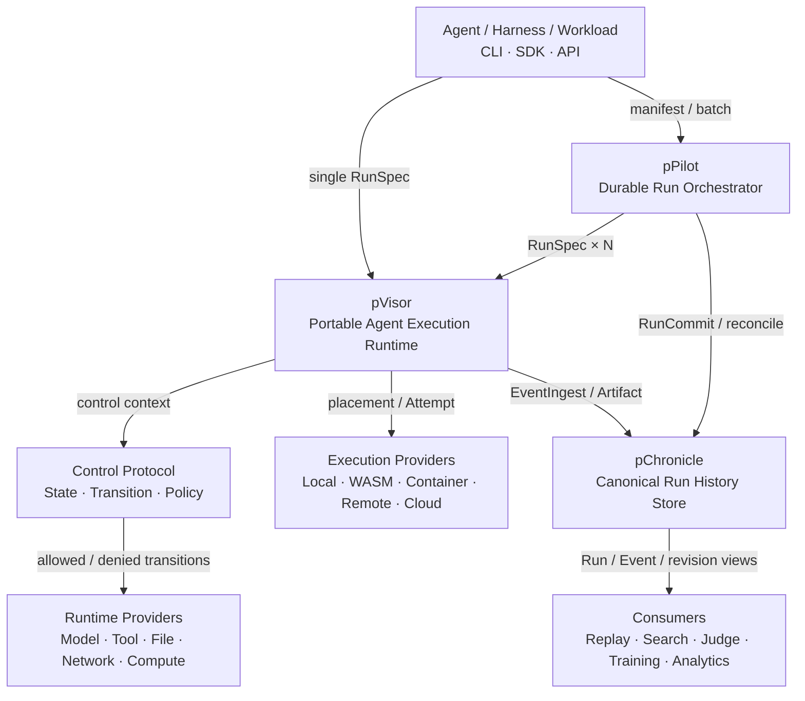
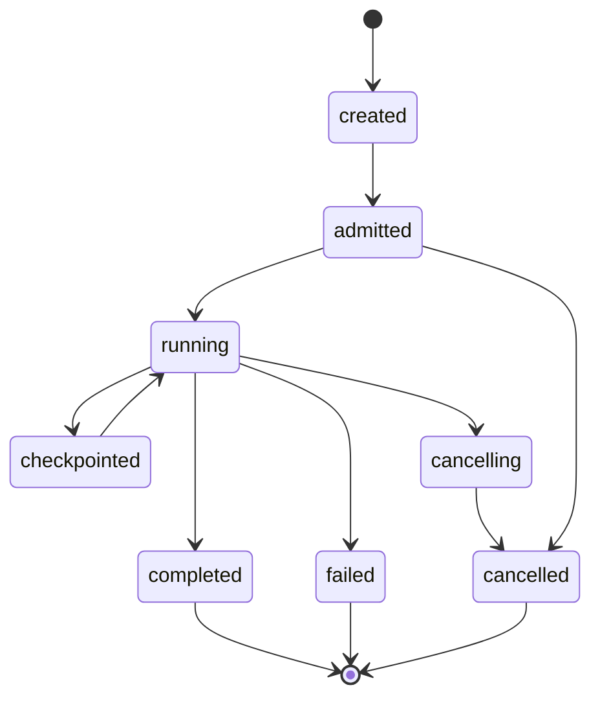

# Persisting Agent 基础设施设计

> 状态：目标架构。本文以当前 Persisting 的 Gateway、Trajectory、pPilot、Queue、Lance 与 Pulsing 实现为起点，定义面向 Agent workload 的统一演进方向。除“当前实现映射”明确列出的内容外，本文不把目标能力视为已实现。

## 1. 产品定义

Persisting 将一次不稳定、带外部副作用的 Agent workload，封装为可执行、可中断、可恢复、可追溯和可消费的 **Run**。

系统由三个核心组件组成：

```text
Persisting
├── pVisor      Portable Agent Execution Runtime
├── pPilot      Durable Run Orchestrator
└── pChronicle  Canonical Run History Store
```

- **pVisor 执行一个 Run**：管理生命周期、资源访问、隔离、placement、checkpoint 与事件采集。
- **pPilot 编排许多 Run**：负责计划、调度、租约、反压、恢复、基础设施重试与结果收成。
- **pChronicle 保存运行事实**：以 canonical events 为事实源，提供终态提交、轨迹视图和可重建的数据资产。

Persisting 不定义 Agent framework、提示词 DSL 或训练算法，也不替代 Kubernetes、`torchrun` 或通用工作流系统。

## 2. 产品入口

面向 Agent 使用者的统一入口是 `persisting`：

```text
persisting
├── execute       执行一个 Run
├── env           管理持久执行环境
├── batch/query   批量编排与历史 SQL
├── history       导入、回放和维护 Run 历史
├── eval          评测 Run 历史
└── gateway       管理长期捕获 sink
```

命令与组件的关系：

| 命令 | 主组件 | 产品语义 |
|---|---|---|
| `persisting execute` | pVisor | 创建并执行一个 Run，装配 Gateway、Control、OverlayNet 与 OverlayFS |
| `persisting env` | pVisor | 创建、执行、检查和维护持久运行环境 |
| `persisting batch/query` | pPilot | 批量编排和历史 SQL 分析 |
| `persisting history/eval` | pChronicle | 导入、读取、维护和评测 Run 历史 |
| `persisting gateway` | Gateway | 独立启动或管理长期捕获 sink |

## 3. 设计目标与非目标

Agent workload 的结果同时受模型采样、工具执行、子 Agent、运行环境和外部副作用影响。若把会话逻辑放入调度器，或把散乱日志直接交给训练与评测，系统会在扩展后失去稳定身份、失败边界和可消费的数据资产。

本设计解决四类问题：

1. **受控执行**：把不同 Agent CLI、脚本和框架接入统一 Run 生命周期。
2. **可靠扩展**：支持批量、并发、取消、恢复和基础设施故障处理，同时保持 Run 独立。
3. **事实沉淀**：把原始交互保存为有 schema、有身份、有血缘的 canonical events。
4. **数据消费**：让 replay、检索、评测、清洗和训练读取稳定历史，而不是运行时目录。

明确不做：

- 不承诺同一输入产生完全一致的模型输出。
- 不承诺 exactly-once 执行；外部副作用必须使用稳定 identity 做幂等。
- 不让 pPilot 解释 prompt、工具协议或 Agent 会话。
- 不让 pChronicle 承担执行控制或调度真相。
- 不把参数和 KV Cache 强行塞入轨迹存储格式；后续只复用通用控制与传输原语。

## 4. 总体架构



默认部署可以是单进程：CLI 内含 pPilot 与本地 pVisor，pChronicle 指向本地 Lance 目录。规模化时替换 executor、扩展 pVisor fleet 或部署独立 pPilot，不改变 Run 和事件契约。

### 4.1 模块边界

| 组件 | 拥有的状态 | 对外契约 | 不拥有 |
|---|---|---|---|
| pVisor | 单个 Run 的 runtime state、Attempt、capability、placement、checkpoint handle | `submit / poll / wait / cancel / checkpoint / migrate` | batch 计划、长期历史、派生数据 |
| Control | 资源请求的 `Requested → Allowed/Denied → Applied/Failed` 状态与转移历史 | `ControlRequest / ControlController / ControlMachine` | 网络转发、模型调用、文件 I/O |
| pPilot | Job、Task、RunFuture 集合、lease、checkpoint、retry、reconcile | `submit_batch / status / resume / cancel` | Agent 会话、provider 协议、事件 payload |
| pChronicle | canonical events、RunCommit、artifact manifest、catalog、revision lineage | `append / commit / scan / get / materialize` | 执行控制、任务调度、业务语义重试 |

### 4.2 核心架构决策

1. **Run 是完整 workload 边界**：执行、调度、成本、取消、恢复和消费都以 Run 为主键。
2. **Run 是迁移单位，Attempt 是执行实例**：同一 Run 可因恢复或迁移产生多个 Attempt，但只能有一个可见终态。
3. **Storyline 是会话与因果边界**：主 Agent 和每个 Subagent 拥有独立 Storyline。
4. **pChronicle 采用 canonical Lance events + 可重建 views**：Markdown、Replay、Search、Judge 和训练数据不是并列事实源。
5. **`Model × Harness × Benchmark` 只是评测/训练型 Run 的 workload profile**，不是通用 Run 定义。
6. **WASM 是 pVisor 的一种 portable executor**，不是整个系统的名称或唯一实现路径。

## 5. 核心对象、身份与状态

### 5.1 运行历史模型

```text
Run
└── Storyline
    └── Turn
        └── Call
            └── Event
```

一个 Run 可包含主 Agent Storyline 与多条 Subagent Storyline；它们通过 `parent_story_id` 和触发生成的 `call_id` 构成因果树。

| 对象 | 含义 | 稳定身份 |
|---|---|---|
| Run | 一次顶层 Agent workload | `run_id` |
| Storyline | Run 中一条主/子 Agent 的连续会话线 | `story_id` |
| Turn | Storyline 中用户可理解的一轮推进 | `id`（≈ ATIF `step_id`） |
| Call | 一次模型、工具、文件、网络或系统调用周期 | `call_id` |
| Event | 不可变的最小运行事实 | `event_id` |
| Revision | 固定消费集合或派生版本 | `revision_id` |

Capture 的 `agent_id`、`root_session_id`、`session_id`、`call_id` 和 `trace_id` 继续保存在事件中。pVisor 已令顶层 `root_session_id == run_id`；子会话的 `session_id → story_id` 仍按 Storyline 模型渐进迁移。

### 5.2 Run、Attempt 与 Job

- **Run**：用户可理解、可追溯、可迁移的计算单位。
- **Attempt**：Run 在某个 executor 上的一次实际执行；包含 `attempt_id`、lease epoch 和 placement。
- **Task**：pPilot manifest 中的稳定输入项；一个 Task 可关联一次初始 Run 和显式派生 Run。
- **Job**：pPilot 管理的一组 Task/Run；只用于编排，不进入 Agent 会话模型。

### 5.3 Run 状态机



- `created`：RunSpec 和 identity 已持久化。
- `admitted`：pVisor 已完成 capability、预算和 placement 检查。
- `running`：至少一个有效 Attempt 正在运行。
- `checkpointed`：已有可恢复状态；不是终态。
- `completed / failed / cancelled`：不可重写的 Run 终态。

重跑或质量重试必须创建新 Run，并以 `parent_run_id`、`task_id` 或 transform lineage 建立关联。

### 5.4 跨组件契约

| 契约 | 生产者 → 消费者 | 内容 |
|---|---|---|
| `RunSpec` | CLI / pPilot → pVisor | workload、运行配置、环境、策略和捕获配置 |
| `RunContext` | pVisor → runtime drivers | identity、capability、credential ref、budget、placement |
| `ControlTransition` | pVisor policy → OverlayNet / Gateway / OverlayFS | 资源授权决策、执行结果与状态历史 |
| `RunFuture` | pVisor → CLI / pPilot | 位置无关的 poll、wait、cancel 与恢复句柄 |
| `RunResult` | pVisor / pChronicle → CLI / pPilot | 终态、指标、错误分类、artifact 与 event refs |
| `EventIngest` | pVisor / Gateway / providers → pChronicle | 多源、幂等、持续追加的运行事实 |
| `RunCommit` | pVisor / pPilot → pChronicle | 每个 Run 唯一可见终态与事件高水位 |
| `RunView` | pChronicle → consumers | replay、检索、评测、派生和 lineage |

## 6. pVisor：Portable Agent Execution Runtime

pVisor 位于 Agent workload 与模型、工具、文件、网络和算力之间。它不试图成为“Agent 操作系统”，而是提供一个稳定、可移植、可审计的 Run runtime boundary。

### 6.1 职责

```text
pVisor
├── Run Interface & Lifecycle
├── Capability Runtime
├── Placement & Migration
├── Checkpoint Manager
├── Event & Artifact Collector
└── Runtime Drivers
    ├── Agent Adapter
    ├── Executor
    ├── Model / Tool
    ├── Filesystem
    └── Network
```

pVisor 负责：

- 校验 RunSpec，创建 RunContext，维护 Attempt 生命周期。
- 管理取消、超时、预算、资源回收和终态分类。
- 将模型、工具、文件、网络和凭据暴露为受 capability 约束的虚拟资源。
- 选择 Local、WASM、Container、Remote 或 Cloud executor。
- 创建 checkpoint，恢复或迁移 Run，并保持 Run identity 不变。
- 统一产生 Event、Artifact 和 RunResult。

pVisor 不负责：

- manifest、Job 调度和大规模 Run 集合恢复。
- canonical events 的长期保存、索引和派生 revision。
- Prompt、Workflow、采样策略和结果质量判断。
- 保证非确定模型产生相同输出。

### 6.2 RunSpec 与 RunContext

```text
RunSpec {
  run_id,
  task_id?,
  agent_ref,
  invocation,
  workload_ref?,
  run_config,
  capture_config,
  input,
  environment_fingerprint?,
  parent_run_id?
}
```

`RunSpec` 是可排队、可持久化的语义输入，不包含 secret。`RunContext` 在实际执行前由 pVisor 签发，加入短期 credential、capability token、budget、placement 和 attempt identity。

`Model × Harness × Benchmark` 可作为 `workload_profile = evaluation` 下的版本化 `workload_ref`；coding agent、交互式 Agent 和脚本仍使用通用 invocation。

### 6.3 Future 与执行协议

```text
submit(RunSpec) -> RunFuture
RunFuture.poll() / wait() / cancel()
RunFuture.checkpoint() / migrate(target)
RunFuture.terminal() -> RunResult | RunFailure
```

`RunFuture` 必须快速返回，并且不能暴露本地进程、容器 ID 或云任务句柄。底层 provider 句柄由 pVisor 保存和恢复。

| 操作 | 目标语义 |
|---|---|
| submit | 使用已签发 RunContext 创建 Attempt；不等待 Agent 完成 |
| poll / wait | 状态单调、支持 deadline、位置无关 |
| cancel | 幂等传播，记录原因，进入资源清理 |
| checkpoint | 返回版本化 checkpoint ref，不内嵌大对象 |
| migrate | 从 checkpoint 创建新 Attempt，旧 lease 失效 |

### 6.4 Executor 与 provider

| Executor | 用途 | 当前基础 |
|---|---|---|
| Local process | Agent CLI 或用户 Python 子进程 | Capture child process、pPilot 过渡 Python host |
| Proxy-assisted | 关联模型/工具流量并执行访问策略 | Gateway sink、dlcapt |
| Long-lived worker | 批量 item 的高吞吐执行 | `persisting-ppilot` WorkerActor |
| WASM | 便携、受限的执行环境 | 目标能力 |
| Container / Cloud | 远端、隔离或异构资源 | 目标能力 |

用户代码通过显式子进程或 worker 执行。`--python`、环境指纹、依赖和最小 doctor 检查属于复现边界。

### 6.5 Capability 与安全边界

| 资源 | pVisor 控制 |
|---|---|
| Model | provider/model allowlist、路由、预算、credential ref |
| Tool | endpoint allowlist、身份转发、超时、审计 |
| File | workspace/path capability、只读/写入授权、artifact 收集 |
| Network | destination policy、proxy、连接审计 |
| Compute | executor 类型、resource request、placement 与隔离 |

策略决策和实际 enforcement 都在 pVisor runtime boundary 内完成；provider 只实现稳定 driver 接口。

文件工作区与执行边界是正交能力：OverlayFS 负责 copy-on-write、review、checkpoint、
apply 和 drop，不单独构成 sandbox。pVisor 以同一 workspace 契约支持四类隔离路径：
FUSE + Landlock、LiteBox VFS、Docker/OCI 和 Firecracker microVM。它们的安全边界、
最低权限模型、数据路径、适用场景与成熟度见
[pVisor isolation architecture](pvisor-isolation.md)。这些后端由 pVisor 自动探测和选择，
不是要求普通用户理解并逐项配置的产品表面。

其中 Linux 本地 `pvisor run --safe` 已实现第一条路径：FUSE staged workspace 外层由
只投影运行时、workspace 和显式 capability 的最小 synthetic root、无特权 user/mount
namespace、Landlock ABI v3、`no_new_privs`、空 capability 集合和继承 FD 清理共同约束；
deny-all 网络策略还会创建独立 network namespace。当前仍未把
seccomp、PID namespace 和 cgroup/rlimit 资源配额纳入完整 enforcement，因此 bundle
会分别记录已生效与仍为协作式的边界，不把“启用了 OverlayFS”误报成完整 sandbox。

macOS 本地 `--safe` 复用同一 staged workspace 契约，并在 Agent 启动前通过系统
`sandbox-exec` 安装参数化 Seatbelt profile。它强制所有路径写入只能落到 merged
workspace、显式读写 capability、精确设备句柄或 Run 独占临时目录；deny-all 策略还会
阻断 IP 与宿主 ambient Unix socket，只保留精确的 Agent ABI 和 Run 私有目录内 IPC。
为保持 Homebrew、Xcode 和动态语言工具链兼容，读取暂时仍为 ambient，因此 bundle 将
read/write enforcement 分开记录，并把 aggregate filesystem 边界保持为 partial。
profile 安装由一次性 launcher attestation 验证，失败时不会执行 Agent。

## 7. pPilot：Durable Run Orchestrator

pPilot 的操作对象是许多 `RunFuture`，不是 Agent 会话。它解决“如何可靠而高效地生产许多独立 Run”。

### 7.1 模块

```text
pPilot
├── Manifest & Planner
├── Scheduler
├── Lease & Backpressure
├── Checkpoint Store
├── Retry Classifier
├── Reconciler
├── Collector
└── Committer
```

| 模块 | 职责 |
|---|---|
| Manifest & Planner | 将稳定 item 映射为 RunSpec，并分配 task/run identity |
| Scheduler | 队列、优先级、配额、资源提示和 pVisor placement 请求 |
| Lease & Backpressure | epoch、heartbeat、有界 inflight 和 stale worker fencing |
| Checkpoint Store | 持久保存 Job、Task、Run、Attempt 与控制状态版本 |
| Retry Classifier | 区分基础设施重试和显式语义重试 |
| Reconciler | 对照 checkpoint、活跃 Attempt 与 pChronicle facts 收敛状态 |
| Collector | 汇聚 RunFuture、指标和错误 |
| Committer | 以 CAS/幂等协议提交唯一可见终态 |

pPilot 不做 Agent 质量判断、工具协议解释、prompt 设计、业务语义重试或训练数据选择。

### 7.2 批次模型

pPilot 接收带稳定 `id` 的任务流，每个 item 对应一个独立 Run；Worker 内的唯一 adapter
将 TaskExpr 转换为 RunSpec，并通过 pVisor RunExecutor/RunResult 执行和收成。后续仍需
让 Driver 与 durable checkpoint 直接观察 RunFuture/Attempt 状态。

```json
{"id":"repo-a","command":"claude","input":"/work/repo-a"}
{"id":"repo-b","command":"claude","input":"/work/repo-b"}
```

首版承诺：

- 有界并发、队列反压和取消。
- 稳定 task ID、每 item 一个 Run、终态 JSONL。
- durable checkpoint 和 `--resume`。
- 基础设施重试可审计，终态提交唯一。

首版不扩展为通用 DAG 或 Agent DSL。

### 7.3 重试、恢复与一致性

| 类型 | 决策者 | 行为 |
|---|---|---|
| infra retry | pPilot | worker crash、节点失联、投递失败；保持 Run，创建新 Attempt |
| semantic retry | workload policy | 结果不合格、重新采样、策略变化；创建派生 Run |

pPilot 至少持久化：

```text
job_id → task_id → run_id → attempt_id / lease_epoch → terminal_commit
```

恢复时按三方事实收敛：

1. pPilot checkpoint 中的期望状态；
2. pVisor 中的活跃 Attempt 与 provider handle；
3. pChronicle 中已提交的 Run 终态。

系统不承诺 exactly-once execution，但通过 stable identity、lease fencing 和 terminal CAS 提供 **at-least-once attempt + single visible Run result**。

## 8. pChronicle：Canonical Run History Store

pChronicle 保存“发生了什么”，并把运行历史组织为可查询、可回放、可派生的数据资产。

### 8.1 存储架构

```text
Producers
  pVisor · Gateway · providers · import
        │
Event Ingress
  validate · dedupe · WAL · dead letter
        │
Canonical Lance Events
  append-only facts · schema version
        ├── RunCommit / terminal watermark
        ├── Artifact manifest / object store
        ├── Catalog / scan
        └── Rebuildable views
            ├── Run / Storyline / Replay
            ├── Search / Judge
            └── Clean / Augment / Training revisions
```

canonical events 是唯一事实源。Markdown 是人读导出或缓存，索引和派生数据是带 lineage 的 revision；它们都必须能够由事件和版本化 transform 重建。

### 8.2 事件模型

当前 `CaptureRecord` 继续作为统一内部记录，Lance `EventRow` 反规范化高频字段并保留完整 payload。

```text
Event {
  event_id,
  run_id,
  story_id?,
  turn_id?,
  call_id?,
  parent_call_id?,
  seq,
  timestamp,
  kind,
  source,
  agent_id?,
  trace_id?,
  payload,
  schema_version,
  producer,
  ingest_time
}
```

事件类别至少包括：

- lifecycle：`run.created`、`run.started`、`run.completed`、`run.failed`、`run.cancelled`
- LLM：`llm.request`、`llm.response`、`llm.response.stream`
- tool：`tool.call`、`tool.result`
- structure：`storyline.started`、`subagent.spawned`、`storyline.ended`
- runtime：`metric`、`artifact`、`checkpoint`、`error`、`audit`

`seq` 只定义 Storyline 内顺序。跨 Storyline 使用因果引用、逻辑时间、采集时间和稳定 tie-break，不要求全局时钟一致。

### 8.3 写入与提交语义

| 项目 | 目标语义 |
|---|---|
| append | `event_id` 幂等追加，不整表 rewrite |
| WAL | 异步写失败可恢复；repair 不生成新的业务 event ID |
| live visibility | `--follow` 可见未提交增量，并明确标记 |
| terminal visibility | RunCommit 以 CAS 定义唯一终态和事件高水位 |
| artifact | 大对象进入 object store，事件保存内容寻址引用与 manifest |
| retention | 原始事件按策略管理；视图和索引可重建 |
| deletion | tombstone / redaction revision；不静默改写历史 |

RunResult 不内嵌全量轨迹，只保存状态、指标、错误、artifact 和 event stream 引用。

### 8.4 视图与 revision

| 形态 | 内容 | 用途 |
|---|---|---|
| Fat | 完整事件、运行参数、时延、token、错误和审计 | 调试与归因 |
| Normal | Storyline、Turn、Call、messages、tools 与必要指标 | replay、检索、评测 |
| Cleaned | 通过质量门、脱敏和归一化的轨迹 | 训练与离线分析 |
| Augmented | 基于父 revision 和 transform spec 的派生数据 | 增广、对照、课程学习 |

每个 revision 必须记录输入事件范围、`parent_revision_id`、transform 版本、schema 版本和生成时间，不得覆盖原始事件。

## 9. 端到端关键路径

### 9.1 单 Run

```text
pvisor run
  → RunSpec
  → pVisor admission / RunContext
  → Attempt on executor
  → events / artifacts → pChronicle
  → terminal RunResult / RunCommit
  → CLI
```

### 9.2 批量 Run

```text
pPilot library
  → manifest → pPilot planner
  → RunSpec × N
  → pVisor fleet → RunFuture × N
  → pPilot collector / reconciler
  → pChronicle terminal commit
  → checkpoint + result JSONL
```

### 9.3 Capture 与 Replay

`capture` 不启动目标 Agent；它把外部运行或历史导入关联为 Run，经 Event Ingress 写入 pChronicle。`replay` 默认只读，不调用模型、不执行工具、不产生副作用。未来的“再执行”必须是独立且显式确认的能力。

## 10. 可靠性、安全与观测

### 10.1 故障行为

| 情形 | 目标行为 |
|---|---|
| capture 异步写失败 | 主请求不被阻断；写入 WAL/dead letter，并可显式 repair |
| pPilot terminal commit 失败 | Job/Task 不得报告成功；由 reconciler 重试或暴露错误 |
| worker reply 丢失 | 查询 pVisor/provider handle；不擅自跨 lease 重复副作用 |
| 控制面崩溃 | 由 checkpoint、活跃 Attempt 和 pChronicle commit 恢复 |
| 用户取消 | 停止新 item、取消 Future、记录原因；外部副作用不保证回滚 |
| schema 演进 | Event 带 schema version；不兼容变更通过显式迁移完成，view 可重建 |

### 10.2 安全原则

- RunSpec 不包含 secret；只包含 credential ref，短期凭据由 pVisor 注入。
- capability 默认最小授权，文件、网络、工具和模型访问均可审计。
- capture level 决定 payload、图像和敏感工具输出的保存范围。
- 清洗与脱敏产生新 revision；原始数据由 retention 和访问控制管理。
- replay 默认只读；发送请求、删除、redact 或 repair 必须显式确认。

### 10.3 必备指标

| 组件 | 指标 |
|---|---|
| pVisor | Run/Attempt 时长、模型/工具错误、token、首 token、取消、checkpoint、迁移、环境指纹 |
| pPilot | 吞吐、队列深度、inflight、lease expiry、retry、worker 利用率、单位 Run 成本 |
| pChronicle | append 延迟、dead letter、事件完整率、commit 延迟、视图滞后、revision 状态 |

## 11. 当前实现映射

| 目标概念 | 当前实现 | 差距 |
|---|---|---|
| canonical record | `persisting-pchronicle::EventRecord`（Gateway 内部称 `CaptureRecord`） | 将 `run_id` 升为跨路径一等身份 |
| canonical Lance events | `persisting-pchronicle::{EventRow, RawEventLanceStore}` | 统一 canonical-first，Markdown 降为 view |
| Storyline / replay view | story actor、TLV Markdown、materialize、replay | 将 session 对齐为 Storyline，并补充因果关系 |
| pVisor proxy drivers | `persisting-overlaynet` 独占显式 HTTP/HTTPS proxy 数据面；Gateway 是 LLM/轨迹 `OverlaySink`；另有 `persisting-dlcapt` | 可配置其他 sink；当前不宣称透明网络隔离。Linux 透明截获已定稿设计（主方案：非特权 netns + 进程内用户态协议栈；备选：seccomp user-notify + ADDFD），见 [OverlayNet interception](overlaynet.md) |
| pVisor executor | Local ProcessExecutor、Docker/Podman transport、QEMU/KVM transport；pPilot Python host 实现 RunExecutor provider | provider 代码仍在 pPilot crate；Docker/KVM 仍有 capability enforcement 差距，尚缺 WASM/Remote，见 [pVisor isolation architecture](pvisor-isolation.md) |
| pPilot batch control | Driver、Scheduler、Sink、Checkpoint；TaskExpr ↔ RunSpec/RunResult adapter | 将 Run/Attempt 写入 durable checkpoint 并增加 reconcile |
| pChronicle commit path | `LanceResultSink: TaskResult → CaptureRecord → TrajectoryAppend` | 升级为 terminal CAS 和唯一可见结果 |
| distributed providers | Pulsing actors、torchrun integration | 只承担发现、投递和 worker 生命周期 |
| pChronicle consumers | CLI、pPilot sink、Python Search、Judge | 直接消费 canonical history/Search API |

## 12. 技术路线

### 阶段一：pVisor + pChronicle 单 Run 闭环

1. `pvisor run` 创建 canonical Run，返回稳定 RunResult。
2. Gateway、执行和导入使用同一 Run/Event identity。
3. `persisting history replay` 读取 pChronicle 历史。
4. append、WAL、dead letter、repair 和 terminal commit 可测试。

### 阶段二：pPilot 批量闭环

1. pPilot item 与 Run 一一对应，支持有界并发、取消和 resume。
2. `TaskExpr/TaskResult` 与 `RunSpec/RunResult` 只有一个 adapter。
3. checkpoint、lease、infra retry、reconcile 与 terminal commit 可审计。
4. pPilot 重启后可从 pVisor 与 pChronicle facts 收敛。

### 阶段三：pVisor capability 与可移植执行

1. 模型、工具、文件、网络和 credential 进入统一 capability model。
2. Local、WASM、Container 与 Remote executor 使用同一 Future/Result 契约。
3. checkpoint/migration 以 Run 为单位，以 Attempt lease 做 fencing。
4. Pulsing/torchrun 保持 provider 角色，不成为新的调度真相。

### 阶段四：pChronicle 数据消费闭环

1. Storyline、Replay、Search、Judge 和训练数据都从 canonical events 生成。
2. clean/judge/augment revision 具备 lineage 和可重建性。
3. 以有效轨迹成本、可复现方差、稳定成功率和下游增益评估系统。

## 13. 参数与 KV Cache 的后续扩展

参数与 KV Cache 不改变 Agent CLI 和三个核心组件的职责。它们复用 Agent 基础设施沉淀的原语：

- stable identity、versioned manifest 和 content addressing；
- placement、lease、backpressure、cancellation 和 fencing；
- control plane 与 bulk data plane 分离；
- durable commit、checksum、revision 与审计；
- Pulsing 负责发现与控制，专用 block/tensor path 负责数据传输。

轨迹由 pChronicle 的 Lance event plane 保存；参数和 KV Cache 使用独立的 TTAS/block data plane。共享的是控制、位置、传输和一致性原语，而不是同一种查询或物理存储格式。

## 14. 设计守则

1. pVisor 执行一个 Run；pPilot 编排许多 Run；pChronicle 保存事实和视图。
2. Run 是跨组件主键；Storyline 是会话与因果边界；Event 是不可变事实。
3. pPilot 只调度 RunFuture，不保存或解释 Agent 会话。
4. Run 可有多个 Attempt，但只能有一个可见终态。
5. pChronicle 的 canonical events 是唯一事实源，所有消费资产必须可追溯。
6. replay 默认只读；副作用必须显式、可确认、可审计。
7. 用户代码和 provider 通过显式 driver/worker 边界执行，不吸附到控制面。
8. 新能力必须归属于 pVisor、pPilot、pChronicle 或 Runtime Provider 之一；边界不清时不进入主路径。
