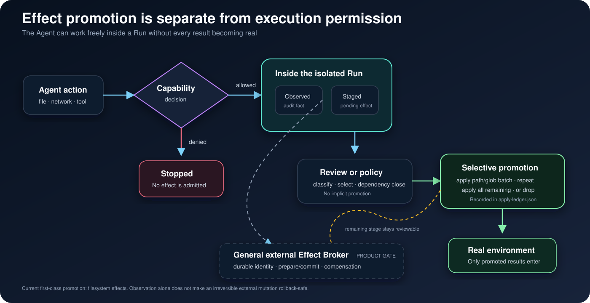
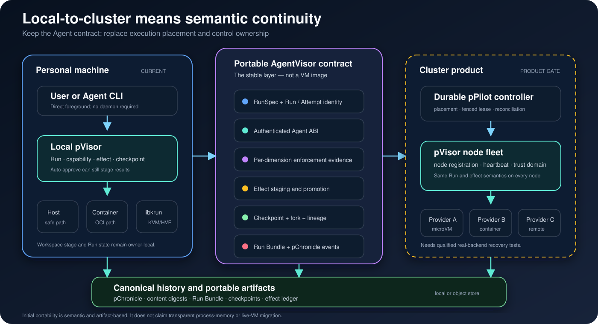

# AgentVisor 契约

> **状态：** 本文定义 AgentVisor 品类和 pVisor 产品契约。标记为“当前实现”的
> 内容描述已经交付的行为；标记为“产品门槛”的内容是在对外声明相应能力之前必须
> 完成的要求。具体版本仍以可执行程序的 `--help`、公共类型和契约测试为准。

**AgentVisor** 是品类名称，**pVisor** 是 Persisting 对 AgentVisor 的实现。

AgentVisor 位于自主 Agent 与执行基础设施之间，负责控制和容纳 Agent。它管理 Agent
的逻辑生命周期、请求的能力、外部效果、检查点、谱系，以及哪些结果可以被提升到
真实环境。

```text
Agent / Coding Agent / 评测 worker
                     │
                     │ 面向 Agent 的 Run 契约
                     ▼
                AgentVisor
        生命周期 · 能力 · 外部效果
        检查点 · 谱系 · 执行证据
                     │
                     │ provider 契约
                     ▼
 host process · sandbox · OCI · microVM · cluster provider
```

AgentVisor 不是 Agent framework、模型路由器、容器 runtime 或操作系统，但可以使用
这些系统。它的核心对象是一个**外部效果受到治理的 Agent Run**，而不是进程、容器、
虚拟机、prompt 或工作流节点。


## 契约总览

每次 pVisor 执行都从逻辑 `RunSpec` 开始，最终产生 `RunResult`、持久化本地状态和
带版本的 Run Bundle。物理重试和不同 placement 以 Run 下属的 Attempt 表达。

```text
RunSpec
  ├── Run identity 与父级谱系
  ├── Agent identity 与 invocation
  ├── capability intent
  ├── runtime limit 与 policy mode
  └── 可选的 fenced supervisor bootstrap
          │
          ▼
Run
  ├── Attempt 1 @ lease epoch N
  ├── Attempt 2 @ lease epoch N+1
  ├── Agent ABI observation 与未关闭 effect
  ├── workspace stage 与 checkpoint
  └── lifecycle 与 trajectory event
          │
          ▼
RunResult + Run Bundle + 被提升或丢弃的 effect
```

该契约包含六条不变量：

1. **Run 不是进程。** 一个逻辑 Run 可以拥有多个物理 Attempt；进程 identity 永远
   不会成为可移植的产品 identity。
2. **被暂存的 effect 不是安全边界。** Copy-on-write 让改动可审查；真正决定 Agent
   能否绕过该视图的是 isolation backend。
3. **请求 capability 不等于已经 enforce。** 每个维度分别记录 enforcement level 和
   提供该边界的具体机制。
4. **进程执行成功不等于 Run 已成功终结。** Teardown、持久 Run 状态、Run Bundle
   和 terminal event publication 都属于完成协议。
5. **Checkpoint 只承诺它实际保存的内容。** pVisor 当前是逻辑 Agent/workspace
   checkpoint，不宣称保存 VM 内存或任意进程的连续执行状态。
6. **Placement 不改变 Agent 语义。** 本地、容器、VM 和未来集群 provider 使用相同
   Run、capability、effect 和 evidence 模型。

## AgentVisor 负责什么

| 平面 | 必须承担的职责 | pVisor 当前实现 |
| --- | --- | --- |
| Identity | 稳定 Run identity、独立 Attempt identity、父级谱系和 fenced ownership generation | `RunId`、`AttemptId`、`parent_run_id`、`lease_epoch` |
| Lifecycle | Admission、启动、观测、取消、quiescence、checkpoint、终态发布和恢复语义 | `PVisor`、`RunHandle`、Agent ABI、RunRecord |
| Capability | 请求的访问，以及明确的 admission/enforcement 结果 | `CapabilitySet`、`PolicyMode`、分维度 evidence |
| Effect | 观测、暂存、分类、批准、提升、拒绝和审计外部可见改动 | 当前的 OverlayFS review/apply/drop、Agent ABI effect registry 与 Gateway 记录 |
| Placement | 选择并绑定 provider，同时保持 Agent 侧契约不变 | host、Docker/Podman、libkrun VM |
| Evidence | 持久记录运行内容、实际边界、改动和终结原因 | Run Bundle 与 pChronicle event |

AgentVisor 不需要自己实现 kernel、镜像格式、容器生命周期、调度器或分析数据库。
除非 Agent 契约需要额外语义，否则这些属于 provider 或相邻系统。

## Run 与 Attempt 生命周期

**当前实现。** pVisor 拥有语义 Run，executor 拥有一个物理 Attempt。启用持久化
编排时，pPilot 可以拥有单调递增的 lease epoch。

```text
created → starting → running ──────────────→ completed
                        │                         ▲
                        ├→ checkpointing → running
                        └→ cancelling ────→ cancelled

启动、执行、teardown 或 publication 失败 ───→ failed
```

进程退出只是必要条件，不是充分条件。pVisor 必须先 teardown Run driver、持久化
RunRecord、写入 Run Bundle 并发布 terminal event，之后才返回 completed result。
不确定或失败的终态发布属于 infrastructure failure，不能变成成功结果上的 warning。

当前本地 registry 与 Agent ABI 都以 Run 为作用域。ABI 负责认证 client、记录进程和
未关闭 effect、返回 desired state，并使用 directive generation fence quiescence ack。

## Capability intent 与 enforcement evidence

**当前实现。** pVisor 将 capability 拆成独立维度，不会把 executor 名称直接提升为
笼统的安全声明：

- 模型访问；
- 工具访问；
- 文件系统读；
- 文件系统写；
- 网络；
- secret；
- 子进程；
- 资源限制。

每个维度有三个等级：

| 等级 | 含义 |
| --- | --- |
| `unenforced` | 不声明该维度存在边界 |
| `cooperative` | 正常 Agent 路径被中介，但可能存在其他绕过路径 |
| `enforced` | 该机制预期对作用域内完整进程树不可绕过 |

Evidence 会记录 Linux network namespace、Landlock、Seatbelt 或 VM smoltcp boundary
等具体机制。Gateway 注入和显式代理只能算 cooperative network evidence，不能证明
direct socket 已被限制。`PolicyMode::Enforce` 在任一请求维度缺乏 enforced evidence
时会拒绝 admission。

**产品门槛。** 当前机制是结构化 runtime record，不是密码学 attestation。集群级
evidence 需要绑定精确 RunSpec digest、provider build、host/guest identity 与 Attempt
generation；威胁模型需要时，还必须签名或锚定到 provider attestation。

## Effect 与结果提升

AgentVisor 把 Run 内执行许可与 effect promotion 分成两个决策：

```text
Agent action
    │
    ├── 被 capability policy 拒绝
    │
    └── 允许在 Run 内发生
             │
             ├── 只观测
             ├── 暂存等待审查
             ├── 由策略或用户决定提升
             └── 丢弃
```



### 文件系统 effect

**当前实现。** pVisor 给 Agent 一个 copy-on-write workspace，执行期间 base 保持不变。
`review` 分类新增、修改、删除、类型变化、opaque directory、link 与 metadata。`apply`
接受精确 path 和 git 风格 include/exclude glob。

Partial apply 会计算 dependency-closed batch：

- 自动包含必要父目录；
- hard-link sibling 保持在同一批次；
- opaque directory 保持原子；
- 显式排除必要依赖时返回错误，而不是产生部分结果；
- 未选改动继续保留，可再次 apply 或 drop；
- 每个成功批次追加到 `apply-ledger.json`。

提交所有剩余改动或 drop 后，该 stage 进入终态。Drop 无法撤销先前已经提升的批次。

**产品门槛。** 当前 apply 还不是跨全部文件的 crash-atomic transaction，也不会用
规划时的 preimage digest 对比实时目标来拒绝目标漂移。在 unattended promotion 被
称为 conflict-safe 之前，必须补齐这两项保证。

### 网络、模型、工具与外部 effect

**当前实现。** Gateway 与 OverlayNet 记录经过中介的流量；Agent ABI 跟踪注册的
未关闭 effect，并在参与 client 仍报告未解决 effect 时阻止逻辑 checkpoint。VM
TCP/DNS enforcement 和支持平台上的 host deny-all 可以在 runtime boundary 阻断访问。

**产品门槛。** 通用 external Effect Broker 需要给不可逆的工具和服务 mutation 分配
持久 identity；在外部系统允许时提供 prepare/commit 或 compensation，并拥有与文件
apply 对等的 promotion policy。记录请求只能证明请求发生过，不能证明外部后果可回滚。

## Checkpoint、fork 与 replay

**当前实现。** Live logical checkpoint 请求所有 Agent ABI client 在同一个 directive
generation 上 quiesce，并要求 open-effect set 为空。pVisor 随后 snapshot workspace
upper，再恢复 client。Stopped Run 可以直接创建 checkpoint。`fork` 把指定 checkpoint
恢复到新 Run，并记录 parent Run 与 checkpoint。

这已经支持 workspace 和 Agent 协作的实验，但不会保存任意进程内存、TCP connection、
kernel state 或不协作工具的隐藏状态。

**产品门槛。** 可移植 semantic replay 还需要模型/工具输入绑定、非确定性记录、artifact
digest，以及对不可 replay 或 compensation 的 effect 做显式处理。

## Execution provider

Provider boundary 回答一个 Attempt 在哪里、如何运行；AgentVisor contract 回答它属于
哪个 Agent Run，以及 effect 如何被治理。

| Provider | 当前状态 | Enforcement boundary |
| --- | --- | --- |
| Linux safe host | 已实现 | Rootless namespace、synthetic root、Landlock、dropped capability；deny-all 使用 private network namespace |
| macOS safe host | 已实现 | Seatbelt write confinement 和可选 deny-all socket；读取保持 ambient |
| Docker/Podman | 已实现 | Container placement；完整 capability-to-OCI compilation 仍未完成 |
| libkrun KVM/HVF | 已实现 | Guest-kernel boundary 与不可绕过的已支持 VM network path；host VMM 威胁模型依赖平台 |
| WASM | 类型已预留 | 没有 production executor |
| Remote fleet | 契约方向 | pPilot 可以协调持久 Run，但当前不声明存在长期运行的通用 fleet provider |

Attempt 的 provider 选择必须持久化。后续操作不能把已有 Attempt 静默路由到更弱的
provider。无法 enforcement 的 capability 必须在 Agent 执行前失败。

## 从单机到集群的一致性

AgentVisor 承诺的是语义可移植性，不是任意机器的 live migration：



| 契约 | 个人机器 | 集群目标 |
| --- | --- | --- |
| Run identity | 本地持久 RunRecord | 持久 control store 与 fenced lease |
| Agent ABI | Run-local authenticated endpoint | 穿过 node boundary 的相同逻辑 ABI |
| Workspace effect | 本地 stage 与 selective apply | artifact-backed stage 与 policy-controlled promotion |
| Capability policy | 本地 profile 与分维度 evidence | admission 加 provider/node evidence |
| History | 本地或 object-store pChronicle | 共享 canonical pChronicle root |
| Execution | Host、container 或本地 VM | 被调度的 pVisor node/provider |

**当前实现。** Standalone pVisor 不需要 controller。pPilot 提供 job-scoped worker、
least-loaded scheduling、durable result、lease epoch、CAS terminal publication，以及本地
或 object-store control root。Worker label 当前只用于信息展示，普通 worker 是
process-local 或由 torchrun 创建。

**产品门槛。** 集群声明需要长期运行的 controller、持久 node registration、heartbeat
与 loss detection、placement constraint、controller/node 故障后的 reconciliation、
artifact transfer、tenant/trust-domain isolation，以及真实 backend 的强制测试 profile。

## pVisor 架构

```text
CLI / pPilot / embedding host
          │ RunSpec
          ▼
       pVisor
          ├── admission 与分维度 evidence
          ├── Run/Attempt state 与 Agent ABI
          ├── WorkspaceOverlay 与 checkpoint lineage
          ├── Gateway / OverlayNet / Control driver
          ├── executor: host / container / libkrun VM
          └── Run Bundle 与 pChronicle event sink
```

pVisor 拥有一个 Run；pPilot 负责跨 Run 的规划和编排；pChronicle 保存 canonical history
与派生视图；Gateway、OverlayNet、Control 和 OverlayFS 是 pVisor driver，而不是独立
的产品控制面。

## 刻意保留的边界

- **不是 OCI 替代品。** OCI 可以是 provider boundary；pVisor 在它之上增加 Agent
  lifecycle、effect、checkpoint 与 evidence 语义。
- **不承诺万能回滚。** 文件系统 promotion 可控，但任意外部服务 mutation 可能不可逆。
- **不是单一 isolation label。** 同一个 Run 的读、写、网络、secret、subprocess 和
  resource enforcement 可能拥有不同强度。
- **不是 live VM migration。** 初期的 local-to-cluster 指兼容的 RunSpec、artifact、
  checkpoint、lineage 与 policy，不是透明迁移内存。
- **本地不强制 daemon。** 本地产品保持直接、foreground；集群可以增加持久 controller
  和 node agent，而不改变 Agent-facing contract。

## 延伸阅读

- [使用 pVisor 运行工作负载](../guide/pvisor-execution.md)
- [pVisor 命令参考](cli-pvisor.md)
- [pVisor 隔离架构](pvisor-isolation.md)
- [Agent 基础设施](agent-infrastructure.md)
- [pPilot 架构](ppilot.md)
