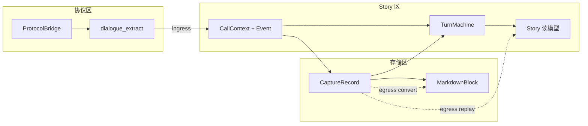
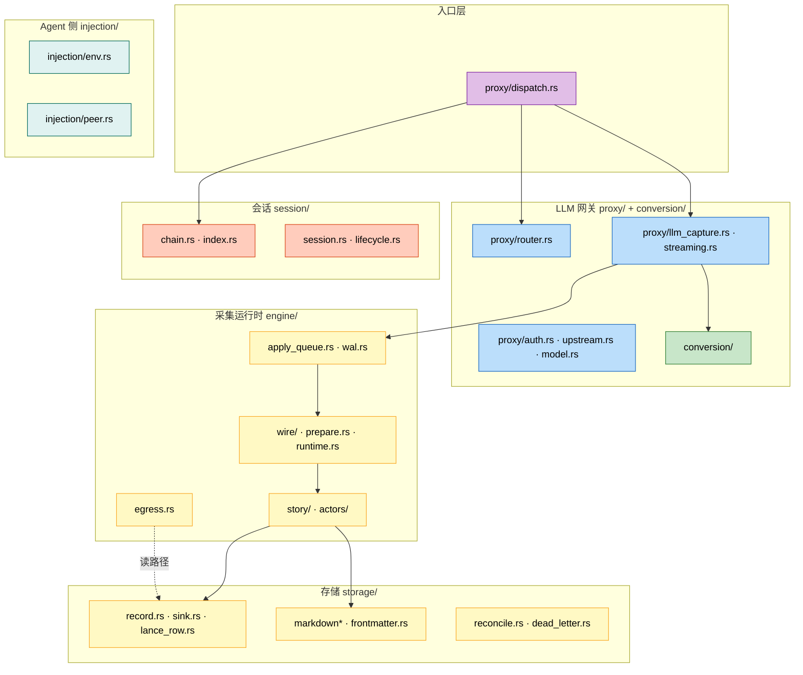
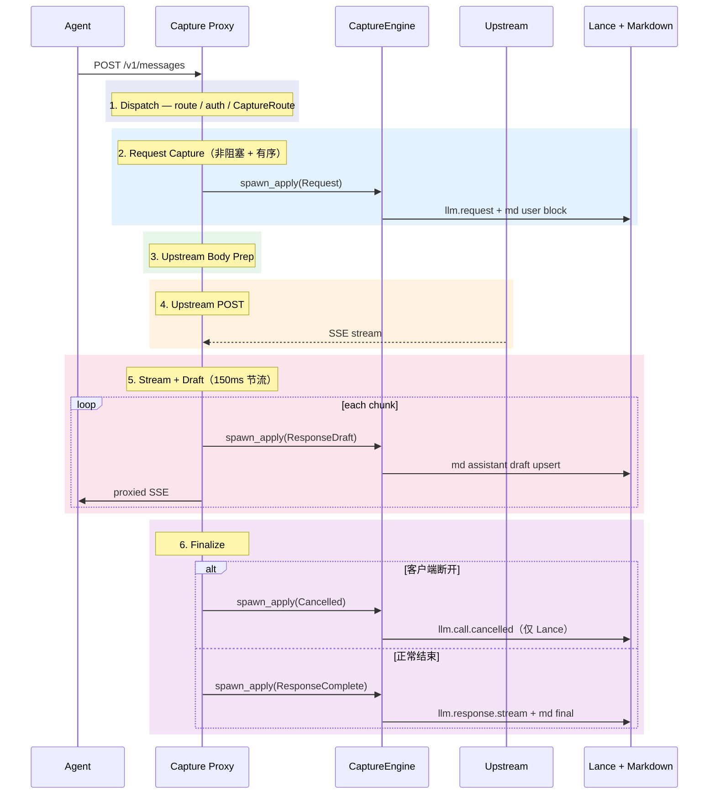

# LLM Capture 代理 — 架构设计

> **版本**：v0.6.0 &emsp;|&emsp; **最后更新**：2026-05-28

---

## 目录

1. [概述](#1-概述)
2. [核心概念模型](#2-核心概念模型)
3. [系统架构](#3-系统架构)
4. [写路径：Ingress 与采集](#4-写路径ingress-与采集)
5. [读路径：Egress 与物化](#5-读路径egress-与物化)
6. [存储与一致性](#6-存储与一致性)
7. [LLM 网关](#7-llm-网关)
8. [子代理与会话路由](#8-子代理与会话路由)
9. [并发与可靠性](#9-并发与可靠性)
10. [运维](#10-运维)
11. [代码地图与技术债](#11-代码地图与技术债)
12. [相关文档](#12-相关文档)

---

## 1. 概述

### 1.1 定位

Persisting Capture 是一个**嵌入式 LLM 反向代理 + 轨迹采集引擎**。它在 Agent（Claude Code / Cursor / 自研 Agent）与上游 LLM 提供商之间透明转发 HTTP 流量，同时将全部对话与工具调用上下文**实时捕获**为可读、可检索、可回放的轨迹。

```
Agent 进程                        上游 LLM
(Claude Code, etc)              (DeepSeek / OpenAI / Anthropic / ...)
      │                                    │
      │  POST /v1/messages                 │
      │  {"model":"claude-4",...}          │
      │                                    │
      ▼                                    │
┌──────────────────────────────────────────┐
│         Capture Proxy                    │
│  路由 · 协议转换 · 鉴权                   │
│         │                                │
│         ▼                                │
│  写路径: Event → StoryActor → 存储        │
│  读路径: Record/Story → egress → 导出     │
└──────────────────────────────────────────┘
```

**核心价值**：Agent 只需将 `base_url` 指向 proxy，无需任何代码改动，即可获得完整的调用轨迹。

### 1.2 设计原则

| 原则 | 说明 |
|------|------|
| **观测不阻断** | LLM 响应优先；采集失败写 dead letter，不上抛到 HTTP handler |
| **Story 边界** | 协议差异在 ingress 消化；Story 区只用 Run/Story/Turn/Call/Event |
| **Lance canonical** | 全量事件以 `CaptureRecord` 写入 Lance；Markdown 为物化视图 |
| **写读对称** | 在线 `TurnMachine` 与离线 `replay_records` 投影同一 `Story` 读模型 |
| **单一提取源** | 可见文本统一经 `CaptureRecord::visible_user_text()` / `visible_assistant_text()` |

### 1.3 与其他组件的关系

| 组件 | 关系 |
|------|------|
| **agentgateway** | 借鉴配置语义与路由模型；conversion 子集 + AG fixture 测试；**不依赖**其运行时 |
| **Persisting Engine** | Capture 产出的 `CaptureRecord` 进入 Engine 的 Lance 管线 |
| **Pulsing Actor** | V3 采集运行时：`CaptureEngine` 编排 **RunActor** + 每 story 一个 **StoryActor** |
| **Claude Code** | 主要一等客户端；深度适配 subagent / session / history replay |

### 1.4 公开 API 边界

`lib.rs` 以**模块路径**对外（避免 crate 根扁平化），主要暴露：

- `proxy` — HTTP 入口与服务（`proxy::serve`）。
- `engine` — `CaptureEngine` 与 `Event` / `Call` / `CallContext` 等 wire 类型。
- `record` / `session_storage` / `markdown_trajectory` / `markdown_pipeline` / `subagent_link` — 存储与轨迹工具。
- `runtime::{discover, run_config, run_env, service, debug}` — 子进程注入与发现支撑。
- `reconcile` / `dead_letter` — CLI 工具支撑。

Story 读模型（`Story`、`Turn`、`TurnMachine`、`egress`）保持 crate 内部，运行时只通过 `CaptureEngine::story_snapshot()` 与 shutdown 时落盘的 `story_snapshots.json` 对外暴露状态。

---

## 2. 核心概念模型

### 2.1 叙事层级：RunId → Story → Turn → Call + Event

采集运行时保留 **五类核心概念**，容器与读模型分层清晰：

```text
RunId（容器，≈ root_session / capture run 目录）
 └── Story（一条 agent 故事线，≈ 一个 .md 文件 + Lance dataset）
      └── Turn（一轮 user → assistant 语义轮次）
           └── TurnCall（单次 HTTP call 上的 phase 时间线）
                └── CallPhase（Request / Draft / Complete / Cancel）
```

| 概念 | 类型 | 职责 |
|------|------|------|
| **RunId** | newtype | 一次 `capture run` 的工作区标识；spawn link 注册域 |
| **Story** / **StoryId** | 读模型 + ID | 一条独立轨迹线（主 session 或 `agent-{id}`） |
| **Turn** / **TurnId** | 读模型 + ID | Story 内语义轮次；由 `TurnMachine` 维护 |
| **Call** | wire 类型 | 单次 LLM HTTP 往返（`call_id` / `trace_id` / `started_at`） |
| **Event** | wire 类型 | Call 上发生的采集事件，驱动 prepare → persist |
| **CallContext** | wire 类型 | Proxy → Engine 上下文（`StoryContext` + `Call` + 路由/模型元数据） |

**TurnKind**（读模型轮次分类）：

| 变体 | 含义 |
|------|------|
| `Dialogue` | 可见 user → assistant 轮 |
| `Autonomous` | 无 opening user 文本的 agent 自主段（tool loop、system-only 续写等）；JSON 兼容别名 `tool_loop` |
| `Internal` | 保留；当前未使用 |

**CallPhase**（读模型；区别于 `CaptureRecord.kind`）：

```rust
pub enum CallPhase { Request, Draft, Complete, Cancel }
```

**Wire 层 Event**（写路径入口）：

```rust
pub enum Event {
    Request(RequestEvent),
    ResponseDraft(DraftEvent),       // 仅 live Markdown
    ResponseComplete(CompleteEvent), // Lance + Markdown finalize
    Cancelled(CancelEvent),          // 仅 Lance
}
```

> **术语说明**：早期文档中的 `Run` 结构体已移除；**Run 仅作为 `RunId` 容器标识** 出现在 `Story.run_id` 与目录布局中。

### 2.2 三层词汇表与转换边界

```text
任意协议 ──(ingress)──→ Story 边界 ──(prepare)──→ 存储
存储 / Story ──(egress)──→ 物化 / 导出 / 协议测试
```

| 层 | 代码位置 | 名词 | 职责 |
|----|---------|------|------|
| **协议区** | `conversion/`、`dialogue_extract/`、`proxy/` | `ProtocolKind`、`messages`/`completions`/`responses`、SSE、`tool_call` | 代理转发、从 wire 提取可见文本与 usage |
| **Story 区** | `engine/story/`、`engine/actors/`、`engine/prepare.rs`、`engine/wire/` | `Story`、`Turn`、`Call`、`Event`、`CallContext`、`CallPhase` | 叙事编排：谁、第几轮、哪次 HTTP、发生了什么 |
| **存储区** | `storage/record.rs`、`storage/markdown*`、`storage/lance_row.rs` | `CaptureRecord`、`kind`、`seq`、`MarkdownBlock` | canonical 事件日志 + 人读视图 |

#### Ingress（协议 → Story）

```text
HTTP wire
  │  proxy: ProtocolBridge 翻译 upstream body
  │  dialogue_extract: → user_content / assistant_content
  ▼
CallContext + Event          ← Story 边界
  │  prepare → CaptureRecord
  ▼
StoryActor (TurnMachine + sink + md)
```

- `TurnMachine` **不感知** `ProtocolKind`；只观察已 persist 的 `CaptureRecord`。
- 可见文本提取的**唯一权威**是 `CaptureRecord::visible_user_text()` / `visible_assistant_text()`（turn 索引、markdown codec、过滤规则共用）。

#### Egress（存储 / Story → 读模型 / 导出）

```text
CaptureRecord[]
  │  TurnMachine::replay_records → Story
  │  storage/convert → MarkdownBlock
  │  conversion/ → AG fixture 对比
  ▼
story_snapshots.json / materialize / reconcile / CLI export
```

- **`engine/egress.rs`** 是读路径核心：`rebuild_session_story`、`story_call_ids`、`story_user_turn_count`。
- AG fixture 测试走 conversion egress；与 capture 主路径分离。



### 2.3 写模型 vs 读模型

| | 写模型 | 读模型 |
|---|--------|--------|
| **载体** | `CaptureRecord`（Lance canonical） | `Story` / `Turn` / `TurnCall` |
| **维护者** | `CapturePreparer` + `StoryActor` | `TurnMachine`（在线 observe / 离线 replay） |
| **一致性** | seq 单调、call_id 关联 | `replay_records` 测试保证与在线 snapshot 一致 |
| **API** | `Event` → `apply` | `story_snapshot()`、`load_story_snapshots()` |

**Story 预留字段**（schema 已有，接线未完成）：`Story.parent: Option<StoryLink>`；`TurnCall.trace_id` / `protocol` / `model` 常为空。

---

## 3. 系统架构

### 3.1 分层架构



### 3.2 模块职责矩阵

| 模块 | 核心职责 | 关键类型 |
|------|---------|---------|
| `injection/` | `capture run` 子进程 env 注入；TCP peer 探测 | `proxy_environment()`, `resolve_peer_client()` |
| `proxy/` | HTTP 入口、路由、鉴权、LLM 编排、SSE 流式 | `llm_capture()`, `streaming_llm_response()` |
| `conversion/` | 协议桥 + 流式翻译器 | `ProtocolBridge`, `StreamTranslator` |
| `engine/story/` | 叙事模型 + `TurnMachine` | `Story`, `Turn`, `Call`, `Event`, `CallPhase` |
| `engine/wire/` | Actor 命令/回复、Run 级路由 | `StoryCommand`, `CaptureAck` |
| `engine/actors/` | RunActor + StoryActor | spawn link、TurnMachine、sink/md I/O |
| `engine/prepare.rs` | `Event` → `CaptureRecord` + index 更新 | `CapturePreparer` |
| `engine/runtime.rs` | `CaptureRuntime` 编排、shutdown、snapshot、WAL replay | `CaptureEngine` |
| `engine/egress.rs` | 离线 Story 重建、snapshot 文件 | `rebuild_session_story`, `story_snapshots.json` |
| `engine/apply_queue.rs` | per-`story_id` 有序 apply（容量 256，barrier flush） | `ApplyDispatcher` |
| `engine/wal.rs` | Event WAL：`spawn_apply` 前 append；apply 后 ack；启动 replay | `EventWal`, `replay_pending` |
| `storage/record.rs` | `CaptureRecord` + **可见文本 accessor** | `visible_user_text()`, `visible_assistant_text()` |
| `storage/markdown_pipeline.rs` | 过滤 + live/batch/reconcile 唯一入口 | `MarkdownPipeline`, `LiveMarkdownWriter` |
| `storage/frontmatter.rs` | YAML 会话摘要；**优先 Story turn 数** | `SessionFrontmatterSummary` |
| `reconcile.rs` | run 结束 **三轨对账**（md / Lance / Story） | `RunReconcileReport` |
| `dead_letter.rs` | apply / Lance 失败 JSONL | `DeadLetterContext`（`ProviderKind`/`ProtocolKind`） |
| `session/index.rs` | `sessions.json`；**dirty 标记 + 批量 flush** | `SessionIndexHandle` |

### 3.3 写路径 vs 读路径

```text
┌──────────────────┐     ┌─────────────────────┐     ┌─────────────────────────┐
│ injection/       │     │ proxy/ + conversion/ │     │ engine/ + storage/      │
│ Agent 侧         │     │ LLM HTTP 网关        │     │ 写路径：采集与持久化     │
├──────────────────┤     ├─────────────────────┤     ├─────────────────────────┤
│ env · peer       │     │ router → upstream    │     │ Event → StoryActor → 存储│
└──────────────────┘     └─────────────────────┘     └─────────────────────────┘
                                                              │
                                                              ▼
                                                    ┌─────────────────────────┐
                                                    │ engine/egress + convert  │
                                                    │ 读路径：Story 重建/物化   │
                                                    └─────────────────────────┘
```

---

## 4. 写路径：Ingress 与采集

### 4.1 请求完整生命周期



**调度决策**（简）：

```text
CONNECT → 隧道 | GET /v1/models → 模型列表 | forward URI → 透明转发或 llm_capture
```

### 4.2 捕获分级与 Record 类型

```rust
pub enum CaptureLevel { Summary, Dialogue, Full }
```

| kind | 触发 | Markdown | Lance |
|------|------|----------|-------|
| `llm.request` | 请求到达 | user 块 | ✓ |
| `llm.response` / `llm.response.stream` | 响应完成 | assistant final | ✓ |
| `llm.call.cancelled` | SSE 客户端断开 | ✗ | ✓ |
| `llm.spawn_link` | 子代理关联 | spawn 块（不跳过） | ✓ |
| `session.started/ended/state` | 生命周期 | ✗ | ✓ |

`CaptureRecord` 字段详见 `storage/record.rs`；payload 内 `user_content` / `assistant_content` 由 prepare 填充，读取时优先经 accessor 解析。

### 4.3 CaptureEngine 与 Actor 拓扑

```text
Proxy: spawn_apply(Arc<CallContext>, Event)
  ├── EventWal::append_event   ─ 同步 append events.wal.jsonl（Mutex<File>）
  └── ApplyDispatcher::enqueue ─ per story_id mpsc(256)
        └── CaptureRuntime (= CaptureEngine)
              ├── CapturePreparer — Event → CaptureRecord + SessionIndex.mark_dirty
              ├── capture/run        RunActor   — spawn link、main route、record enrich
              └── capture/story/{id} StoryActor — TurnMachine + sink + LiveMarkdownWriter
```

| Actor | 路径 | mailbox |
|-------|------|---------|
| `RunActor` | `capture/run` | 256 |
| `StoryActor` | `capture/story/{story_id}` | 256 |

**可靠性**：

| 机制 | 行为 |
|------|------|
| `spawn_apply` | Proxy **不 await apply**；先同步 `EventWal::append_event`，再入队；接 `impl Into<Arc<CallContext>>` 避免热路径 clone |
| `EventWal` | append-before-dispatch；apply 成功 / 入 dead-letter 后写 `Ack { seq }`；clean shutdown 后 truncate；启动时 `replay_pending` 扫未 ack 行重投 |
| `ApplyDispatcher` | per `story_id` mpsc(256) 有序消费；`flush()` 用 `Barrier` 等所有已入队 job 完成；队列满 → dead letter + WAL ack |
| Actor wire | `StoryCommand` / `RunCommand` 用 `Vec<u8>` 承载 JSON payload，避免 bincode 二次 UTF-8 校验 |
| StoryActor `ask` | 失败写 `dead_letter.jsonl`（含 `prepared_record_json`） |
| `lance_dead_letter.jsonl` | Lance worker flush 失败 |
| 采集错误 | warn + dead letter；**不上抛** HTTP |

| 组件 | 职责 |
|------|------|
| `CapturePreparer` | `Event` → `CaptureRecord`；request/complete 时更新 `SessionIndex`、触发 RunActor enrich |
| `RunActor` | spawn-link 状态、main route、record enrich、backfill |
| `StoryActor` | `TurnMachine` 维护 + `PersistRecord` / `UpsertDraft` 串行化 I/O；frontmatter 节流刷新 |
| `CallbackSink` | 按 story 分配 seq → CLI worker 批量写 Lance |
| `MarkdownPipeline` | 过滤（history replay dedup）+ live/batch/reconcile 共用 |

### 4.4 流式 Markdown：draft upsert + finalize

```
translator:  "你好"  →  "你好，我来帮"  →  "你好，我来帮你review代码"
md assistant: upsert → upsert (rewrite)  → upsert (final)
Lance:         (无)  →  (无)             → llm.response.stream ×1
```

- draft header 带 `"draft": true`；finalize 后移除。
- upsert 键：**`call_id` + `role`**。
- draft 的 header `seq` 经 `sink.peek_next_seq()` 预填。

---

## 5. 读路径：Egress 与物化

### 5.1 `engine/egress.rs`

| 函数 | 用途 |
|------|------|
| `rebuild_session_story()` | 从 Lance records 离线 replay 出 `Story` |
| `story_call_ids()` | Story 读模型中的 call_id 集合 |
| `story_user_turn_count()` | `Dialogue` 且含 user 的轮次数 |
| `persist_story_snapshots()` / `load_story_snapshots()` | run 级 Story 快照文件 |

离线 replay 与在线 `TurnMachine::observe_record` 共用同一状态机逻辑（测试覆盖）。

### 5.2 在线快照与 `story_snapshots.json`

| 时机 | 行为 |
|------|------|
| 运行时 | `CaptureEngine::story_snapshot(&StoryContext)` → 向 StoryActor ask |
| `shutdown()` | 收集各 active story 的 local snapshot → 写入 `.capture/story_snapshots.json` |
| frontmatter refresh | 优先从 snapshot 取 `turns`；无 snapshot 时回退数 md user 块 |

```json
{
  "updated_at": "2026-05-28T12:00:00Z",
  "stories": {
    "run-20260528-120000": { "story_id": "...", "turns": [...] },
    "agent-abc123": { ... }
  }
}
```

### 5.3 Materialize 与 conversion 测试

| 路径 | 模块 | 说明 |
|------|------|------|
| Record → Markdown | `storage/convert.rs`, `markdown_pipeline` | `materialize` CLI、`trajectory convert` |
| Record → Engine lines | `storage/record.rs` | RONL wire |
| 协议 roundtrip | `conversion/` + AG fixtures | egress 测试；**非** capture 热路径 |

---

## 6. 存储与一致性

> 细节见 [轨迹存储模型](trajectory_storage.zh.md)。

### 6.1 存储拓扑

```text
CaptureRecord
  ├── sessions.json                       SessionIndex（list / status）
  ├── Lance Event Log                     canonical，按 session dataset
  ├── TLV Markdown                        物化人读视图
  ├── .capture/events.wal.jsonl           Event WAL（append-before-dispatch；非 clean shutdown 启动时 replay）
  ├── .capture/story_snapshots.json       Story 读模型快照（shutdown）
  ├── .capture/dead_letter.jsonl          apply 失败
  ├── .capture/lance_dead_letter.jsonl    Lance worker flush 失败
  └── .capture/reconcile.json             run 结束三轨对账
```

### 6.2 目录布局

```text
{storage_root}/
├── .capture/
│   ├── sessions.json
│   ├── events.wal.jsonl        ← spawn_apply 时 append；clean shutdown 后 truncate
│   ├── story_snapshots.json    ← shutdown 写入
│   ├── dead_letter.jsonl
│   ├── lance_dead_letter.jsonl
│   ├── reconcile.json
│   ├── run_session
│   ├── run_child.yaml
│   └── daemon.env.json
├── {agent_id}/
│   └── run-{timestamp}-{nanos}/
│       ├── run-*.md
│       ├── agent-{id}.md
│       └── .lance/
```

### 6.3 Markdown 过滤

live / materialize / reconcile **统一**经 `MarkdownPipeline`：

| 跳过 | 原因 |
|------|------|
| `count_tokens` | 内部探测 |
| history replay（`user_message_count` 未增） | Claude Code 重发全量 history |
| 无可见文本 | `visible_*()` 均为空 |
| `session.*` / `llm.call.cancelled` | 非对话 / Lance-only |
| flash/haiku 影子请求 | 预热探测 |
| 内部 suggestion | Claude 优化流量 |
| `llm.spawn_link` | **不跳过** |

Block 格式见 [轨迹 Markdown 格式](trajectory_tlv_format.zh.md)。

### 6.4 Frontmatter 摘要

| 字段 | 来源 |
|------|------|
| `turns` | **优先** `story_user_turn_count(Story)`；否则 md user 块计数 |
| `total_tokens` / `cost` / `model` / `duration` | `sessions.json` |
| `subagents` | run 目录 `agent-*.md` stem |
| `client` | `run_child.yaml` / `session-meta.yaml` |

刷新时机：StoryActor `frontmatter_pending` 计数器，每 `FRONTMATTER_REFRESH_EVERY_N_RECORDS=4` 条 dialogue / `Flush` / `LocalSnapshot` 前补刷一次（避免每条记录触发同步 I/O）；`capture run` 结束统一全量 refresh + stderr 摘要行。

### 6.5 Reconcile 三轨对账

run 结束（worker shutdown 之后）生成 `reconcile.json`，每个 session 对比：

| 轨道 | 来源 |
|------|------|
| **md** | live markdown 块 `call_id` |
| **lance** | `expected_markdown_call_ids(records)` |
| **story** | `story_call_ids(rebuild_session_story(...))` |

`SessionReconcile.ok()` 要求三轨均无 missing/extra，且无 structural_issues。

---

## 7. LLM 网关

> 本章属于**协议区**；名词不得渗入 Story / TurnMachine。

### 7.1 路由

模型名按配置数组**顺序**匹配（精确 > 前缀/后缀通配 > `*`）。Forward **仅 1 跳**。

```yaml
models:
  - name: deepseek-chat
    upstream: "https://api.deepseek.com/v1"
    api_key_env: DEEPSEEK_API_KEY
  - name: "claude-*"
    forward: deepseek-chat
```

`resolve_upstream_url()` 处理 `/v1`、`upstream_anthropic`、`v1beta` 等前缀布局（详见原实现）。

### 7.2 协议转换

**ProtocolBridge 决策**（简）：

| 客户端 | 条件 | 策略 |
|--------|------|------|
| Messages | 无 `upstream_anthropic` | MessagesToCompletions |
| Messages | 有 `upstream_anthropic` | Passthrough |
| Completions | — | Passthrough |
| Responses | 上游非 OpenAI | ResponsesToCompletions |

**流式翻译器**：双缓存（逐行 buf + 完整 raw SSE）、TTFT、`streaming_capture_snapshot()`、DeepSeek `reasoning_content` 缓存回放。

客户端 SSE 转发使用 **bounded channel（256）**；慢客户端对 upstream reader 施加背压。

### 7.3 鉴权

API Key 优先级：YAML 明文 → `api_key_env` → 客户端 Header → 报错。

Anthropic/Messages 用 `x-api-key`；OpenAI 用 `Authorization: Bearer`。

部分 key 环境变量互认（如 `DEEPSEEK_API_KEY` ↔ `ANTHROPIC_API_KEY`）。

---

## 8. 子代理与会话路由

### 8.1 CaptureRoute

```rust
pub struct CaptureRoute {
    pub root_session: Option<String>,
    pub session_id: String,
    pub storage_session_id: String,   // md stem / Lance dataset
    pub subagent_id: Option<String>,
}
```

`storage_session_id` 决议：capture run + `agent_id` → `agent-{id}`（task notification 除外回主 session）；serve 模式用 header / run_id。

工厂方法：`CaptureRoute::for_replay_stem()`、`for_run_markdown_stem()`（统一 replay / frontmatter 路由）。

### 8.2 文件隔离 invariant

- 子 agent 块 → **仅** `agent-*.md`
- 主 agent + `llm.spawn_link` → **仅** `run-*.md` / `{session_id}.md`
- 主文件引用子 agent，**不内联**全文

### 8.3 RunActor spawn link

主 agent assistant 中的 spawn hint → `PendingMainSpawn`；子 agent 首请求到达 → 注册 + 匹配 → 回填 `llm.spawn_link` 到主 StoryActor（可延迟）。

---

## 9. 并发与可靠性

### 9.1 请求处理

```text
TcpListener → proxy_handler → llm_capture（call_ctx 一次 Arc::new；不 await 采集）
  └── spawn_apply(Arc::clone, event)
        ├── EventWal::append_event   ── append events.wal.jsonl
        └── ApplyDispatcher::enqueue ── per-story mpsc(256)

streaming: tokio::spawn
  ├── upstream 消费 + SSE 翻译（StreamTranslator）
  ├── maybe_emit_stream_draft(&Arc<CallContext>) → spawn_apply(Draft)
  ├── bounded_channel(256) → 客户端
  └── spawn_apply(Complete | Cancelled)
```

### 9.2 共享状态

| 状态 | 原语 | 说明 |
|------|------|------|
| `EventWal` | `Mutex<File>` + `AtomicU64` | `spawn_apply` 前同步 append；apply 后写 `Ack { seq }`；启动 replay 未 ack entry |
| `SessionIndex` | `RwLock` + `dirty` 原子标记 | 变更 mark_dirty；**flush 时** `flush_if_dirty()` |
| `ApplyDispatcher` | per-story mpsc(256) | 有序 apply；`Barrier` flush；满 → dead letter + WAL ack |
| `StoryActor` | pulsing mailbox(256) | `TurnMachine` + I/O 串行；frontmatter 计数器节流 |
| `CallContext` | `Arc<CallContext>` | 入口处一次 `Arc::new`，`spawn_apply` / draft 路径仅 `Arc::clone` |
| `ReasoningCache` | `Mutex` | 流结束写入 |
| `sink.next_seq` | `Mutex<HashMap>` | 按 story 分散 |

### 9.3 Run 结束保障

| 步骤 | 时机 |
|------|------|
| `story_snapshots.json` | `CaptureEngine.shutdown()` |
| `CaptureEngine.flush()` | apply queue barrier drain + story mailbox drain + index flush |
| `events.wal.jsonl` | clean shutdown truncate；非 clean shutdown 下次启动 replay 未 ack events |
| `TrajectoryAppendWorker.shutdown()` | Lance 批量 flush |
| `reconcile.json` | worker shutdown **之后** |
| frontmatter refresh | StoryActor 计数器，每 `FRONTMATTER_REFRESH_EVERY_N_RECORDS=4` 条触发；`Flush` / `LocalSnapshot` 前若 pending > 0 补刷 |

### 9.4 已知限制

| 现象 | 缓解 / 计划 |
|------|------------|
| WAL replay 后再次 crash 可能重复 replay | replay entry 目前不携带原 seq ack；**P1** 让 `PendingEntry` 复用原 seq 并在 apply 后 ack |
| WAL `next_seq` 重启归零 | 多轮 crash 未 truncate 时可能 seq 碰撞；**P1** open 时扫 max(seq)+1 |
| WAL replay 缺 request headers | `DeadLetterContext` 不保存 headers；spawn link 恢复可能降级；**P2** 扩展 WAL context |
| apply 队列满 | 已写 dead letter + WAL ack；仍需运维 replay-dead-letter / 指标告警 |
| Lance per-session dataset | 目录膨胀 → **P0** 按日分桶 |
| `Story.parent` / `TurnCall` 元数据空 | **P2** 读模型接线 |
| Lance 两列 blob | **P2** 列存检索未发挥 |
| 定价硬编码 | **P1** 外部 pricing JSON |

---

## 10. 运维

### 10.1 配置模板

```toml
listen = "127.0.0.1:19080"
admin_listen = "127.0.0.1:9876"
agent_id = "my-team"
capture_level = "dialogue"

[[models]]
name = "deepseek-chat"
upstream = "https://api.deepseek.com/v1"
api_key_env = "DEEPSEEK_API_KEY"

[[models]]
name = "claude-*"
upstream = "https://api.deepseek.com/v1"
upstream_anthropic = "https://api.deepseek.com/anthropic/v1"
api_key_env = "DEEPSEEK_API_KEY"
provider = "anthropic"

[[models]]
name = "*"
forward = "deepseek-chat"
```

### 10.2 运行模式

| 模式 | 命令 | 场景 |
|------|------|------|
| **capture run** | `persisting capture run -o ./store -- claude` | 一次性任务；结束打印摘要 |
| **capture serve** | `persisting capture serve --config proxy.toml` | 长期 daemon |
| **replay dead letter** | `persisting capture replay-dead-letter` | 重放失败事件 |

`capture run` 注入 `HTTP_PROXY` / `HTTPS_PROXY` / `PERSISTING_CAPTURE_SESSION_ID` 及 daemon env 快照中的 API keys。

### 10.3 Admin API

```bash
curl http://127.0.0.1:9876/admin/status
curl http://127.0.0.1:9876/admin/sessions
```

返回 listen 地址、active_requests、`SessionSummary` 列表（usage / cost / model）。

---

## 11. 代码地图与技术债

### 11.1 代码量分布（粗估）

| 模块 | 行数 | 职责 |
|------|------|------|
| `proxy/` + `conversion/` | ~3950 | HTTP 网关、SSE 翻译、协议桥 |
| `storage/dialogue_extract/` | ~1240 | 按协议 SSE/JSON 提取 |
| `storage/markdown/` | ~1410 | TLV 解析/写入（`io.rs` / `parse.rs` / `paths.rs` / `types.rs`） |
| `engine/story/` + `actors/` | ~1270 | 叙事模型 + RunActor + StoryActor + `TurnMachine` |
| `storage/subagent_link/` | ~1110 | spawn link 提取 / 注册 / 匹配 |
| `storage/dialogue/` | ~680 | `CaptureRecord` ↔ `MarkdownBlock`（共用 accessor） |
| `storage/markdown_pipeline.rs` | ~510 | 过滤 + live/batch/reconcile |
| `engine/wal.rs` + `apply_queue.rs` | ~580 | Event WAL + per-story 有序 apply |
| `engine/egress.rs` | ~280 | 离线 Story 重建 |
| 其余 | ~2000+ | config / session / runtime / reconcile / injection / dead_letter |

**测试**：crate 内 **237** 单元测试 + 3 个集成测试二进制（`ag_fixture_tests` 14、`capture_apps_claude` 24、`llm_fixtures` 8 ≈ 46），共 **283** test case（`cargo test -p persisting-capture`）。

### 11.2 技术债与演进

#### 已完成（v0.6.0 截至 2026-05-28）

| 主题 | 说明 |
|------|------|
| Proxy 非阻塞 + dead letter | `spawn_apply` + JSONL replay |
| **Event WAL** | `engine/wal.rs`：`events.wal.jsonl` append-before-dispatch；apply 后 `Ack { seq }`；启动 `replay_pending` 重投；clean shutdown truncate |
| per-story 有序 apply | `apply_queue.rs`，mpsc 深度 256 |
| **ApplyDispatcher barrier flush** | `flush()` 通过 `Barrier` job 等所有已入队 apply 完成 |
| **Actor wire 序列化优化** | `StoryCommand` / `RunCommand` 用 `Vec<u8>` 承载 JSON，免去 bincode 二次 UTF-8 校验 |
| **`Arc<CallContext>` 热路径** | 入口一次 `Arc::new`，`spawn_apply` / 流式 draft 仅 `Arc::clone` |
| **frontmatter 节流** | StoryActor `frontmatter_pending` 计数器，每 4 条 / `Flush` / `LocalSnapshot` 前刷新一次 |
| **响应头过滤** | body rewrite 时统一通过 `proxy/http_headers::skip_response_header_when_body_changed` 丢弃 hop-by-hop / `content-length` / `content-encoding` / `content-type` |
| **overlapping call 归属** | `TurnMachine` 维护 `call_id → turn_id`，迟到 response 挂回原 turn |
| StoryActor ask + dead letter | 生产可观测 |
| V3 Actor 运行时 | RunActor + StoryActor（pulsing mailbox 256） |
| Run/Story/Turn/Call/Event 收敛 | 移除 beats/Invocation；`Run` 结构体 → `RunId` |
| 三层词汇表 + ingress/egress | §2.2；`engine/egress.rs` |
| `markdown_pipeline` 统一过滤 | live / materialize / reconcile |
| run 结束 reconcile + frontmatter | 三轨对账 + Story 优先 turns |
| `story_snapshots.json` | shutdown 持久化 |
| 流式 cancelled | `llm.call.cancelled`（Lance only） |
| `injection/` | env + peer |
| `proxy/` 拆分 | dispatch / llm_capture / streaming / state / http_headers |
| `SessionIndex` 批量 flush | `mark_dirty` + `flush_if_dirty()`（shutdown/flush） |
| 流式 bounded channel | `STREAM_CLIENT_QUEUE = 256` |
| 可见文本 accessor 统一 | `record.rs` → turn / md / filter 共用 |
| `TurnKind::Autonomous` | 替代 `ToolLoop`；serde 别名 `tool_loop` |
| `CallPhase` 命名 | 替代 `EventKind` |
| DeadLetter 强类型 | `ProviderKind` / `ProtocolKind`（JSONL 兼容字符串） |

#### 待办

| 优先级 | 主题 | 说明 |
|--------|------|------|
| 🔴 P0 | Lance 按日分桶 | 替代 per-session dataset |
| 🟠 P1 | WAL replay ack / seq 恢复 | replay 后再次 crash 不应重复 apply；open 时扫 `max(seq)+1` |
| 🟠 P1 | 外部定价文件 | 替代硬编码 `default_pricing_table` |
| 🟡 P2 | `Story.parent` 接线 | spawn 读模型闭环 |
| 🟡 P2 | `TurnCall` 元数据 | trace_id / protocol / model 填充 |
| 🟡 P2 | Lance 列存优化 | 减少 blob 列、提升检索 |
| 🟡 P2 | `conversion/` 收缩 | Responses 面 deprecate 评估 |
| 🟢 P3 | 上游限流 / WebSocket Realtime | 长期 |

---

## 12. 相关文档

- [轨迹存储模型](trajectory_storage.zh.md) — Lance ↔ Markdown 双层存储
- [轨迹 Markdown 格式](trajectory_tlv_format.zh.md) — TLV block 规范
- [Capture 命令](cli_capture_command.zh.md) — CLI 用法
- [CLI 整体架构](cli_architecture.zh.md) — 命令行工具设计
