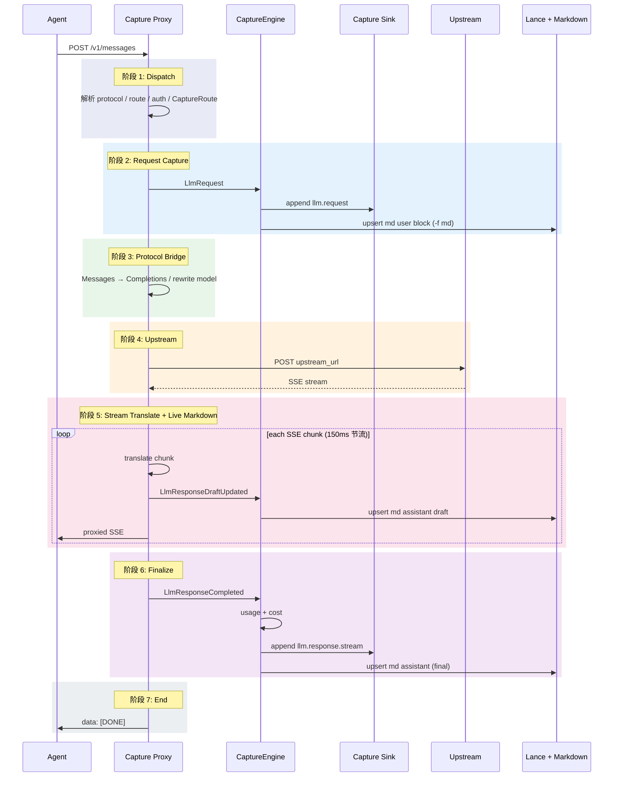
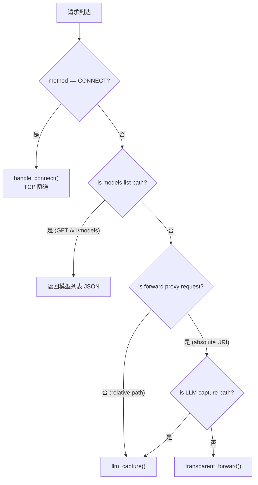
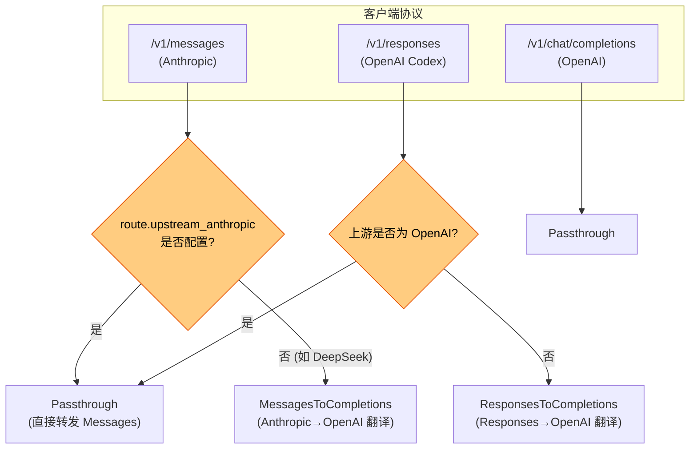
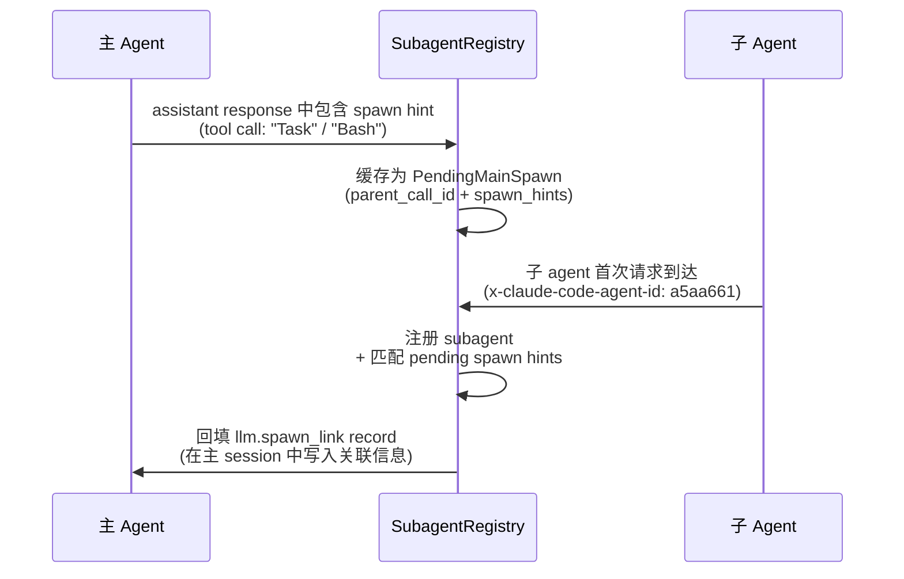

# LLM Capture 代理 — 完整架构设计

> **版本**：v0.1.1 &emsp;|&emsp; **最后更新**：2026-05-24

---

## 1. 概述

### 1.1 定位

Persisting Capture 是一个**嵌入式 LLM 反向代理 + 轨迹采集引擎**。它在 Agent（Claude Code / Cursor / 自研 Agent）与上游 LLM 提供商之间透明转发 HTTP 流量，同时将全部对话与工具调用上下文**实时捕获**为可读、可检索、可回放的轨迹。

```
Agent 进程                        上游 LLM
(Claude Code, etc)              (DeepSeek / OpenAI / Anthropic / ...)
      │                                    │
      │  POST /v1/messages                 │
      │  {"model":"claude-4",...}          │
      │                                    │
      ▼                                    │
┌──────────────────────────────────────────┐
│         Capture Proxy                    │
│                                          │
│  ┌──────────┐  ┌──────────┐  ┌────────┐ │
│  │ 路由匹配  │  │ 协议转换  │  │ 鉴权   │ │
│  └──────────┘  └──────────┘  └────────┘ │
│         │              │           │     │
│         ▼              ▼           ▼     │
│  ┌────────────────────────────────────┐  │
│  │         采集管线                    │  │
│  │  CaptureRecord → Sink → Storage    │  │
│  │  (Lance + Markdown + Index)        │  │
│  └────────────────────────────────────┘  │
└──────────────────────────────────────────┘
```

**核心价值**：Agent 只需将 `base_url` 指向 proxy，无需任何代码改动，即可获得完整的调用轨迹。

### 1.2 与其他组件的关系

| 组件 | 关系 |
|------|------|
| **agentgateway** | 借鉴了配置语义与路由模型，但不依赖其运行时 |
| **Persisting Engine** | Capture 产出的 `CaptureRecord` 最终进入 Engine 的 Lance 管线 |
| **Pulsing** | 无直接依赖；Capture 是独立的代理/采集子系统 |
| **Claude Code** | 主要支持的一等客户端，深度适配其 subagent / session 协议 |

---

## 2. 系统架构

### 2.1 分层架构

```mermaid
graph TD
    subgraph "入口层"
        A1["proxy/mod.rs<br/>HTTP Handler"]:::accent0
    end

    subgraph "路由 & 鉴权"
        A2["proxy/router.rs<br/>模型名匹配 & forward"]:::accent1
        A3["proxy/auth.rs<br/>API Key 注入"]:::accent1
        A4["proxy/http_headers.rs<br/>Hop-by-hop 过滤"]:::accent1
    end

    subgraph "协议转换"
        A5["conversion/mod.rs<br/>ProtocolBridge 决策"]:::accent2
        A6["conversion/messages_completions.rs<br/>Anthropic ↔ OpenAI 互转"]:::accent2
        A7["conversion/responses_completions.rs<br/>Responses ↔ Completions 互转"]:::accent2
        A8["conversion/stream.rs<br/>SSE 流式翻译 (→ Messages)"]:::accent2
        A9["conversion/responses_stream.rs<br/>SSE 流式翻译 (→ Responses)"]:::accent2
    end

    subgraph "采集 & 存储"
        A10["storage/sink.rs<br/>CaptureSink + Record 构造"]:::accent3
        A11["storage/record.rs<br/>CaptureRecord ↔ RON"]:::accent3
        A12["storage/markdown.rs<br/>TLV Markdown 解析/写入"]:::accent3
        A13["storage/lance_row.rs<br/>LanceEventRow 列存"]:::accent3
        A14["storage/convert.rs<br/>Lance ↔ Markdown 双向物化"]:::accent3
        A15["storage/dialogue.rs<br/>Record ↔ Block 转换 + 过滤"]:::accent3
    end

    subgraph "会话 & 生命周期"
        A16["session/call.rs<br/>CaptureCall 标识"]:::accent4
        A17["session/chain.rs<br/>Header → session_id"]:::accent4
        A18["session/index.rs<br/>SessionIndex 聚合"]:::accent4
        A19["storage/lifecycle.rs<br/>session.started/ended"]:::accent4
        A20["storage/session.rs<br/>CaptureRoute 路由"]:::accent4
    end

    subgraph "周边能力"
        A21["storage/subagent_link.rs<br/>子代理注册 & 链接回填"]:::accent5
        A22["session/peer_process.rs<br/>lsof 客户端检测"]:::accent5
        A23["usage.rs<br/>Token 提取 & 成本估算"]:::accent5
        A24["proxy/deepseek_reasoning.rs<br/>推理内容缓存"]:::accent5
        A25["runtime/debug.rs<br/>调试日志"]:::accent5
        A26["runtime/run_env.rs<br/>运行环境注入"]:::accent5
    end

    A1 --> A2
    A1 --> A3
    A1 --> A5
    A5 --> A6
    A5 --> A7
    A5 --> A8
    A5 --> A9
    A1 --> A10
    A10 --> A11
    A10 --> A12
    A10 --> A13
    A14 --> A11
    A14 --> A12
    A14 --> A13
    A10 --> A15
    A1 --> A16
    A1 --> A17
    A1 --> A18
    A1 --> A19
    A1 --> A20
    A1 --> A21
    A1 --> A22
    A1 --> A23
    A9 --> A24

    classDef accent0 fill:#e1bee7,stroke:#7b1fa2,color:#000
    classDef accent1 fill:#bbdefb,stroke:#1565c0,color:#000
    classDef accent2 fill:#c8e6c9,stroke:#2e7d32,color:#000
    classDef accent3 fill:#fff9c4,stroke:#f9a825,color:#000
    classDef accent4 fill:#ffccbc,stroke:#d84315,color:#000
    classDef accent5 fill:#d7ccc8,stroke:#4e342e,color:#000
```



### 2.2 模块职责矩阵

| 模块 | 核心职责 | 关键结构 |
|------|---------|---------|
| `proxy/mod.rs` | HTTP 调度、主 handler、流式处理 | `ProxyState`, `llm_capture()`, `streaming_llm_response()` |
| `proxy/router.rs` | 模型名匹配、forward 链、body 改写 | `ResolvedRoute`, `resolve_route()` |
| `proxy/auth.rs` | API key 解析、Bearer/x-api-key 注入 | `resolve_upstream_api_key()` |
| `proxy/forward.rs` | CONNECT 隧道、透明转发 | `handle_connect()` |
| `conversion/` | 协议检测与双向转换 | `ProtocolBridge`, `StreamTranslator` |
| `storage/sink.rs` | Record 构造工厂 | `llm_request_summary_record()` |
| `storage/record.rs` | 核心数据结构的序列化 | `CaptureRecord` |
| `storage/markdown.rs` | TLV block Markdown 读写 | `MarkdownBlock` |
| `storage/lance_row.rs` | Lance 列存行定义 | `LanceEventRow` |
| `storage/session.rs` | 会话路由决议 | `CaptureRoute` |
| `session/index.rs` | 内存 + JSON 文件索引 | `SessionIndex` |
| `storage/subagent_link.rs` | 子代理 spawn link 追踪 | `SubagentRegistry` |

---

## 3. 核心数据流

### 3.1 请求完整生命周期

一次 LLM 调用从进入到结束，经过七个阶段：



### 3.2 请求调度决策树



---

## 4. 路由系统

### 4.1 模型名匹配规则

```
请求 model = "claude-sonnet-4"
           │
           ├── models[].name 精确匹配 "claude-sonnet-4"  → 直接用其 upstream
           │
           ├── models[].name = "claude-*"  通配前缀       → 可用 forward 或自带 upstream
           ├── models[].name = "*sonnet-4" 通配后缀
           ├── models[].name = "*"         全匹配
           │
           └── 无匹配 → 502 Bad Gateway
```

**设计原则**：规则按数组顺序匹配，**第一个命中者胜出**。具体模型名应排在通配规则之前。

### 4.2 Forward 链

```yaml
models:
  - name: deepseek-chat
    upstream: "https://api.deepseek.com/v1"
    api_key_env: DEEPSEEK_API_KEY

  - name: "claude-*"
    forward: deepseek-chat   # 所有 claude-* 请求转发到 deepseek-chat 的上游
```

Forward 解析为 `ResolvedRoute`，其中：
- `client_model`: Agent 看到的原始模型名（如 `claude-sonnet-4`）
- `upstream_model`: 实际发送给上游的模型名（如 `deepseek-chat`）
- `model_rewritten`: 是否需要改写请求 body 中的 `model` 字段

**约束**：Forward 仅支持 **1 跳**，不允许 `A → B → C` 的链式转发。如果 forward 目标本身也配置了 `forward`，config validate 会报错。

### 4.3 上游 URL 拼接

`ModelRoute::resolve_upstream_url()` 处理了多种 API 前缀布局：

| 场景 | incoming path | upstream base | 最终 URL |
|------|-------------|---------------|---------|
| base 含 `/v1` | `/v1/chat/completions` | `https://api.openai.com/v1` | `https://api.openai.com/v1/chat/completions` |
| base 纯 host | `/v1/chat/completions` | `https://api.openai.com` | `https://api.openai.com/v1/chat/completions` |
| Anthropic 双端点 | `/v1/messages` | upstream_anthropic=`https://api.deepseek.com/anthropic/v1` | `https://api.deepseek.com/anthropic/v1/messages` |
| v1beta | `/v1beta/models/gemini-pro:generateContent` | `https://generativelanguage.googleapis.com/v1beta` | `https://generativelanguage.googleapis.com/v1beta/models/gemini-pro:generateContent` |

---

## 5. 协议转换

### 5.1 ProtocolBridge 决策矩阵



### 5.2 转换详表

| 转换方向 | 触发条件 | 请求转换 | 响应转换 | 流式翻译器 |
|---------|---------|---------|---------|-----------|
| **Messages → Completions** | upstream_anthropic 未配置 | `system` → system msg<br/>`content[]` → text<br/>移除 top_k/metadata/thinking/tool_choice/tools | `choices[0].message.content` → Anthropic content block | `CompletionsStreamTranslator` |
| **Responses → Completions** | 上游非 OpenAI | `instructions` → system msg<br/>`input[]` → messages<br/>注入 reasoning_content 缓存 | `choices[0].message` → Responses output | `CompletionsToResponsesStreamTranslator` |
| **Passthrough** | 上游支持该协议 | 无 | 无 | 无 |

### 5.3 流式翻译器设计

```rust
/// 流式翻译器的统一抽象
pub enum StreamTranslator {
    ToMessages(CompletionsStreamTranslator),       // OpenAI SSE → Anthropic SSE
    ToResponses(CompletionsToResponsesStreamTranslator), // OpenAI SSE → OpenAI Responses SSE
}

impl StreamTranslator {
    pub fn push_chunk(&mut self, chunk: &[u8]) -> Result<String>;  // 逐 chunk 翻译
    pub fn finish_stream(&mut self) -> Result<String>;             // 流结束，flush 尾部
    pub fn metrics(&self) -> &StreamMetrics;                       // TTFT + usage
    pub fn streaming_capture_snapshot(&self) -> Option<String>;    // 增量采集文本
    pub fn drain_reasoning_snapshot(&mut self) -> (Vec<String>, String); // 推理内容缓存
}
```

关键设计点：

1. **双缓存**：翻译器同时保留 `upstream_buf`（逐行解析用）和 `upstream_raw`（完整原始 SSE，用于采集回放）。
2. **TTFT 计时**：首个 delta 事件到达时记录 `Instant::now() - started`，无额外系统开销。
3. **增量 Snapshot**：`streaming_capture_snapshot()` 返回当前累积的 assistant 文本，在采集侧用于增量写入 Markdown。
4. **推理缓存**：DeepSeek v4 在 tool-call 响应中提供 `reasoning_content`，翻译器在流结束时将其存入 `ReasoningCache`，供后续请求回放。

---

## 6. 采集管线

### 6.1 捕获分级

```rust
pub enum CaptureLevel {
    Summary,   // 仅 model / path / byte counts / usage / cost
    Dialogue,  // + user_content / assistant_content 文本（默认）
    Full,      // + 完整 JSON body
}
```

| Level | 记录内容 | 适用场景 |
|-------|---------|---------|
| **Summary** | model, path, body_bytes, usage, estimated_cost_usd | 仅关心用量和成本的监控场景 |
| **Dialogue** (默认) | Summary + user_content, assistant_content | 绝大多数开发/调试场景 |
| **Full** | Dialogue + 完整请求/响应 body JSON | 需要精确回放的调试/测试场景 |

### 6.2 Record 类型

```rust
pub struct CaptureRecord {
    pub seq: u64,                  // session 内单调递增序号
    pub source: String,            // "persisting-proxy" | "persisting-capture"
    pub kind: String,              // "llm.request" | "llm.response" | "session.started" | ...
    pub timestamp: Option<String>,
    pub session_id: Option<String>,
    pub agent_id: Option<String>,
    pub trace_id: Option<String>,
    pub call_id: Option<String>,
    pub subagent_id: Option<String>,
    pub parent_agent_id: Option<String>,
    pub branch: Option<String>,
    pub parent_call_id: Option<String>,
    pub payload: serde_json::Value, // 自由格式 JSON
}
```

全部 record 类型：

| kind | 触发时机 | 关键 payload 字段 |
|------|---------|------------------|
| `llm.request` | 每个 LLM 请求到达 | model, path, body_bytes, protocol, provider, user_content, forward_to |
| `llm.response` | 非流式响应完成 | status, usage, estimated_cost_usd, assistant_content |
| `llm.response.stream` | 流式响应完成 | 同上 + ttft_ms, reasoning_tokens |
| `llm.spawn_link` | 子代理关联建立 | subagent_type, subagent_id, subagent_trajectory |
| `session.started` | proxy 启动 | mode, listen, command |
| `session.ended` | proxy 关闭 | reason, exit_code, duration_ms |
| `session.state` | 状态转换 | from, to, reason |

### 6.3 流式 Markdown：draft upsert + finalize rewrite

流式响应不再向 Lance 写入 partial 事件。Proxy 在 SSE 翻译过程中节流（**150ms**）发送 `LlmResponseDraftUpdated`，由 `CaptureEngine` **仅更新 Markdown**：

```
translator snapshot:  "你好"     →  "你好，我来帮"     →  "你好，我来帮你review代码"
                         │              │                        │
                         ▼              ▼                        ▼
md assistant block:  upsert        upsert (rewrite)         upsert (final, 覆盖 draft)
Lance:               (无)           (无)                     llm.response.stream ×1
```

**规则**：

- draft 块 header 带 `"draft": true`；finalize 后以完整 assistant 文本 rewrite，移除 draft 标记。
- upsert 匹配键为 **`call_id` + `role`**，user 块与 assistant 块互不覆盖。
- draft 的 header `seq` 通过 `sink.peek_next_seq()` 预填，与最终 Lance 行 seq 对齐。

旧版 `llm.response.stream.partial` + `trim_stream_partial_duplicate()` 已移除；replay 旧 Lance 行时 `skip_markdown_block` 仍会过滤 `stream_partial: true`。

### 6.4 CaptureEngine 与 CaptureSink

采集链路分为 **事件核心** 与 **持久化 sink** 两层：

```rust
/// 所有采集副作用的统一入口（proxy 侧）
pub enum CaptureEvent {
    LlmRequest(LlmRequestCaptured),
    LlmResponseCompleted(LlmResponseCompleted),
    LlmResponseDraftUpdated(LlmResponseDraftUpdated), // 仅 md，不写 Lance
}

pub struct CaptureEngine {
    sink: Arc<dyn CaptureSink>,
    stream_markdown: bool,   // capture -f md 时为 true
    md_lock: Arc<Mutex<()>>, // 串行化 live md upsert
    // index, subagent_registry, ...
}

pub trait CaptureSink: Send + Sync {
    fn append(&self, route: &CaptureRoute, agent_id: &str, record: CaptureRecord)
        -> Result<CaptureRecord>;  // 返回带 seq 的 stamped record
    fn peek_next_seq(&self, route: &CaptureRoute) -> u64;
}
```

**职责划分**：

| 组件 | 职责 |
|------|------|
| `CaptureEngine` | 处理 `CaptureEvent`；enrich / index / spawn_link；`-f md` 时 live upsert |
| `CallbackSink` | 按 `seq_key` 分配单调 seq，委托 CLI worker 批量写 Lance |
| `TrajectoryAppendWorker` | 缓冲 RON lines → Lance flush（**不写** live md；`stream_markdown=false`） |

Proxy 在 `serve_with_shutdown_and_ready(..., stream_markdown)` 中构造 `CaptureEngine::new(..., stream_markdown)`；`capture run -f md` 传 `true`，`-f bin` 传 `false`。

---

## 7. 存储模型

详见 [轨迹存储模型](trajectory_storage.zh.md)，此处仅列关键设计点。

### 7.1 三层存储

```
CaptureRecord
     │
     ├──→ sessions.json        ← SessionIndex: 快速 list / status 查询
     │
     ├──→ Lance Event Log      ← canonical: 全量无损事件，列存，按 session 分 dataset
     │
     └──→ TLV Markdown         ← materialized view: 人类可读的对话块，可选
```

### 7.2 目录布局

```
{storage_root}/
├── .capture/
│   ├── sessions.json           ← 全局会话索引
│   ├── debug.log               ← 可选调试日志
│   ├── run_session             ← capture run 的 run_id
│   ├── run_child.yaml          ← 子进程信息 (PID + 命令行)
│   └── daemon.env.json         ← daemon 环境快照 (API keys)
│
├── {agent_id}/                  ← 按 agent 分租户
│   ├── run-{timestamp}-{nanos}/ ← capture run 目录
│   │   ├── run-*.md             ← 主 agent Markdown (run bucket)
│   │   ├── agent-{id}.md        ← 子 agent Markdown
│   │   ├── .lance/              ← Lance dataset 存储
│   │   └── session-meta.yaml    ← 客户端进程元信息 (serve 模式)
│   │
│   └── {session_id}/            ← serve 模式平铺
│       ├── {session_id}.md
│       └── session-meta.yaml
```

### 7.3 Materialize 过滤规则

从 Lance materialize 到 Markdown 时，`storage/dialogue.rs` 的 `skip_markdown_block()` 会跳过以下内容：

| 跳过项 | 原因 |
|--------|------|
| `count_tokens` 探测请求 | 内部流量，非对话内容 |
| 无可见文本的空白 turn | 无信息量 |
| `session.started/ended/state` | 生命周期事件，不在对话中展示 |
| 主 session 的 flash/haiku 影子请求 | Claude Code 在 pro 之前发的预热探测，与 pro 内容重复 |
| 内部 suggestion 请求 | Claude Code 的内部优化流量 |

### 7.4 TLV Markdown 格式

```markdown
---
format: persisting-trajectory-v1
client:
  peer: "127.0.0.1:54321"
  command: "codex"
---

<!-- persisting:block:user {"type":"markdown","length":156,"role":"user","kind":"llm.request","seq":1,"turn":1,"call_id":"call-abc"} -->

帮我review下代码

<!-- persisting:block:assistant {"type":"markdown","length":2048,"role":"assistant","kind":"llm.response.stream","seq":2,"turn":1,"call_id":"call-abc"} -->

这段代码的整体结构...
```

See [轨迹 Markdown 格式](trajectory_tlv_format.zh.md) for the complete specification.

---

## 8. 会话路由 & 子代理隔离

### 8.1 CaptureRoute 决议

```rust
pub struct CaptureRoute {
    pub root_session: Option<String>,       // run 目录名 (capture run 模式)
    pub session_id: String,                 // 逻辑会话 ID (来自 header)
    pub storage_session_id: String,         // Lance dataset 名 / Markdown 文件名 stem
    pub subagent_id: Option<String>,        // Claude Code agent id
}
```

决议逻辑（`resolve_capture_route()`）：

```
1. 读取 storage/.capture/run_session → root_session
2. 从请求头提取 session_id (优先级: x-persisting-session-id > x-session-id > x-litellm-trace-id > x-*-session-id)
3. 从请求头提取 claude_agent_id (x-claude-code-agent-id)
4. 确定 storage_session_id:
   - capture run 模式 + 有 agent_id + 非 task notification → "agent-{id}"
   - capture run 模式 + 有 agent_id + 是 task notification → 主 session id (回到主 agent 文件)
   - capture run 模式 + 无 agent_id → 主 session id
   - serve 模式 → 从 header 提取或使用 run_id
```

### 8.2 子代理文件隔离

```
session "e96634a3-fa28-4083-b354-55542e2dca01"
    │
    ├── 主 agent (无 agent-id header)
    │   └── → {session_id}.md  (capture run 下用 run-*.md)
    │
    ├── 子 agent "a5aa661" (x-claude-code-agent-id: a5aa661)
    │   └── → agent-a5aa661.md  (独立文件)
    │
    └── 子 agent "b7bb772"
        └── → agent-b7bb772.md
```

**核心 invariant**：
- 子 agent 的 user/assistant/tool 块**仅**写入对应的 `agent-*.md`
- 主 agent 的对话与 `llm.spawn_link`**仅**写入 `run-*.md` 或 `{session_id}.md`
- 主文件通过 `llm.spawn_link` 引用子 agent 文件，**不内联**子 agent 全文

### 8.3 子代理关联追踪

`SubagentRegistry` 负责建立主 agent 的 spawn 调用与子 agent 轨迹之间的链接：



**延迟回填**：由于子 agent 注册可能晚于主 agent 的 assistant response，`PendingMainSpawn` 缓存未匹配的 spawn hints。当子 agent 到达时，调用 `apply_spawn_link_backfills()` 补写 `llm.spawn_link` record。

---

## 9. 鉴权模型

### 9.1 API Key 优先级链

```
1. YAML 明文 api_key           ← 最高优先级（仅开发环境）
2. YAML api_key_env + 环境变量  ← 推荐
3. 客户端请求头中的 key         ← 透传
4. 无     → 报错（如果配置了 api_key_env 但环境变量未设置）
```

### 9.2 认证格式选择

```rust
fn apply_upstream_headers(req, headers, route, protocol) {
    let anthropic_style = provider == Anthropic || protocol == Messages;

    if anthropic_style {
        req.header("x-api-key", key);    // Anthropic 风格
    } else {
        req.bearer_auth(key);           // OpenAI 风格
    }
}
```

### 9.3 环境变量别名

为避免用户配置复杂度，部分 API key 环境变量有自动别名：

| 主变量 | 别名 |
|--------|------|
| `DEEPSEEK_API_KEY` | `ANTHROPIC_AUTH_TOKEN`, `ANTHROPIC_API_KEY` |
| `ANTHROPIC_API_KEY` | `ANTHROPIC_AUTH_TOKEN`, `DEEPSEEK_API_KEY` |
| `ANTHROPIC_AUTH_TOKEN` | `ANTHROPIC_API_KEY`, `DEEPSEEK_API_KEY` |
| `OPENAI_API_KEY` | `ANTHROPIC_AUTH_TOKEN` |

---

## 10. 并发模型

### 10.1 请求处理模型

```
TcpListener (tokio)
     │
     ├── conn 1 → proxy_handler ──→ dispatch_impl ──→ llm_capture
     ├── conn 2 → proxy_handler ──→ dispatch_impl ──→ llm_capture
     └── conn N → proxy_handler ──→ dispatch_impl ──→ llm_capture
                                                        │
                                   streaming 路径 spawn bg task (tokio::spawn)
                                        │
                                        ├── upstream 消费 (reqwest stream)
                                        ├── SSE 翻译 (translator)
                                        ├── draft 事件 → CaptureEngine (md only)
                                        ├── 客户端转发 (unbounded_channel → Body::from_stream)
                                        └── finalize → CaptureEngine (Lance + md)
```

### 10.2 共享状态与锁

| 状态 | 并发原语 | 风险 |
|------|---------|------|
| `SessionIndex` | `RwLock<SessionIndex>` | 每次请求 flush → 争用写锁 |
| `SessionClientRegistry` | `Mutex<HashSet<String>>` | 低竞争（首次记录后跳过） |
| `SubagentRegistry` | `Mutex<SubagentRegistry>` | 所有并发的子代理注册都争用同一把锁 🔴 |
| `CaptureEngine.md_lock` | `Mutex<()>` | 串行化 live md upsert；与 bg streaming task 共享 |
| `ReasoningCache` | `Mutex<ReasoningCache>` | 低竞争（仅在流结束时写入） |
| `active_requests` | `AtomicUsize` | 无竞争 |
| `sink.next_seq` | `Mutex<HashMap<...>>` | 按 seq_key 分散，中低竞争 |

### 10.3 已知风险

| 问题 | 影响 | 建议 |
|------|------|------|
| 并发 in-flight 时 live md 可能缺 user 块 | md 与 Lance 短暂不一致 | run 结束 `trajectory materialize`；upsert 失败改为 retry / error |
| 流式转发使用 `unbounded_channel` | 客户端断开时内存泄漏 | 改用 `mpsc::channel(64)` + 背压 |
| `SessionIndex.flush()` 每次请求 | 高并发 I/O 风暴 | 改为定时批量 flush (每 5s / 每 100 请求) |
| `SubagentRegistry` 全局 Mutex | 多子代理并发时排队 | `DashMap<String, RunSubagents>` 按 run 分片 |
| `sessions.json` 无原子写入 | crash 可能损坏索引 | write-to-temp + rename |

---

## 11. 配置参考

### 11.1 完整配置模板

```yaml
# proxy.yaml
listen: "127.0.0.1:19080"          # LLM 代理监听地址
admin_listen: "127.0.0.1:9876"     # Admin API 监听地址
agent_id: "my-team"                # Agent 标识（租户隔离 key）
session_header: "x-persisting-session-id"  # 会话标识请求头
capture_level: dialogue            # summary | dialogue | full
debug: false                       # 开启调试日志

models:
  # 精确匹配：DeepSeek
  - name: deepseek-chat
    upstream: "https://api.deepseek.com/v1"
    api_key_env: DEEPSEEK_API_KEY
    provider: openai

  # 精确匹配：DeepSeek v4 Pro 推理模型
  - name: deepseek-v4-pro
    upstream: "https://api.deepseek.com/v1"
    api_key_env: DEEPSEEK_API_KEY

  # Anthropic 风格请求走 DeepSeek 的 Anthropic 兼容端点
  - name: "claude-*"
    upstream: "https://api.deepseek.com/v1"
    upstream_anthropic: "https://api.deepseek.com/anthropic/v1"
    api_key_env: DEEPSEEK_API_KEY
    provider: anthropic

  # Gemini（不常用，示例）
  - name: gemini-2.0-flash
    upstream: "https://generativelanguage.googleapis.com/v1beta"
    api_key_env: GEMINI_API_KEY
    provider: gemini

  # 兜底：全部未识别模型转发到 DeepSeek
  - name: "*"
    forward: deepseek-chat
```

### 11.2 环境变量注入

`capture run` 启动子进程时，自动注入以下环境变量：

| 变量 | 值 | 用途 |
|------|----|------|
| `HTTP_PROXY` | `http://{listen}` | 将子进程的 HTTP 流量路由到 proxy |
| `HTTPS_PROXY` | `http://{listen}` | 同上 |
| `PERSISTING_CAPTURE_SESSION_ID` | run_id | 子进程感知当前 session |
| 各 API Key 变量 | daemon.env.json 快照值 | 确保子进程可访问上游 |

---

## 12. 运行模式

| 模式 | 命令 | 生命周期 | 适用场景 |
|------|------|---------|---------|
| **capture run** | `persisting capture run -o ./store -- claude` | 代理随子进程启停 | 一次性 agent 任务，CLI 最简用法 |
| **capture serve** | `persisting capture serve -o ./store --config proxy.yaml` | 长期 daemon | 本地开发，多终端共享 |
| **capture start** | `persisting capture start -o ./store` | 后台 daemon | CI / 无人值守环境 |

---

## 13. Admin API

```bash
# 查看代理状态
curl http://127.0.0.1:9876/admin/status

# 响应
{
  "listen": "127.0.0.1:19080",
  "admin": "127.0.0.1:9876",
  "started_at": "2026-05-25T10:00:00Z",
  "active_requests": 3,
  "sessions": [
    {
      "agent_id": "my-team",
      "session_id": "e96634a3-...",
      "provider": "anthropic",
      "protocol": "messages",
      "model": "deepseek-chat",
      "request_count": 42,
      "usage": { "input_tokens": 12000, "output_tokens": 3400, ... },
      "estimated_cost_usd": 0.068,
      "active": true
    }
  ]
}

# 列出全部会话
curl http://127.0.0.1:9876/admin/sessions
```

---

## 14. 代码量分布

| 模块 | 行数 | 职责 |
|------|------|------|
| `proxy/mod.rs` | ~1215 | HTTP 调度、主 handler、流式处理 |
| `storage/dialogue_extract.rs` | ~1180 | SSE/JSON 内容提取与解析 |
| `storage/markdown.rs` | ~1113 | TLV Markdown 解析/写入/roundtrip |
| `storage/subagent_link.rs` | ~1040 | 子代理注册与 spawn link 回填 |
| `storage/dialogue.rs` | ~743 | Record ↔ Block 双向转换 |
| `config.rs` | ~280 | YAML 配置解析与验证 |
| `session/index.rs` | ~260 | 会话索引与发现 |
| `proxy/router.rs` | ~230 | 模型路由匹配 |
| `proxy/auth.rs` | ~200 | API Key 解析与注入 |
| 其余 | ~2000+ | conversion, usage, runtime, lifecycle 等 |

---

## 15. 技术债务与演进方向

| 优先级 | 问题 | 计划 |
|--------|------|------|
| 🔴 P0 | `unbounded_channel` 无背压 | 换 `mpsc::channel(64)` |
| 🔴 P0 | `SessionIndex` 每次请求 flush | 定时批量 flush |
| 🟠 P1 | `SubagentRegistry` 全局 Mutex | `DashMap` 按 run 分片 |
| 🟠 P1 | `proxy/mod.rs` 过大 | 拆为 `streaming.rs` + `finalize.rs` |
| 🟡 P2 | 成本估算硬编码 | 对接外部定价文件 |
| 🟡 P2 | 错误响应全 502 | 结构化 JSON + 细分 status |
| 🟢 P3 | 上游限流 | 添加并发连接数控制 |
| 🟢 P3 | WebSocket 拒绝 | 支持 Realtime API |

---

## 16. 相关文档

- [轨迹存储模型](trajectory_storage.zh.md) — Lance ↔ Markdown 双层存储详解
- [轨迹 Markdown 格式](trajectory_tlv_format.zh.md) — TLV block 完整规范
- [Capture 命令](cli_capture_command.zh.md) — CLI 用法参考
- [CLI 整体架构](cli_architecture.zh.md) — 命令行工具设计
