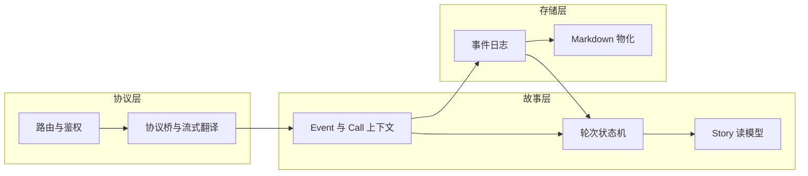
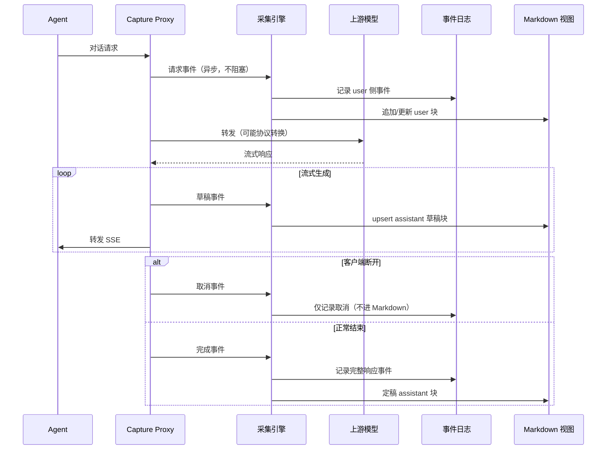

# Persisting Capture — 架构与设计

> **读者**：需要在 Agent 与 LLM 之间落地**可观测、可回放、可审计**轨迹的平台工程师、架构师与集成方。  
> **版本**：1.0（对外） &emsp;|&emsp; **最后更新**：2026-05-28

本文描述 **Persisting Capture** 的产品定位、核心概念与架构取舍。实现细节（块格式字段表、CLI 参数、目录布局）见文末延伸阅读；文中尽量避免绑定具体源码路径。

---

## 目录

1. [摘要](#1-摘要)
2. [问题与价值](#2-问题与价值)
3. [设计原则](#3-设计原则)
4. [核心概念](#4-核心概念)
5. [系统全景](#5-系统全景)
6. [数据流：从 HTTP 到轨迹](#6-数据流从-http-到轨迹)
7. [存储与一致性](#7-存储与一致性)
8. [网关与协议](#8-网关与协议)
9. [多 Agent 与会话](#9-多-agent-与会话)
10. [可靠性与运行形态](#10-可靠性与运行形态)
11. [演进方向](#11-演进方向)
12. [延伸阅读](#12-延伸阅读)

---

## 1. 摘要

**Persisting Capture 是 coding agents 的轨迹层**：让 **Claude Code** 或 **OpenAI Codex** 通过本地代理运行，即可得到持久化事件日志、人类可读的 Markdown 轨迹，以及运行结束时的 consistency report。

它是一个可嵌入的 **LLM 反向代理 + 轨迹采集引擎**。在已支持的客户端上，只需通过 `capture run` 注入代理或显式将 API 指到 Capture，即可在**不修改业务代码**的前提下：

- 透明转发对话流量到上游模型；
- 将对话与调用上下文沉淀为**机器可读**的事件日志与**人类可读**的 Markdown 轨迹；
- 在运行结束或运维流程中，对「事件日志 / 对话视图 / 叙事模型」做**三轨对账**，发现物化偏差。

Capture 不是通用 API 网关的替代品，而是围绕 **Agent 轨迹（trajectory）** 设计的观测与存储子系统；路由与协议转换能力服务于「采得全、看得懂、对得上」。

---

## 2. 问题与价值

### 2.1 典型痛点

| 痛点 | Capture 的回应 |
|------|----------------|
| Agent 对话散落在各厂商 API 形态中，难以统一分析 | 归一为统一事件记录，再物化为对话视图 |
| 只要日志不要改代码 | 反向代理 + 环境注入（`capture run`） |
| 需要给人 review 的会话稿 | TLV Markdown：正文可读，元数据在注释中 |
| 流式输出想「边生成边看见」 | Live Markdown upsert（草稿块 → 定稿块） |
| 子 Agent、多 session 易混 | 按故事线分文件 + spawn 关联，不内联全文 |
| 采集不能拖慢 LLM 首 token | **观测不阻断**：采集异步化，失败进 dead letter |

### 2.2 客户端支持（实时采集）

| 客户端 | `capture run` 实时采集 | 说明 |
|--------|:----------------------:|------|
| **Claude Code** | ✅ | 主适配目标：Anthropic Messages、subagent 分轨、history replay 去重 |
| **OpenAI Codex** | ✅ | Responses API 路径；通过 `-c openai_base_url=…` 等注入网关 |
| **Cursor** | ❌ | **当前版本不支持**（无官方注入与流量适配） |
| **自研 / 通用 OpenAI SDK** | ⚠️ | 若客户端走 `HTTP_PROXY` 或 `OPENAI_BASE_URL` / `ANTHROPIC_BASE_URL`，可尝试接入，无专项保证 |

事后从 IDE 本地 JSONL **import** 的路径以 CLI 文档为准；Cursor 本地日志导入亦在规划中，与上表「实时采集」无关。

### 2.3 能力边界

**擅长**

- 单次或长期 `capture run` / `capture serve` 下，对 **Claude Code / Codex** 的对话采集；
- Claude Code 场景的 history replay 去重、subagent 分轨；
- Codex 场景的 Responses ↔ Completions 桥接与上下文注入过滤；
- Lance 全量事件 + Markdown 物化视图的双层存储；
- 轻量模型路由、协议桥接（Messages / Completions / Responses 等）。

**不替代**

- 多租户计费、复杂 RBAC、MCP/A2A 联邦等企业网关（可参考 [agentgateway](https://github.com/agentgateway/agentgateway) 类方案）；
- 100+ 厂商的一站式 SDK（可参考 LiteLLM 类方案）；
- 终端命令输出的 token 压缩（与 [RTK](https://github.com/rtk-ai/rtk) 等工具互补）。

### 2.4 在 Persisting 生态中的位置

```text
Agent 客户端
      │
      ▼
┌─────────────────────────────────────┐
│  Persisting Capture（本文）          │  ← 代理 + 采集 + 物化
│  · 事件日志（Lance）                 │
│  · 人读轨迹（Markdown）              │
└──────────────┬──────────────────────┘
               │ CaptureRecord / 轨迹文件
               ▼
┌─────────────────────────────────────┐
│  Persisting Engine / 分析 / 检索     │  ← 消费 canonical 数据
└─────────────────────────────────────┘

运行时编排可依托 Pulsing Actor（每故事线串行处理），与分布式 Actor 集群解耦部署。
```

---

## 3. 设计原则

| 原则 | 含义 |
|------|------|
| **观测不阻断** | 用户请求的延迟与成功率优先；采集失败写入 dead letter，**不**因写盘失败而中断 HTTP 响应。 |
| **Story 边界** | 协议差异在「进入故事模型」之前消化；故事层只谈谁、第几轮、哪次调用、发生了什么。 |
| **Lance 为事实源** | 全量事件以结构化记录 append；Markdown 是**物化视图**，允许有损过滤。 |
| **写读对称** | 在线维护的「轮次 / 调用」读模型，与离线从事件日志重放的结果一致（通过对账与测试保证）。 |
| **单一可见文本语义** | 用户/助手可见正文只有一套提取规则，供轮次索引、Markdown 正文、过滤策略共用。 |
| **单一写入门** | 每条进入 Lance 的会话事件，经统一的故事线 Actor 路径落盘，避免双写竞态。 |

---

## 4. 核心概念

### 4.1 叙事层级

Capture 用一套与具体 HTTP API **无关**的故事词汇描述 Agent 行为：

```text
Run（一次采集工作区 / 根会话）
 └── Story（一条独立故事线 ≈ 一个会话文件 + 一份事件数据集）
      └── Turn（语义轮次：用户意图 → 助手回应）
           └── Call（单次 LLM HTTP 往返）
                └── Phase（请求 / 流式草稿 / 完成 / 取消）
```

| 概念 | 说明 |
|------|------|
| **Run** | 一次 `capture run` 或逻辑上的根工作区；子 Agent 注册与对账的边界。 |
| **Story** | 主 Agent 或某个 subagent 的独立轨迹线（例如 `run-*.md` 与 `agent-*.md`）。 |
| **Turn** | Story 内的语义轮；区分「对话轮」与「无 opening user 的自主段」（工具循环等）。 |
| **Call** | 一次模型调用，由 `call_id` 等标识关联请求与响应。 |
| **Event** | 写路径上的采集单元：请求到达、流式草稿、响应完成、客户端取消等。 |

早期设计中的「Beat / Invocation」等概念已收敛为上述层级，避免与存储记录类型混淆。

### 4.2 三层词汇表

为避免「协议字段」污染「故事语义」和「存储行格式」，系统刻意划分三层：

```text
┌─────────────────────────────────────────────────────────────┐
│  协议层：HTTP、SSE、OpenAI/Anthropic/Responses 形态          │
│  职责：转发、翻译、提取可见正文与 usage                        │
└───────────────────────────┬─────────────────────────────────┘
                            │ Ingress
                            ▼
┌─────────────────────────────────────────────────────────────┐
│  故事层：Run / Story / Turn / Call / Event                   │
│  职责：编排「发生了什么」、维护轮次与调用关系                  │
└───────────────────────────┬─────────────────────────────────┘
                            │ 持久化
                            ▼
┌─────────────────────────────────────────────────────────────┐
│  存储层：CaptureRecord（事件） + MarkdownBlock（物化块）     │
│  职责：append-only 事实日志 + 人读视图                        │
└─────────────────────────────────────────────────────────────┘
                            │ Egress
                            ▼
              快照、materialize、对账、导出、下游检索
```

**Ingress**：协议层输出「故事层事件 + 上下文」，不再向下游泄漏 `messages`/`completions` 原生结构。  
**Egress**：从事件日志重放故事、生成 Markdown、或导出给外部系统；协议回归测试与采集主路径分离。



### 4.3 写模型与读模型

| | 写模型 | 读模型 |
|---|--------|--------|
| **是什么** | 追加式**事件记录**（canonical） | **Story**：轮次、调用阶段、关联关系 |
| **谁维护** | 采集引擎在 apply 路径写入 | 轮次状态机在线观察 + 离线重放 |
| **用途** | 审计、replay、检索、对账 | 摘要、frontmatter、运维快照 |
| **对外暴露** | 文件与 Engine 消费 | 运行时查询快照；进程退出时写入故事快照文件 |

读模型中的父子 Story 链接、调用元数据（模型名、协议类型）等字段在 schema 上已预留，部分仍在与 spawn 链路对齐中完善。

---

## 5. 系统全景

### 5.1 逻辑组件

```text
                    ┌──────────────┐
                    │ Agent 进程    │
                    └──────┬───────┘
                           │ HTTP(S)
                           ▼
              ┌────────────────────────┐
              │   Capture Proxy        │
              │   · 路由 / 鉴权        │
              │   · 协议桥 / 流式转发   │
              │   · 触发采集事件        │
              └───────────┬────────────┘
                          │
          ┌───────────────┼───────────────┐
          ▼               ▼               ▼
   ┌────────────┐  ┌────────────┐  ┌────────────┐
   │ 采集引擎    │  │ 上游 LLM    │  │ 会话索引    │
   │ WAL·队列   │  │            │  │ (列表/用量) │
   │ 故事 Actor │  └────────────┘  └────────────┘
   └──────┬─────┘
          │
    ┌─────┴─────┐
    ▼           ▼
 Lance       Markdown
 (事件日志)   (物化视图)
```

| 组件 | 职责 |
|------|------|
| **Proxy** | 唯一 HTTP 入口；在转发前后发射采集事件；流式场景下节流草稿事件。 |
| **采集引擎** | 将事件转为记录；按故事线串行 apply；协调 Lance 与 Markdown 写入。 |
| **Run 协调** | 跨故事线的 spawn 关联、主从路由、记录 enrichment。 |
| **故事线处理** | 每 Story 一个串行执行体：轮次状态、Lance 序号、Live Markdown、摘要刷新。 |
| **会话索引** | 轻量 `sessions.json`：列表、token、费用估算、状态；批量刷盘。 |
| **对账与 dead letter** | 运行结束三轨校验；失败事件可重放。 |

### 5.2 集成方式（概念）

- **库嵌入**：Rust 工程可挂载 Proxy 与 `CaptureEngine`，自行提供存储 sink（默认对接 Lance 管线）。
- **CLI**：`persisting capture run` 包装子进程；`persisting capture serve` 长期监听。
- **配置**：TOML 声明监听地址、模型路由、采集级别、存储根目录；无需改 Agent 源码。

公开 API 以**模块边界**发布（代理、引擎、记录、轨迹、会话），避免扁平导出 hundreds 个符号；故事读模型主要通过快照与对账产物对外可见。

### 5.3 与 agentgateway 的关系

Capture 在**配置语义与路由模型**上借鉴 agentgateway 子集，并可用其 fixture 做协议回归；**运行时互不依赖**。定位差异：agentgateway 面向集群级多协议网关；Capture 面向**单点嵌入的轨迹事实源**。

---

## 6. 数据流：从 HTTP 到轨迹

### 6.1 一次对话请求（概念时序）



要点：

1. **Proxy 不等待**整段采集完成再响应；事件先入 WAL，再进入 per-story 有序队列。
2. **草稿只更新 Markdown**；完整响应以**一条**事件进入 Lance，避免 partial 行污染事实源。
3. 慢客户端通过有界队列对上游施加背压，避免无限缓冲。

### 6.2 采集事件与记录类型

写路径用少量**事件种类**驱动一切持久化：

| 事件 | 典型效果（Dialogue 级别） |
|------|---------------------------|
| 请求到达 | Lance：请求记录；Markdown：user 块 |
| 流式草稿 | 仅 Markdown：assistant 草稿（可原地覆盖） |
| 响应完成 | Lance：流式/完整响应记录；Markdown：定稿 assistant |
| 调用取消 | 仅 Lance：取消记录 |
| Spawn 关联 | Lance + Markdown：关联元数据（不当作可跳过噪音） |

**采集级别**（Summary / Dialogue / Full）控制记录粒度；生产默认 Dialogue：保留可见对话，省略无关探测流量。

存储记录类型（`llm.request`、`llm.response.stream`、`llm.spawn_link`、`session.*` 等）属于**存储层词汇**，由故事层事件推导，不必与 HTTP 一一对应。

### 6.3 流式与人读视图

```text
助手输出:  "你" → "你好" → "你好，我来帮你…"
Markdown:   [草稿] → [覆盖草稿] → [定稿]
Lance:      —      —              一条最终响应事件
```

- 草稿块带明确标记；定稿时按 **call + 角色** 覆盖同一块，避免重复段落。
- 块头 schema 带版本号（`v: 1`），便于将来演进线格式而不改文件后缀。

详见 [轨迹 Markdown 格式](trajectory_tlv_format.zh.md)。

---

## 7. 存储与一致性

> 双层存储、目录约定、materialize/import 路径见 [轨迹存储模型](trajectory_storage.zh.md)。

### 7.1 双层存储

| | Lance（事实源） | Markdown（物化视图） |
|---|----------------|----------------------|
| **读者** | 程序、检索、replay | 人、git、review |
| **完整性** | 无损（在采集级别内） | 有损：过滤内部与重复 history |
| **写入** | append | live upsert 或批量 append / 全量 materialize |
| **关系** | 行数 ≥ 块数（物化只减不增） | 从 Lance 重建可修复漂移 |

### 7.2 物化过滤（统一策略）

无论实时写入还是事后 materialize，**同一套规则**决定某条事件是否出现在 Markdown 中，例如：

- 内部 `count_tokens`、影子模型预热；
- Claude Code 式 **history replay**（用户消息计数未增加的重发）；
- 无可见正文的空记录；
- 纯生命周期、仅-cancel 类记录（保留在 Lance）。

Spawn 关联等「对人仍有意义」的事件**不会**被误杀。

### 7.3 会话摘要（Frontmatter）

每个 Markdown 会话文件可带 YAML 摘要：`turns`、token、估算费用、子 Agent 列表、客户端信息等。  
**轮次数以故事读模型为准**，块内 `turn` 字段仅作展示启发式，不作为权威计数。

### 7.4 三轨对账（Reconcile）

一次 Run 正常结束时，对每个 session 比对：

| 轨道 | 含义 |
|------|------|
| **Markdown** | 物化块中的 call 集合 |
| **Lance** | 事件日志中应对话出现的 call 集合 |
| **Story** | 从事件重放得到的 call 集合 |

三者一致且结构检查通过，才认为「人读视图与事实源对齐」。不一致时应用 materialize 或排查 dead letter，而非直接信任 Markdown。

### 7.5 辅助产物

| 产物 | 作用 |
|------|------|
| 事件 WAL | 进程崩溃后重放未确认的采集事件 |
| dead letter | 应用失败或 Lance 刷盘失败的留存与重放 |
| 故事快照 | 退出时固化各 Story 的轮次读模型，供摘要与恢复 |

---

## 8. 网关与协议

Capture 内置**轻量 LLM 网关**，服务于「本地或团队固定上游 + 采集」，而非替代云厂商控制台。

| 能力 | 说明 |
|------|------|
| **模型路由** | 按配置顺序匹配模型名；支持前缀/通配与单跳 forward。 |
| **协议桥** | 例如 Anthropic Messages ↔ OpenAI Completions；Responses API 在非 OpenAI 上游时降级转换。 |
| **流式翻译** | 统一 SSE 形态；支持 TTFT 观测、推理字段缓存回放。 |
| **鉴权** | 配置文件、环境变量或客户端 Header 注入 API Key；按提供商约定选择 Header 名。 |

网关逻辑严格停留在**协议层**，不进入故事层状态机，避免「路由规则」与「轮次语义」耦合。

---

## 9. 多 Agent 与会话

### 9.1 路由与存储键

每个 HTTP 请求绑定一条**采集路由**：逻辑 session、磁盘上的 storage 键（决定 `.md` 文件名与 Lance 数据集）、可选 subagent 标识。  
Capture run 下，子 Agent 通常写入 `agent-{id}.md`；主会话写入 `run-{id}.md` 或扁平 session 名。

### 9.2 文件隔离不变式

- 子 Agent 正文只出现在 **agent-*** 文件；
- 主 Agent 的 spawn 引用与链接出现在 **run-*** 文件，**不内联**子 Agent 全文；
- 块头 JSON 承载机器可读关联；正文脚注仅辅助人读（解析 roundtrip 时会剥离脚注行）。

### 9.3 Spawn 关联

主 Agent 助手消息中的 spawn 提示与子 Agent 首包注册可能**时间错开**。系统用 Run 级注册表做延迟匹配与回填，使主会话在事后仍能看到「调用了哪个子 Agent、轨迹文件在哪」。

---

## 10. 可靠性与运行形态

### 10.1 可靠性模型

```text
请求线程 ──► 发事件（写 WAL + 入队）──► 立即继续转发
                    │
                    └──► 后台：有序 apply ──► Lance / Markdown
                              │
                              ├─ 成功 → 确认 WAL
                              └─ 失败 → dead letter（不影响 HTTP）
```

| 机制 | 目的 |
|------|------|
| **异步 apply** | 采集不占用上游连接线程 |
| **Per-story 有序队列** | 同一故事线内事件顺序可复现 |
| **事件 WAL** | 崩溃后至少一次投递到 apply |
| **Barrier flush** | 优雅退出前排空队列与 Actor 邮箱 |
| **Dead letter** | 可运维重放，而非静默丢数 |

已知限制（实现仍在加强）：极端崩溃场景下 WAL 序号与重复投递策略、超长会话 Markdown 全文件 upsert 的 IO 成本等——见 [§11 演进方向](#11-演进方向)。

### 10.2 运行形态

| 形态 | 适用场景 |
|------|----------|
| **`capture run`** | 包装一次 Agent 命令（如 `claude`、`codex`）；注入代理环境变量；结束打印会话摘要 |
| **`capture serve`** | 长期 daemon；已支持客户端指向固定 `listen` |
| **仅 Lance / 补 Markdown** | `-f bin` 先落盘，事后 `trajectory materialize` |
| **Dead letter 重放** | 修复存储或配置后补写失败事件 |

配置示例（节选）：

```toml
listen = "127.0.0.1:19080"
admin_listen = "127.0.0.1:9876"
agent_id = "my-team"
capture_level = "dialogue"

[[models]]
name = "deepseek-chat"
upstream = "https://api.deepseek.com/v1"
api_key_env = "DEEPSEEK_API_KEY"
```

管理端口提供健康与会话列表查询（用量、模型、活跃请求数），便于 sidecar 监控。

---

## 11. 演进方向

下列为产品级方向，**非**承诺排期：

| 方向 | 动机 |
|------|------|
| **Cursor 实时采集与 import** | 与 Claude Code 对等的注入与 JSONL 导入 |
| Lance 按时间/规模分桶 | 控制 per-session 数据集膨胀 |
| WAL 与序号恢复增强 | 降低 crash 后重复 apply 与 seq 冲突风险 |
| Markdown 追加日志 + 周期性 compact | 长会话 live upsert 的 IO 与 git diff 友好性 |
| 外部定价表 | 摘要费用估算可配置 |
| 故事读模型 enrich | 父子 Story、调用元数据与 spawn 完全闭环 |
| Lance 列布局优化 | 更好利用列存检索，而非大 blob |
| 协议面收敛 | 随行业 API 稳定，收缩长期维护的转换矩阵 |

块格式已通过 `v: 1` 预留兼容；详见 [轨迹 Markdown 格式 §2.6](trajectory_tlv_format.zh.md#26-大文件-upsert演进格式不变)。

---

## 12. 延伸阅读

| 文档 | 内容 |
|------|------|
| [轨迹存储模型](trajectory_storage.zh.md) | Lance ↔ Markdown 数据流、materialize、import |
| [轨迹 Markdown 格式](trajectory_tlv_format.zh.md) | 块结构、字段规范、subagent 脚注、golden 示例 |
| [Capture 命令](cli_capture_command.zh.md) | `capture run` / `serve` 参数与操作 |
| [Trajectory / `traj` 命令](cli_trajectory_command.zh.md) | Capture 离线 Egress：add、truncate、stats、replay、extract、materialize |
| [CLI 整体架构](cli_architecture.zh.md) | Persisting 命令行体系 |

**示例轨迹文件**（由编码器生成的 golden，可供格式对照）：

- [`examples/trajectory-tlv/demo-agent/demo-run-001/0001.md`](../../examples/trajectory-tlv/demo-agent/demo-run-001/0001.md)

---

*本文随 Capture 发布版本更新；若行为与文档不一致，以仓库内测试与 golden fixture 为准。*
