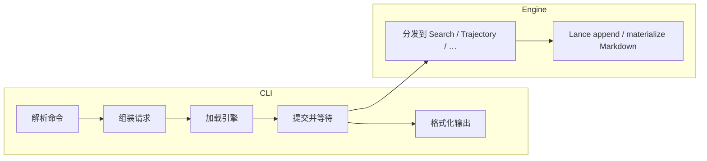

# CLI 整体架构

`persisting` 是面向用户的统一入口。它把单次执行和持久环境交给 pVisor，把批量编排和
SQL 查询交给 pPilot，并直接提供历史维护、评测、搜索和 Gateway 管理。pChronicle 是
底层存储与查询库，不提供独立命令行。

`pvisor` 和 `ppilot` 二进制仍保留为组件级、专家级入口，方便独立部署和调试；日常使用
不需要记住它们。

| 统一命令 | 实现边界 |
|----------|----------|
| `persisting execute`（别名 `exec`） | 转发到 `pvisor run`，创建一次性 Run |
| `persisting env …` | 转发到 `pvisor env …`，管理可复用的持久 OverlayFS 环境 |
| `persisting batch …` | 转发到 `ppilot run …`，批量编排 Run |
| `persisting query …` | 转发到 `ppilot query …`，以 DataFusion SQL 查询 Lance/ATIF |
| `persisting history …` | 导入、追加、转换、回放、统计和物化轨迹 |
| `persisting eval …` | judge 与评测统计 |
| `persisting search …` | Search 数据与索引 |
| `persisting gateway …` | 长期 Gateway 服务和状态管理 |

轨迹能力分别由 `history`、`eval` 和 `gateway` 提供，不再保留第二套轨迹命令树。

```text
persisting
├── execute
├── env
│   ├── create / start / stop / exec / shell
│   └── list / status / inspect / apply / drop / delete
├── batch
├── query
├── history
├── eval
├── search
└── gateway
```
查询实现和物理格式仍归 pChronicle 所有，pPilot 只拥有用户交互。

---

## 1. 核心思想

| 原则 | 说明 |
|------|------|
| **组件化 CLI** | `persisting`、`pvisor`、`ppilot` 作为匹配的组件集安装；统一入口按职责转发 |
| **动态引擎** | Search 等旧引擎请求仍通过窄 ABI 惰性加载；pChronicle 历史格式由 CLI 直接链接 |
| **版本门禁** | 加载时校验 ABI 版本，不兼容则拒绝执行 |
| **异步任务** | 一次用户操作对应一个引擎 job，可报告进度 |
| **文本协议** | CLI 与引擎之间用结构化文本（RON）交换请求与响应 |

```
用户命令
    │
    ▼
CLI（解析 · 组件转发 · 历史格式 · 展示结果）
    ├── pvisor（Run / Env）
    ├── ppilot（Batch / Query）
    └── 动态加载 · 窄 ABI · 异步 job
        ▼
      引擎（Search 等旧引擎请求）
    │
    ▼
持久化存储
```

---

## 2. 引擎发现

引擎库按优先级定位：

1. 命令行显式指定路径
2. 环境变量
3. 与 CLI 可执行文件同目录

**惰性加载**：仅在首次需要调用引擎时才加载，避免参数错误也触发重量级初始化。

---

## 3. 一次调用的生命周期

```
提交请求 → 排队/运行（可轮询进度）→ 取回结果 → 释放资源
```

- **提交**与**取结果**分离：提交只拿到任务句柄，结果通过后续步骤获取。
- **轮询**可选：长任务（大批量导入、索引构建）可反馈进度百分比。
- **释放**幂等：异常或提前退出时可安全清理。

Python API **不经过**此路径——它直接绑定 Python 扩展，适合嵌入式与交互式场景。
CLI 通过 `just install-cli` 安装匹配的三个二进制和引擎库，避免只安装统一入口却在运行时缺少组件。

---

## 4. 协议与版本

CLI 与引擎通过**带版本号的信封**交换消息：请求携带协议版本，引擎校验后 dispatch 到对应能力（Search、Trajectory 等）。

两层版本独立维护：

| 层次 | 何时递增 |
|------|----------|
| **ABI** | 动态库接口、job 状态布局、信封格式不兼容 |
| **协议** | 请求/响应消息字段或语义变化 |

CLI 在加载时校验 ABI；协议版本由请求携带、引擎侧校验。

---

## 5. 子命令与引擎能力

概念映射（非 exhaustive）：

| 用户意图 | CLI | 引擎能力 |
|----------|-----|----------|
| 导入文档、建索引、检索 | `search` | Search |
| 随 Run 实时采集 LLM 流量 | `persisting execute` | pVisor + Gateway sink + pChronicle |
| 独立代理采集 LLM 流量 | `persisting gateway serve` | Gateway sink + pChronicle |
| 追加 / 回放 / 统计 / 物化轨迹 | `persisting history add` / `replay` / `stats` / `materialize` / … | Trajectory |
| 事后导入 IDE 或网关日志 | `persisting history import` | Trajectory（CLI 侧归一化） |
| Lance/ATIF SQL 分析 | `persisting query` | pPilot + pChronicle DataFusion |

部分纯本地操作（如格式转换）可由 CLI 侧直接完成；索引文件重排等数据操作仍经过引擎。

---

## 6. 输出约定

- **成功**：结构化结果写入 stdout；轨迹类命令默认 **TOML** 便于脚本解析。
- **失败**：错误信息写入 stderr，非零退出码。

---

## 7. 数据流概览



轨迹存储模型见 [轨迹存储](trajectory.md)。

---

## 8. 相关文档

- [`persisting search`](cli-search.md)
- [`persisting history` / `eval` / `gateway`](cli-history.md) — 轨迹数据、评测与代理入口
- [`persisting execute` / `env`](cli-pvisor.md) — 单 Run 执行与环境管理
- [`persisting batch` / `query`](cli-ppilot.md) — 批量编排与 SQL 分析
