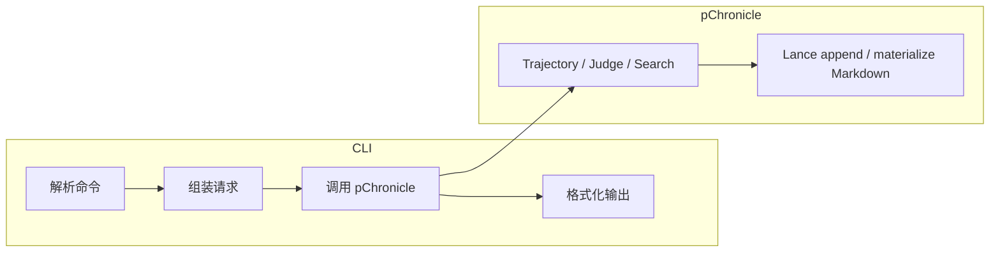

# CLI 整体架构

`persisting` 是 Agent 执行面的统一入口：它把单次执行和持久环境交给 pVisor，把批量编排
交给 pPilot。`pchronicle` 是轨迹数据层的独立入口，负责 Dataset 浏览、查询、导入导出和
只读服务；旧 `persisting history/query` 与 `ppilot query/chronicle` 在迁移期转发。

`pchronicle`、`pvisor` 和 `ppilot` 都是可独立部署和调试的组件级入口。

| 统一命令 | 实现边界 |
|----------|----------|
| `persisting execute`（别名 `exec`） | 转发到 `pvisor run`，创建一次性 Run |
| `persisting env …` | 转发到 `pvisor env …`，管理可复用的持久 OverlayFS 环境 |
| `persisting batch …` | 转发到 `ppilot run …`，批量编排 Run |
| `persisting query …` | 迁移期转发；Dataset SQL 与点查最终归 `pchronicle` |
| `persisting history …` | 迁移期转发；导入导出和维护最终归 `pchronicle` |
| `persisting eval …` | judge 与评测统计 |
| `persisting gateway …` | 长期 Gateway 服务和状态管理 |

目标命令树见 [pChronicle 产品架构设计](pchronicle-product.md)。迁移完成后不永久保留两套
轨迹命令树。

```text
persisting
├── execute
├── env
│   ├── create / start / stop / exec / shell
│   └── list / status / inspect / apply / drop / delete
├── batch
├── query
├── history
├── eval
└── gateway
```
查询实现、用户交互和物理格式均归 pChronicle；pPilot 只拥有批量编排与分布式处理。

---

## 1. 核心思想

| 原则 | 说明 |
|------|------|
| **组件化 CLI** | `persisting`、`pchronicle`、`pvisor`、`ppilot` 作为匹配的组件集安装；统一入口按职责转发 |
| **领域直调** | `pchronicle` 在进程内调用 pChronicle 的强类型 Rust API |
| **单一所有权** | 轨迹格式、存储、评测和 Search 全部归 pChronicle |
| **边界转发** | Run/Env 转发 pVisor，Batch 转发 pPilot；旧轨迹入口迁移到 pChronicle |

```
用户命令
    │
    ▼
CLI（解析 · 组件转发 · 历史格式 · 展示结果）
    ├── pvisor（Run / Env）
    ├── ppilot（Batch / Process）
    └── pchronicle（Dataset / Query / Exchange / Serve）
    │
    ▼
持久化存储
```

---

## 2. 调用边界

CLI 与 pChronicle 在同一 Rust 进程内通过强类型 request/response 值调用。
不存在动态库发现、C ABI、job handle 或 RON/bincode 信封。

---

## 3. 一次调用的生命周期

```
解析参数 → 组装 pChronicle 请求值 → 执行领域操作 → 格式化输出
```

错误以 `anyhow::Error` 直接返回 CLI，不再经过传输层错误码二次映射。
Python Search API 通过 PyO3 调用同一 pChronicle 实现。

---

## 4. API 兼容性

pChronicle 的 Rust 类型是编译时边界；不兼容变更由 workspace 统一编译捕获。
持久化格式仍通过各自的 schema version 管理，不与进程内 API 版本混用。

---

## 5. 子命令与领域能力

概念映射（非 exhaustive）：

| 用户意图 | CLI | 实现边界 |
|----------|-----|----------|
| 随 Run 实时采集 LLM 流量 | `persisting execute` | pVisor + Gateway sink + pChronicle |
| 独立代理采集 LLM 流量 | `persisting gateway serve` | Gateway sink + pChronicle |
| 追加 / 回放 / 统计 / 物化轨迹 | `persisting history add` / `replay` / `stats` / `materialize` / … | Trajectory |
| 事后导入 IDE 或网关日志 | `persisting history import` | Trajectory（CLI 侧归一化） |
| Lance/ATIF SQL 分析 | `persisting query` | pPilot + pChronicle DataFusion |

轨迹数据操作和格式转换都使用 pChronicle 的类型与 service。

---

## 6. 输出约定

- **成功**：结构化结果写入 stdout；轨迹类命令默认 **TOML** 便于脚本解析。
- **失败**：错误信息写入 stderr，非零退出码。

---

## 7. 数据流概览



轨迹存储模型见 [轨迹存储](trajectory.md)。

---

## 8. 相关文档

- [`persisting history` / `eval` / `gateway`](cli-history.md) — 轨迹数据、评测与代理入口
- [`persisting execute` / `env`](cli-pvisor.md) — 单 Run 执行与环境管理
- [`persisting batch` / `query`](cli-ppilot.md) — 批量编排与 SQL 分析
