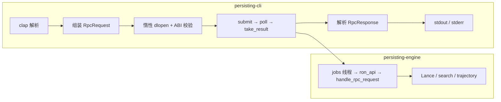

# CLI 整体架构设计

本文档描述 `persisting` CLI 与 `persisting-engine` 之间的交互架构：如何加载引擎、如何发起请求、wire 格式与版本约束。

`search` 与 `trajectory` 子命令共用此架构，各命令的交互设计见独立文档。

---

## 1. 整体模型

```
persisting CLI (persisting-cli)
    │
    │  dlopen + C ABI
    │
    ▼
libpersisting_engine.{dylib,so,dll} (persisting-engine)
    │
    │  Lance / 向量 / 全文
    │
    ▼
Lance Dataset
```

- CLI **不静态链接** Lance 或引擎核心逻辑。
- CLI 通过动态库 (`dlopen`) 加载 `libpersisting_engine`，经极窄 C ABI 发起异步 job 调用。
- 引擎独立发版，CLI 通过版本常量校验兼容性。

---

## 2. 引擎发现与惰性加载

### 2.1 路径解析

| 优先级 | 来源 | 说明 |
|--------|------|------|
| 1 | `--core-lib <PATH>` | 命令行显式指定 |
| 2 | `PERSISTING_ENGINE_LIB` | 环境变量 |
| 3 | 可执行文件同目录查找 | 按平台顺序：`dylib`（macOS）→ `so`（Linux）→ `dll`（Windows） |

### 2.2 惰性加载

引擎仅在首次需要发起调用时才 `dlopen`。在此之前 CLI 已完成参数解析和请求序列化，避免因序列化错误触发不必要的加载。

加载时校验 `RON_ABI_VERSION`（见 §4），不匹配则立即报错退出。

---

## 3. 异步 Job ABI

一次完整的 CLI → 引擎调用经过四个 C 符号：

| 步骤 | C 符号 | 方向 | 说明 |
|------|--------|------|------|
| 1 | `persisting_engine_submit` | CLI → 引擎 | 提交 UTF-8 RON 请求，获取 job handle |
| 2 | `persisting_engine_job_poll` | CLI → 引擎 | 轮询 job 状态与进度（0–100%） |
| 3 | `persisting_engine_job_take_result` | CLI → 引擎 | 取走 UTF-8 RON 响应（probe + fill） |
| 4 | `persisting_engine_job_release` | CLI → 引擎 | 释放 job 资源（幂等） |

### 3.1 Job 生命周期

```
submit ──→ PENDING ──→ RUNNING ──→ COMPLETE
                    │                  │
                    └── poll 轮询 ←────┘
                                           │
                                           ├── take_result → 取走响应
                                           └── release     → 释放资源
```

- `submit` 是**单向**的，不在此步返回业务结果。
- `poll` 返回 `PersistingJobStatus { state, progress_percent }`，CLI 以 1ms 间隔轮询直到 `COMPLETE`。
- `take_result` 使用 probe/fill 模式：先传空缓冲获取所需大小，再分配缓冲取回数据。成功后 job 从引擎表中移除。
- `release` 用于提前终止或异常清理，对不存在的 job id 幂等。

### 3.2 Rust 封装

`persisting_proto::invoke_ron_utf8_via_jobs_sync` 封装了上述四步的同步调用，CLI 直接使用该封装。

---

## 4. Wire 格式

### 4.1 请求与响应

CLI 与引擎之间统一使用 **RON（Rusty Object Notation）** UTF-8 文本：

```
请求: RpcRequest { version, body: RequestBody::... }
响应: RpcResponse { version, body: ResponseBody::... }
```

- `version` 字段携带 `PROTOCOL_VERSION`，供引擎校验。
- `body` 根据子命令使用不同变体。

### 4.2 CLI 子命令 → RequestBody 映射

#### search

| CLI 子命令 | `RequestBody` 变体 |
|------------|-------------------|
| `search create`（JSONL / CSV） | `SearchAdd` |
| `search create`（Lance） | `SearchImportLance` |
| `search index build` | `SearchIndex` |
| `search index list` | `SearchIndexList` |
| `search index delete` | `SearchIndexDelete` |
| `search index rebuild` | `SearchIndexRebuild` |
| `search query` | `SearchQuery` |
| `search index reorder` | —（不经引擎） |

#### trajectory

| CLI 子命令 | `RequestBody` 变体 |
|------------|-------------------|
| `trajectory add` | `TrajectoryAppend` |
| `trajectory replay` | `TrajectoryReplay` |
| `trajectory stats` | `TrajectoryStats` |

### 4.3 输出

- **成功**：CLI 解析 `RpcResponse`，若 `body` 非 `Error` 变体，pretty 打印 `body` 到 stdout，退出码 0。
- **失败**：若请求 RON 无法解析或 `body` 为 `Error`，打印错误信息到 stderr，非零退出。

---

## 5. 版本常量

| 常量 | 当前值 | 含义 |
|------|--------|------|
| `RON_ABI_VERSION` | 6 | C ABI 不兼容变化时递增（函数签名、`PersistingJobStatus` 布局、RON 信封格式） |
| `PROTOCOL_VERSION` | 4 | `RpcRequest` / `RpcResponse` 枚举布局变化时递增 |

- CLI 在 `dlopen` 后校验 `RON_ABI_VERSION`，不匹配则拒绝执行。
- CLI **不校验** `PROTOCOL_VERSION`，但请求中携带供引擎侧校验。

---

## 6. 数据流



---

## 7. 与 Python API 的区别

Python 侧通过 PyO3 的 `persisting-engine::bridge` 直接调用引擎函数，**不经过** RON 字符串序列化与 C ABI。bincode 路径（`engine_dispatch`）受 `PROTOCOL_VERSION` 约束，但 CLI 不使用此路径。

此差异对 CLI 设计文档的读者透明——CLI 的用户只需知道 `--core-lib` 指向正确的动态库即可。
