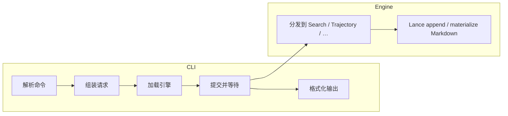

# CLI 整体架构

`persisting` CLI 是**薄前端**：负责解析用户意图、序列化请求、展示结果；重逻辑（Lance、检索、轨迹引擎）在**可独立发版的引擎**中运行。

`search`、`trajectory`、`capture import` 等子命令共用此架构。

---

## 1. 核心思想

| 原则 | 说明 |
|------|------|
| **瘦 CLI** | 不静态链接 Lance 或引擎；启动快、二进制小 |
| **动态引擎** | 运行时加载引擎库；CLI 与引擎可独立升级 |
| **版本门禁** | 加载时校验 ABI 版本，不兼容则拒绝执行 |
| **异步任务** | 一次用户操作对应一个引擎 job，可报告进度 |
| **文本协议** | CLI 与引擎之间用结构化文本（RON）交换请求与响应 |

```
用户命令
    │
    ▼
CLI（解析 · 组装请求 · 展示结果）
    │
    │  动态加载 · 窄 ABI · 异步 job
    ▼
引擎（Lance · Search · 轨迹 · …）
    │
    ▼
持久化存储
```

---

## 2. 引擎发现

引擎库按优先级定位：

1. 命令行显式指定路径
2. 环境变量
3. 与 CLI 可执行文件同目录

**惰性加载**：仅在首次需要调用引擎时才加载，避免参数错误也触发重量级初始化。

---

## 3. 一次调用的生命周期

```
提交请求 → 排队/运行（可轮询进度）→ 取回结果 → 释放资源
```

- **提交**与**取结果**分离：提交只拿到任务句柄，结果通过后续步骤获取。
- **轮询**可选：长任务（大批量导入、索引构建）可反馈进度百分比。
- **释放**幂等：异常或提前退出时可安全清理。

Python API **不经过**此路径——它直接绑定引擎，适合嵌入式与交互式场景。CLI 用户只需保证引擎库版本与 CLI 匹配。

---

## 4. 协议与版本

CLI 与引擎通过**带版本号的信封**交换消息：请求携带协议版本，引擎校验后 dispatch 到对应能力（Search、Trajectory 等）。

两层版本独立维护：

| 层次 | 何时递增 |
|------|----------|
| **ABI** | 动态库接口、job 状态布局、信封格式不兼容 |
| **协议** | 请求/响应消息字段或语义变化 |

CLI 在加载时校验 ABI；协议版本由请求携带、引擎侧校验。

---

## 5. 子命令与引擎能力

概念映射（非 exhaustive）：

| 用户意图 | 引擎能力 |
|----------|----------|
| 导入文档、建索引、检索 | Search |
| 追加 / 回放 / 统计 / 物化轨迹 | Trajectory |
| 事后导入 IDE 或网关日志 | Trajectory（经 CLI 侧归一化） |

部分纯本地操作（如格式转换）可由 CLI 侧直接完成；索引文件重排等数据操作仍经过引擎。

---

## 6. 输出约定

- **成功**：结构化结果写入 stdout；轨迹类命令默认 **TOML** 便于脚本解析。
- **失败**：错误信息写入 stderr，非零退出码。

---

## 7. 数据流概览



轨迹存储模型见 [轨迹存储](trajectory_storage.zh.md)。

---

## 8. 相关文档

- [`persisting search`](cli_search_command.zh.md)
- [`persisting trajectory`](cli_trajectory_command.zh.md)
- [`persisting capture`](cli_capture_command.zh.md)
