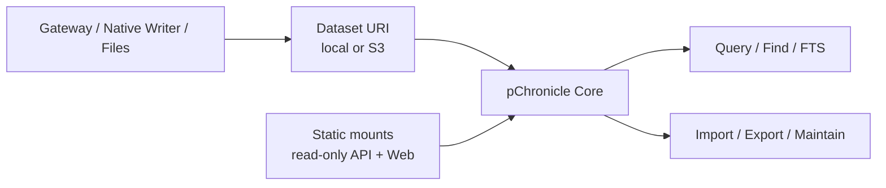

# pChronicle 产品架构设计

| 项目 | 内容 |
|---|---|
| 状态 | Target Architecture |
| 文档层级 | 产品边界、命令树规范与参数概要 |
| 目标读者 | Agent 平台工程师、训练数据工程师、CLI/服务端/存储开发者 |
| 目标入口 | 独立 `pchronicle` CLI、pChronicle Core、只读 Warehouse API 与 Web |
| 相关设计 | [Dataset Catalog](dataset-catalog.md) · [轨迹存储](trajectory.md) · [Storyline 三表 Lance](storyline-lance.md) · [Ownership RFC](../rfcs/0003-pchronicle-ownership.md) |

本文定义 pChronicle 的产品边界、核心模型和交互契约。完整 flags、wire schema、物理布局与
索引算法由后续详细设计规定。当前仓库中的 `ppilot`、`persisting chronicle` 和本地 Web 接口
不等同于本文的完整目标形态。

## 1. 产品定位与边界

pChronicle 是 path-first 的 Agent 轨迹数据层：它从本地目录和对象存储发现轨迹，将不同交换
格式投影到统一模型，并提供 SQL、精确定位、全文搜索、导入导出和只读可视化。

| 产品形态 | 用法 | 持久状态 |
|---|---|---|
| 路径直用 | CLI 直接浏览本地目录或 S3 prefix | 无额外状态 |
| 原生 Dataset | create-only import 或 Gateway/native writer 写入 | Dataset 自身版本和 manifest |
| 只读 Warehouse | 静态挂载多个 Dataset，提供 API 与 Web | 配置文件和可重建 cache |
| 本地默认 Warehouse | 单个本地目录作为默认 Dataset 根 | 用户设置中的规范化绝对路径 |



产品遵循以下约束：

- Dataset URI 就是身份；本地和 S3 使用同一资源与查询模型。
- Dataset 可保留复杂目录、多种 Source 和原始相对路径。
- 每次读取报告 Catalog Snapshot，不虚构跨 Source 的全局原子快照。
- 核心不依赖全局 ID 服务、后台 Job、远程 embedding 或可变 Warehouse 状态。
- 共享服务是只读视图，不是数据湖控制面。

以下能力不进入核心产品，只有真实需求证明必要后才单独立项：

| 非核心能力 | 当前替代方案 |
|---|---|
| Dataset 全局 canonical ID、跨 Source 唯一索引 | 使用 Dataset URI、Source 路径和原始 ID 组成完整地址 |
| Dataset 物理删除 | 使用文件系统、对象存储或基础设施工具 |
| vector/hybrid Search、embedding provider | v1 只提供 lexical FTS |
| 动态 Warehouse、服务端写入与后台 Job | 静态配置和同步只读 API |
| pChronicle 内执行用户脚本或 transform | SQL pipeline、pPilot 或独立执行系统 |
| Langfuse/OTLP 兼容入口 | Gateway 或独立 adapter |
| 分布式 SQL、内建用户系统和多租户控制面 | 交由外部基础设施 |

## 2. 核心模型

### 2.1 Dataset 与 Source

Dataset 是经过规范化的本地目录 URI 或对象存储 prefix，也是所有数据命令的资源边界：

- 同一 URI 在 CLI 与 Warehouse 中代表同一个 Dataset；
- Warehouse 挂载名只是别名，不参与身份计算；
- 复制或移动到新 URI 后得到新的 Dataset；
- URI 不得包含 access key、secret、签名 query 或其他凭证。

Source 是 Dataset 中可独立发现、固定版本、查询和诊断的最小物理单元，例如一个 events Lance
store、Storyline 三表 store、外部交换文件或同版本分区。每个 Source 至少暴露：

| 字段 | 含义 |
|---|---|
| `source_path` | Dataset 内的相对逻辑路径 |
| `format` | 物理格式或交换格式 |
| `snapshot_ref` | Lance/manifest version、对象 version/ETag 或文件指纹 |
| `read_consistency` | `native`、`conditional` 或 `fingerprint` |
| `capabilities` | 可查询关系、是否可写、是否支持历史版本 |
| `status` | `ready`、`degraded` 或 `error`，以及脱敏原因 |

`pchronicle ls` 展示逻辑 Source，只有 `--physical` 才展开普通文件和对象；Lance fragment 默认
保持折叠。

### 2.2 轨迹模型与地址

```text
Dataset
└── Source
    └── Run
        └── Trajectory / Session
            └── Step
                ├── Event / Message / Generation
                └── Tool Call / Result
```

- Run 表示一次 Agent 任务执行组，可包含主 Agent、subagent 和重试轨迹。
- Trajectory/Session 表示 Run 中一条有序、连续的交互序列。
- Step 是规范化分析单元；Event 是 append-only 的细粒度采集事实。
- Judgment 是独立于事实层的评测或标注。

pChronicle 原样保留外部 `run_id`、`session_id` 和 trace/span ID，不为满足 Dataset 级唯一性而
改写。完整实体地址是：

```text
(normalized_dataset_uri, source_path, entity_kind, original_id)
```

ID 只要求在 Source 的对应实体类型内可用。输入缺少必需 ID 时，importer 可以生成 Source-local
ID，并在报告中标记。`find` 未指定 Source 时只做候选发现：一个候选直接返回，多个候选返回
完整地址并要求调用方补充 `--source`。

### 2.3 Catalog Snapshot、权威层与 SQL

Catalog Snapshot 是一次 query、find、search、export 或 recipe 实际读取的 Source 集合及其固定
引用。`snapshot_id` 是 Dataset URI、Source 路径、`snapshot_ref` 和发现错误的稳定摘要。

| Source | 操作内保证 | 后续可复现性 |
|---|---|---|
| Storyline Lance | 固定 `CURRENT` generation/table versions | 版本保留期间可复现 |
| events Lance | 固定 manifest revision 和可见 segments | 版本保留期间可复现 |
| S3 version | 按 version 条件读取 | 对象版本保留期间可复现 |
| S3 ETag | 条件读取，变化则失败 | 覆盖后不保证 |
| 普通本地文件 | 读取前后校验身份、大小和指纹 | 修改后不保证 |

多个 Source 分别固定，不宣称来自同一全局时刻。CLI 将 `snapshot_id`、警告和 report 路径写入
stderr；REST 通过 metadata 或 headers 返回相同信息。

pChronicle 区分三层数据：

| 层次 | 示例 | 作用 |
|---|---|---|
| Exchange | ATIF、ACTF、OpenAI messages、Storyline | 导入导出与互操作 |
| Logical | Run、Trajectory、Step、ToolCall、Event、Judgment | 查询与产品语义 |
| Physical | events Lance、Storyline Lance、外部文件 | 持久化、版本和性能 |

Gateway/native writer 写入 append-only events，采用 at-least-once 语义；重复事实可以存在，
规范化投影必须暴露 duplicate count。Storyline 是分析模型，不反向覆盖事实层。全文索引和统计
是记录输入 `snapshot_id` 的可重建派生数据。

每个 Dataset 挂载为 SQL schema；位置参数使用 `dataset`，额外挂载使用 `--dataset name=uri`。
稳定逻辑关系如下：

| 关系 | 一行表示什么 |
|---|---|
| `sources` | 一个 Source 及其版本、能力和状态 |
| `runs` | 一个 Source 内的 Run |
| `trajectories` | 从 Storyline 表派生的 Source-local Trajectory |
| `steps` | 一条规范化 Step/Observation |
| `tool_calls` | 一次工具调用及可关联结果 |
| `events` | 一条事实事件 |
| `judgments` | 一条评测或人工标注 |

所有实体关系都携带 `source_path` 和原始 ID。SQL 只允许只读语句，不开放写入、DDL、网络函数
或文件函数。

## 3. CLI 产品面

独立 `pchronicle` 是目标入口。数据命令可显式接收 Dataset URI；配置本地默认 Warehouse 后，
支持该形态的命令可以省略 URI。TTY 默认输出人读表格，结构化输出使用 `--format`。stdout
只承载主结果，进度、Snapshot 和警告写入 stderr。

| 命令 | 职责 |
|---|---|
| `default` | 设置或读取单目录本地默认 Warehouse |
| `ls/list`、`status` | Source 发现、能力、版本、数量与健康状态 |
| `query` | 只读 SQL、结构化结果输出和内置 recipe |
| `find` | 按 Source-local ID 精确定位或发现候选 |
| `search` | lexical full-text search |
| `import` | 从单一格式创建新 Dataset |
| `export` | 导出完整 Trajectory |
| `maintain` | 原生格式维护和失败 staging 清理 |
| `serve` | 启动静态挂载的只读 API 与 Web |

### 3.1 Query、Find 与 FTS

```bash
pchronicle query <dataset-uri> \
  "SELECT * FROM dataset.trajectories LIMIT 20"

pchronicle query --dataset live=<uri> --dataset archive=<uri> \
  "SELECT * FROM live.runs UNION ALL SELECT * FROM archive.runs"

pchronicle query <dataset-uri> --format jsonl|csv|parquet|arrow \
  --output <path-or-> "<read-only-sql>"

pchronicle find <dataset-uri> --session-id <id> [--source <source-path>]
pchronicle search <dataset-uri> "database timeout" --top-k 20
```

每次读取先构造 Catalog Snapshot。Query 承担任意 SQL 投影的结构化输出；find 带 `--source` 时
是精确地址查询，不带时只发现候选。两者都受内存、行数、并发、超时和 spill 上限约束。

Search v1 只索引 Step 的消息、模型输入输出、工具参数和结果。命中返回完整轨迹地址、受限
snippet、lexical score 和索引 `snapshot_id`。FTS cache 是实现细节：输入 Snapshot 不匹配时
同步刷新或失败，不能返回陈旧结果；只读 Dataset 不写入 sidecar。

### 3.2 Import 与 Export

```bash
pchronicle import --from <path-or-> --output <new-dataset-uri> \
  --format auto|atif|actf|openai-messages|storyline

pchronicle import --from <path> # 在默认 Warehouse 下创建确定性子目录

pchronicle import --stream --from - --output <new-dataset-uri> --format atif

pchronicle export --from <dataset-uri> --output <path-or-> \
  --format atif|actf|openai-messages|storyline \
  [--source <source-path>] [--run-id <id>] [--session-id <id>] [--where <expr>]
```

Import 只有 create 语义：目标已存在时拒绝，不提供 append/upsert/replace。一次调用只接受一种
输入格式；目录 `auto` 必须得到唯一格式，stdin 必须明确格式。导入先写不可见 staging，完成
格式、schema 和 Source-local ID 校验后再原子发布；失败或断流不留下可查询半成品。

Export 只输出完整 Trajectory，不编码任意 SQL 行。`--where` 仅作用于 `trajectories` view；复杂
筛选可先由 query 产生地址列表。格式转换默认 best-effort，字段损失写入 machine-readable
conversion report；`--strict` 遇到损失即失败。stream 均是读取到 EOF 后退出的有限记录流。

### 3.3 Recipe、Pipeline 与 Maintenance

```bash
pchronicle query <dataset-uri> --recipe users|models|tool-calls
pchronicle query <dataset-uri> --format jsonl "<read-only-sql>" | python metrics.py
pchronicle maintain <dataset-uri>
```

Recipe 是有版本、参数 schema、SQL 定义和输出 schema 的 query 别名。pChronicle 不启动、上传、
分发或 sandbox 用户脚本，也不解释脚本输出。

Maintain 只执行原生格式支持的 compaction、scalar index refresh、vacuum 和 orphan staging 清理。
pChronicle 不提供 `rm/drop`；maintain 不能删除 Dataset 根或任意 Source 子树。物理删除由文件系统、
对象存储或基础设施工具完成。

## 4. 只读 Warehouse

### 4.0 本地默认 Warehouse

最基础 Warehouse 不需要服务端：用户通过 `pchronicle default <DIRECTORY>` 将一个本地目录
保存为默认 Warehouse。该目录同时是一个递归发现 Source 的 Dataset 根；设置后，`ls`、
`status`、`query`、`find` 和 `export` 可以省略 Dataset URI。显式 URI 始终优先。

```bash
pchronicle default ./trajectory-data
pchronicle query "SELECT COUNT(*) FROM dataset.runs"
pchronicle find --session-id session-42
```

配置只保存规范化绝对路径，不保存凭证；数据、Catalog Snapshot 和查询仍由 pChronicle Core
直接从该目录构建。此形态没有 HTTP、认证、守护进程、后台 Job 或额外数据库，可用于完整开发
和集成测试。`default` 无目录参数时只读取并打印当前设置。

### 4.1 静态配置与服务

Warehouse 是 operator-managed 配置定义的只读多 Dataset 视图，例如：

```toml
cache_dir = "/var/cache/pchronicle"

[[datasets]]
name = "production"
uri = "s3://agent-data/production/"

[[datasets]]
name = "local-evals"
uri = "/srv/evals"
```

```bash
pchronicle serve --config warehouse.toml
pchronicle serve --config warehouse.toml --open
```

名称必须唯一，URI 在启动时规范化并固定。公开 API 只接受配置名称，不接收任意 URI、自定义
endpoint、凭证或写权限。`--open` 打开同一 Web UI，取代单独的 `dashboard` 命令。

Web 提供 Dataset/Source overview、Run/Trajectory 列表与详情、基础筛选、SQL、FTS 和查询结果
下载。API 只提供 Catalog、query/find、FTS 和 health；不提供 import、trajectory export job、
index mutation、maintenance、删除或在线 ingest。所有请求同步且有界，不创建隐藏后台 Job。

### 4.2 在线写入边界

Gateway/native writer 可以按原生协议直接写入指定 Dataset，但不经过只读 Warehouse API。需要
OTLP/Langfuse 接入时，由独立 adapter 将固定入口映射到固定 Dataset；请求 header 不能动态指定
URI。认证、重试、attribute mapping 和写入语义由 adapter RFC 定义。

## 5. 系统保证

### 5.1 一致性与故障

| 场景 | 对外行为 |
|---|---|
| Source 在读取中变化 | 当前操作失败，不混合新旧内容 |
| 单个 Source 损坏 | strict 失败；report 模式标记 degraded 并跳过 |
| import 中断 | staging 不可见，可由 maintenance 清理 |
| export 丢字段 | 生成 conversion report；`--strict` 失败 |
| FTS cache 落后 | 同步刷新或失败，不返回陈旧结果 |
| Warehouse 请求断开 | 同步操作取消或失败，不转为后台 Job |
| 反向代理身份缺失 | fail closed，不猜测 Dataset 或 principal |

错误响应包含稳定 error code、request ID、Dataset、Source 和 `snapshot_id`，并脱敏 URI 与
payload。所有读取和结果下载具备大小、时间、并发与输出上限。

### 5.2 安全与可观测性

共享服务只有静态配置会引入本地路径、S3 URI 和可选 S3 endpoint；HTTP 请求不接受这些字段。
远程目标必须经过统一校验：

1. 配置加载时拒绝非法 scheme、内嵌凭证、签名 query、loopback、metadata、私网地址和未允许
   端口；私有 MinIO/S3 需要独立 host/IP/CIDR allowlist；
2. 实际连接时重新解析 DNS 并校验 peer IP；
3. 默认禁用 endpoint 重定向；必须支持时逐跳复验，并在跨 origin 时删除敏感 header；
4. 凭证只来自服务端 credential provider 或标准云凭证链。

负向测试至少覆盖 loopback、metadata IP、RFC1918/ULA、DNS 指向私网、内嵌凭证、跨域跳转
私网和空 allowlist。非 loopback endpoint 默认要求 HTTPS。

Server 默认监听 loopback；对外服务必须配置可信代理，丢弃非可信来源注入的身份和 Dataset
header。Web 将轨迹内容按文本渲染。访问日志记录 request ID、可信 principal、配置别名、Dataset
摘要、`snapshot_id` 和结果，不记录凭证或完整 payload。

实现至少观测 Source 发现与版本固定、query 扫描量和 spill、FTS cache 命中/刷新、conversion
loss、staging/orphan bytes、同步取消和资源峰值；每个阶段提供本地/S3 的可复现基准。

## 6. 交付与演进

现有入口保留一个明确发布周期的转发：

| 旧入口 | 目标入口 |
|---|---|
| `ppilot chronicle import/export/maintain` | `pchronicle import/export/maintain` |
| `ppilot query ...` | `pchronicle query/find` |
| `ppilot convert ...` | `pchronicle import/export` 或文件转换兼容入口 |
| `ppilot analysis ...` | `pchronicle query --recipe ...`；脚本继续由 pPilot 承担 |
| `persisting chronicle serve ...` | `pchronicle serve --config ...` |

转发层输出 deprecation warning，但不能污染 stdout 数据；一个弃用周期后移除旧入口。

交付顺序为：

1. 独立 CLI、Dataset/Source/Catalog Snapshot、统一 SQL 和 create-only import/export；
2. Source-scoped find、FTS、SQL recipe 和 Catalog/status；
3. 静态 Warehouse、只读 API/Web、可信代理和服务端可重建 cache。

核心验收聚焦以下结果：

1. 同一 URI 在 CLI 与 Warehouse 中产生相同 Dataset identity 和逻辑关系。
2. 嵌套、混合格式目录形成确定 Source 列表，读取中变化不会被静默混读。
3. 外部 ID 原样保留；跨 Source 冲突返回完整候选地址。
4. 任意读取报告 `snapshot_id` 与 Source `snapshot_ref`。
5. Import 只创建新 Dataset且原子发布；query/export 职责分离并报告转换损失。
6. Find/FTS 返回含 `source_path` 的地址，FTS 不使用陈旧 cache。
7. pChronicle 不执行用户脚本、不物理删除 Dataset、不提供服务端写接口。
8. 共享 API 只解析静态别名；远程连接、凭证和可信代理边界通过负向测试。

后续详细设计只覆盖 URI/Source discovery、轨迹地址与 Snapshot schema、import/export framing、
FTS cache、静态 Warehouse API 及出站连接校验。OTLP adapter、vector Search、动态 Catalog、
物理删除和远程执行均保持为独立可选扩展，不得成为核心依赖。
