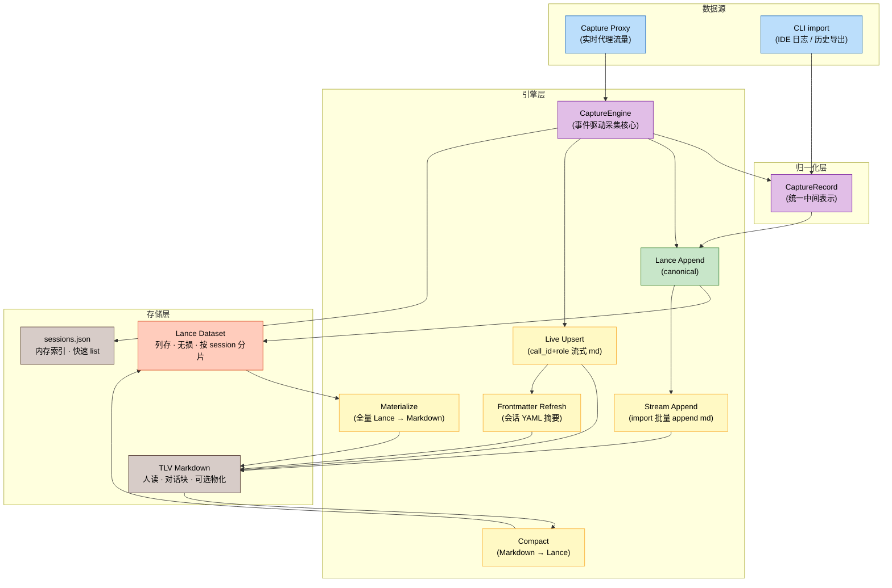
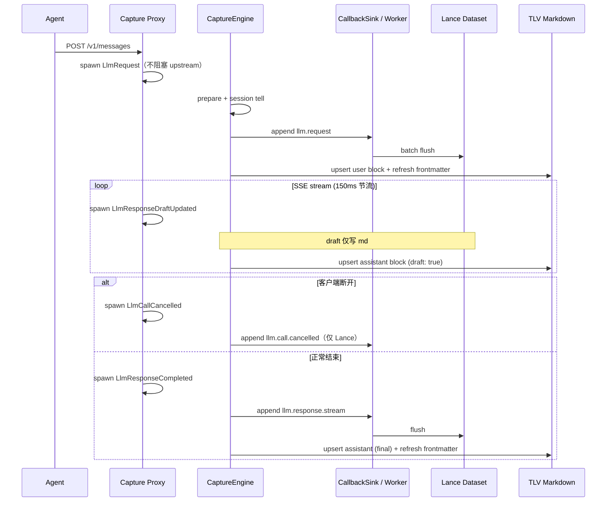
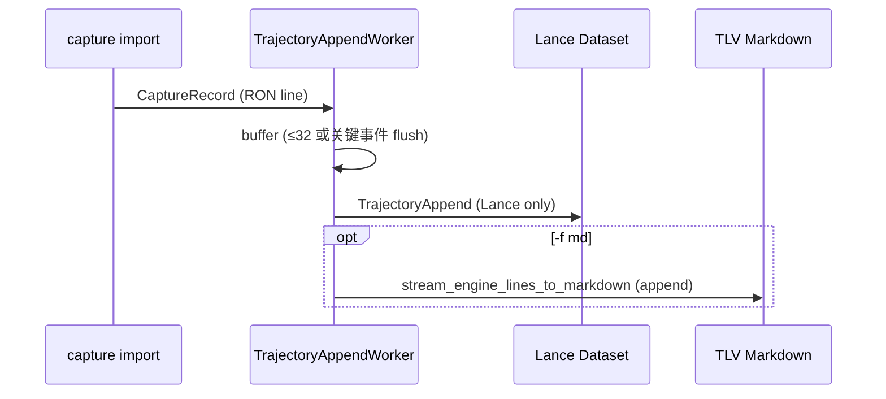
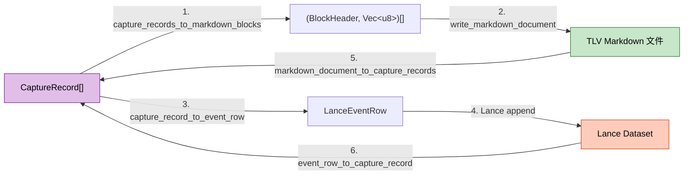
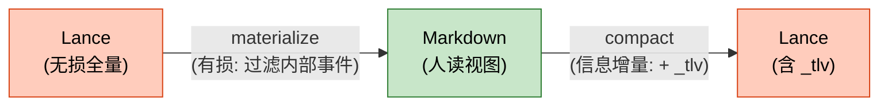

# 轨迹存储模型 — 完整架构设计

> **版本**：v0.2.0 &emsp;|&emsp; **最后更新**：2026-05-24

---

## 文档地图

| 你想了解… | 见 |
|-----------|-----|
| Capture 代理的整体架构（路由 / 协议转换 / 采集管线） | [Capture 架构设计](capture_design.zh.md) |
| TLV Markdown 的块格式规范 | [轨迹 Markdown 格式](trajectory_tlv_format.zh.md) |
| `persisting capture` 命令用法 | [Capture 命令](cli_capture_command.zh.md) |
| `persisting trajectory` 命令用法 | [Trajectory 命令](cli_trajectory_command.zh.md) |

---

## 1. 概述

Agent 轨迹在 Persisting 中同时服务两类读者：**机器**（回放、统计、检索）与**人**（阅读、git diff、code review）。为此采用**两层存储**：Lance 为 canonical raw event log，TLV Markdown 为按需物化的人读视图。



**核心 invariant**：`Lance row_count ≥ Markdown block_count`（materialize 是有损的）。

---

## 2. 两层结构对比

| 维度 | Lance (canonical) | TLV Markdown (materialized view) |
|------|-------------------|----------------------------------|
| **角色** | 全量 event log，系统的 single source of truth | 人类可读对话视图 |
| **完整性** | 无损，所有事件全部保留 | 有损，过滤内部流量与 lifecycle |
| **格式** | 列存（`LanceEventRow`），按 session 分 dataset | TLV 块序列（`MarkdownBlock`），纯文本文件 |
| **写入方式** | 每次 LLM 事件 append；import / CLI worker 批量 append | Proxy `-f md` 时 **CaptureEngine live upsert**；import 走批量 append；均可 `materialize` 全量重建 |
| **典型操作** | `replay`、`stats`、Search import、FTS | 直接打开、`git diff`、code review |
| **按 session 分片** | ✅ `.lance/{storage_session_id}/` | ✅ `{run_dir}/{storage_session_id}.md` |

---

## 3. 数据流全景

### 3.1 Capture Proxy（`-f md`）— 事件驱动 + 非阻塞采集

Proxy 侧采集经 [`CaptureEngine`](../../crates/persisting-capture/src/engine/mod.rs) 统一处理；**Proxy 不 await 完整 `apply`**（`spawn_capture_apply`），Lance/Markdown 写入在后台完成。不再向 Lance 写入 `llm.response.stream.partial`。



关键设计决策：

1. **Lance 仍是 canonical**。`LlmResponseDraftUpdated` 只更新 Markdown，不产生 Lance 行。
2. **Live Markdown 用 upsert**。`upsert_block_by_call_id` 按 **`call_id` + `role`** 匹配；块区间替换使用 `rewrite_block_range`（**不再** truncate-to-EOF）。
3. **CLI worker 只写 Lance**。`-f md` 时 Proxy 内 `CaptureEngine(stream_markdown=true)` 负责 live md；worker `stream_markdown=false`。
4. **Run 结束对账**。`worker.shutdown()` 后写 `.capture/reconcile.json`（md call_id vs Lance replay）；不一致时可 `trajectory materialize` 全量重建。
5. **Frontmatter 摘要**。每次 dialogue 写入后刷新 YAML（turns / tokens / cost / subagents）；`capture run` 结束打印 stderr 一行汇总。

### 3.2 CLI Import — 批量 Lance + 可选 append Markdown

IDE 日志 / gateway 导入不经 Proxy，仍走 `CaptureRecord` → 批量 Lance append；`-f md` 时对同批 engine lines 调用 `stream_engine_lines_to_markdown()` **末尾追加**（无 upsert，因无流式 draft）。



---

## 4. 核心数据结构

### 4.1 CaptureRecord（统一中间表示）

```rust
pub struct CaptureRecord {
    pub seq: u64,                    // session 内单调序号
    pub source: String,              // "persisting-proxy" | "persisting-capture"
    pub kind: String,                // "llm.request" | "llm.response" | "session.started" | ...
    pub timestamp: Option<String>,   // RFC3339
    pub session_id: Option<String>,
    pub agent_id: Option<String>,
    pub trace_id: Option<String>,
    pub call_id: Option<String>,
    pub subagent_id: Option<String>,
    pub parent_agent_id: Option<String>,
    pub parent_call_id: Option<String>,
    pub payload: serde_json::Value,  // 自由格式，按 kind 不同
}
```

`CaptureRecord` 是系统中**唯一的内部数据交换格式**。数据源（proxy / CLI import）产出 `CaptureRecord`，引擎（Lance / Markdown / Index）消费它。

### 4.2 LanceEventRow（列存行）

```rust
pub struct LanceEventRow {
    pub seq: i64,                     // 会话内序号
    pub timestamp: Option<String>,
    pub kind: String,                 // 索引列
    pub source: String,
    pub agent_id: Option<String>,     // 过滤/路由
    pub session_id: Option<String>,   // 过滤/路由
    pub call_id: Option<String>,      // 调用链
    pub trace_id: Option<String>,
    pub parent_call_id: Option<String>,
    pub model: Option<String>,        // 从 payload 反规范化
    pub payload_json: String,         // 完整 CaptureRecord JSON（canonical 载荷）
}
```

**反规范化设计**：`kind`、`session_id`、`model` 等高频查询字段提升为独立列，`payload_json` 存储完整 JSON。这样可以在不解析 JSON 的情况下做过滤和聚合。

### 4.3 MarkdownBlock（人读块）

```rust
pub struct MarkdownBlock {
    pub header: BlockHeader,  // 元数据（type, length, role, kind, turn, ...）
    pub body: Vec<u8>,        // 正文内容（纯文本 / JSON）
}

pub struct BlockHeader {
    pub type_name: String,           // "llm.request" | "llm.response" 等
    pub length: usize,               // body 字节长度
    pub fields: BTreeMap<String, Value>,  // role, kind, turn, model, seq, tokens...
}
```

详见 [轨迹 Markdown 格式](trajectory_tlv_format.zh.md)。

---

## 5. 转换管线

### 5.1 四条转换路径



| 方向 | API | 模式 | 触发场景 |
|------|-----|------|---------|
| **CaptureRecord → Markdown** | `capture_records_to_markdown_blocks()` | 过滤 + 转换 | `trajectory materialize` |
| **Block → .md 文件** | `write_markdown_document()` | 全量重写 | materialize 全量 |
| **Block → .md 文件（增量 append）** | `stream_engine_lines_to_markdown()` | 末尾追加 | **import** `-f md`（非 Proxy live 路径） |
| **Block → .md 文件（live upsert）** | `upsert_block_by_call_id()` | 按 call_id+role 替换或 append | Proxy `-f md` 流式采集 |
| **.md 文件 → CaptureRecord** | `markdown_document_to_capture_records()` | 解析 + 重建 | compact 导入 |
| **CaptureRecord → Lance** | `capture_record_to_event_row()` | 一行一条 | Lance append |
| **Lance → CaptureRecord** | `event_row_to_capture_record()` | 反序列化 | replay / stats |

### 5.2 Materialize（Lance → Markdown 全量）

```rust
pub struct MaterializeStats {
    pub source_events: usize,    // Lance 行数
    pub markdown_blocks: usize,  // Markdown 块数
    pub skipped_events: usize,   // 被过滤的事件数
}
```

流程：

```
Lance dataset (全量扫描)
    │  event_row_to_capture_record()
    ▼
CaptureRecord[]
    │  try_capture_record_to_block()  ← 应用对话过滤
    ▼
(BlockHeader, Vec<u8>)[]
    │  format_document_preamble() + encode_block_with_header()
    ▼
TLV Markdown 文件 (全量重写)
```

### 5.3 Live Upsert（Proxy `-f md` 流式）

Proxy 流式场景下，Markdown 通过 `upsert_block_by_call_id()` 增量更新，而非每批 append：

```
CaptureEvent::LlmRequest
    │  try_capture_record_to_block() → user block
    ▼
upsert_block_by_call_id(call_id, role=user)   ← 不存在则 append

CaptureEvent::LlmResponseDraftUpdated (≤150ms)
    │  draft_stream_assistant_block() → header.draft=true
    ▼
upsert_block_by_call_id(call_id, role=assistant)   ← 流式原地更新

CaptureEvent::LlmResponseCompleted
    │  enrich + append Lance llm.response.stream
    │  try_capture_record_to_block() → final assistant
    ▼
upsert_block_by_call_id(call_id, role=assistant)   ← 覆盖 draft，移除 draft 标记
```

**匹配键**：`call_id` + `role`（user / assistant 各一块，互不覆盖）。同一 call 的 user 与 assistant 可并存。

**seq 预览**：draft 块通过 `sink.peek_next_seq()` 写入 header，与实际 Lance append 序号对齐；finalize 后以 stamped record 的 seq 覆盖。

### 5.4 Stream Append（Import `-f md` 增量）

```rust
pub struct StreamMaterializeStats {
    pub events_seen: usize,      // 本批 lines 数
    pub blocks_appended: usize,  // 实际写入文件的块数
    pub skipped_events: usize,   // 被过滤的事件数
}
```

与 live upsert 的区别：**仅 append 到文件末尾**，无 call_id 级 rewrite；适用于离线 import，不适用于 Proxy 流式 draft。

```
新批次的 engine lines (RON)
    │  engine_line_to_record() + try_capture_record_to_block()
    ▼
筛选后的 (BlockHeader, Vec<u8>)[]
    │  append_engine_lines_to_markdown()
    ▼
已有 .md 文件 (末尾追加)
```

### 5.5 Compact（Markdown → Lance）

```rust
pub struct CompactStats {
    pub source_blocks: usize,   // Markdown 块数
    pub lance_rows: usize,      // 生成的 Lance 行数
}
```

流程：

```
TLV Markdown 文件
    │  parse_document()
    ▼
MarkdownBlock[]
    │  block_to_capture_record() + enrich: payload["_tlv"] = {...}
    ▼
CaptureRecord[]
    │  capture_record_to_event_row()
    ▼
Lance Dataset
```

**`_tlv` 字段**：compact 时为每个 `CaptureRecord` 注入 `payload._tlv`，包含 `role` 和原始 `block_fields`。这保留了 TLV 元数据，使 compact 操作是信息增量的 —— 但 materialize 时丢弃的内部事件（如 lifecycle）无法通过 compact 恢复。

---

## 6. 对话过滤规则

`storage/dialogue.rs` 的 `skip_markdown_block()` 负责决定哪些 `CaptureRecord` 不应出现在 Markdown 中：

| 跳过项 | 检测条件 | 原因 |
|--------|---------|------|
| 内部探测请求 | `path` 含 `count_tokens` 或 `count-tokens` | 非对话流量 |
| 无可见文本的空白请求 | `visible_user_text()` 为 None | 无信息量 |
| 无可见文本的空白响应 | `visible_assistant_text()` 为 None | 无信息量 |
| 流式 draft（仅 md） | header `draft: true` | 不落 Lance；finalize 后 draft 被覆盖 |
| 生命周期事件 | `kind` 以 `session.` 开头 | 不在对话中展示 |
| 客户端取消 | `llm.call.cancelled` | 仅 Lance；不进 Markdown |
| 主 session flash/haiku 影子请求 | 无 subagent_id + model 含 `flash`/`haiku` + 非 subagent shape payload | Claude Code 的预热探测，与 pro 内容重复 |
| `llm.spawn_link` | **不跳过**，始终保留 | 主/子代理关联是重要轨迹信息 |

```rust
pub fn skip_markdown_block(rec: &CaptureRecord) -> bool {
    match rec.kind.as_str() {
        "llm.request" => {
            if is_internal_llm_request(&rec.payload) { return true; }        // count_tokens
            if should_skip_main_flash_companion_request(rec) { return true; } // flash/haiku 影子
            visible_user_text(rec).is_none()                                  // 空 turn
        }
        "llm.response" | "llm.response.stream" => visible_assistant_text(rec).is_none(),
        "llm.spawn_link" => false,
        "llm.call.cancelled" => true,
        k if k.starts_with("session.") => true,
        _ => false,
    }
}
```

**invariant**：materialize 之后 `Lance row_count ≥ Markdown block_count`。

**turn 字段**：`turn = seq / 2 + 1` 为全局 seq 的派生编号，**不**保证同一 call 的 user/assistant 共享语义轮次；并发 in-flight 时相邻块可能属于不同 call 却共享 turn 值。分析对话轮次时应以 `call_id` 为准。

## 7. 存储布局

### 7.1 Capture run 布局（推荐）

```
{store}/
├── .capture/
│   ├── sessions.json                   ← 全局会话索引
│   ├── dead_letter.jsonl               ← 采集失败事件
│   ├── reconcile.json                  ← run 结束 md↔Lance 对账
│   ├── run_session                     ← 当前 run_id（纯文本一行）
│   ├── run_child.yaml                  ← 子进程信息 (PID + 命令行)
│   └── daemon.env.json                 ← daemon 环境快照 (API keys)
│
├── {agent_id}/
│   └── run-{timestamp}-{nanos}/        ← 一次 capture run 的根目录
│       ├── run-{timestamp}-{nanos}.md   ← 主 agent Markdown (run bucket)
│       ├── agent-{claude_agent_id}.md   ← 子 agent Markdown (sibling)
│       ├── agent-{...}.md               ← 更多子 agent
│       └── .lance/
│           ├── run-{timestamp}-{nanos}/  ← lifecycle events
│           ├── {header_session_id}/      ← 主 session Lance
│           └── agent-{id}/               ← 各子 agent Lance
```

**关键隔离 invariant**：

- 子 agent 的 user/assistant/tool 块**仅**写入对应的 `agent-{id}.md`
- 主 agent 对话与 `llm.spawn_link`**仅**写入 `run-{run_id}.md` 或 `{header_session_id}.md`
- 主 md **不内联**子 agent 的完整轨迹，而是通过 `llm.spawn_link` 块引用 sibling 文件
- capture run 模式下**不写** `session-meta.yaml`；客户端元信息进入 Markdown YAML frontmatter 的 `client:` 段

### 7.2 扁平 session 布局（serve 模式）

```
{store}/
├── {agent_id}/
│   └── {session_id}/
│       ├── {session_id}.md             ← Markdown（可选）
│       ├── session-meta.yaml           ← 客户端进程元信息（serve 模式）
│       └── .lance/
│           └── {session_id}/           ← Lance v1
```

serve 模式下无 `run_session`，每个逻辑 session 独立一个目录。`session-meta.yaml` 记录发起连接的客户端进程信息（peer addr / PID / 命令行）。

### 7.3 Markdown 路径解析算法

`locate_session_markdown_for_key()` 在给定 run 目录内按以下优先级解析目标 Markdown 文件：

```
输入: run_dir, storage_session_id

1.  {run_dir}/{storage_session_id}.md 已存在 → 使用该文件
2.  storage_session_id 为 "agent-*" → 仅匹配 {run_dir}/agent-{id}.md；
    不 fallback 到 run 主文件（防止主 session 误写入 subagent 文件）
3.  run_dir 名为 "run-*" → 优先 {run_dir}/run-{run_dir名}.md (locate_run_bucket_markdown)
4.  扫描时排除 agent-*.md，避免主 session 误走 subagent 路径
5.  均不存在 → 新建 {run_dir}/{storage_session_id}.md
    （subagent 则为 agent-{id}.md）
```

该算法同时服务于 capture CLI worker 和 `trajectory materialize`。

---

## 8. 存储策略

| 策略 | `--storage-format` / `-f` | 行为 |
|------|--------------------------|------|
| **Lance only** | `bin` | 仅 append Lance，不生成 Markdown |
| **Lance + Markdown** | `md` | Lance 批量写入 + Proxy **CaptureEngine live upsert**（import 走 append） |
| **Both** | `both` | 同 `md` |
| **Auto** | `auto` | 空 session → Lance；已有数据按探测结果；不自动物化 |

**读取优先级**：`replay` / `stats` 默认以 Lance 为准；纯 Markdown session 从块序列还原。`-f md` run 结束后优先查看 `reconcile.json`；不一致时执行 `trajectory materialize` 全量对齐。

---

## 8.1 Markdown Frontmatter 摘要

每个 live md 文件头部 YAML 含会话 rollup（实现：`storage/frontmatter.rs`）：

| 字段 | 含义 |
|------|------|
| `format` | 固定 `persisting:1.0` |
| `block` | TLV 块布局说明（模板字符串） |
| `session` / `agent` | 逻辑 session 与租户 |
| `model` / `provider` | 来自 `sessions.json` |
| `started` / `duration` | 首末请求时间差 |
| `turns` | user 块数量 |
| `total_tokens` / `estimated_cost_usd` | 累计用量与成本 |
| `subagents` | 同 run 下 `agent-*.md` stem 列表 |
| `client` | 子进程 / peer 元信息 |

刷新：dialogue 块写入后自动更新；`capture run` 结束全量 refresh + stderr 摘要行。

---

## 8.2 Run 结束 Reconcile

`capture run -f md` 在 `TrajectoryAppendWorker.shutdown()` **之后**：

1. 扫描 run 目录下所有 `*.md`
2. Engine `replay` 各 session 的 Lance 记录
3. 比较 md 与 Lance 的 **call_id 集合**（及结构性问题如 excessive blank lines）
4. 写入 `{storage}/.capture/reconcile.json`

失败时 stderr 提示；不阻断子进程 exit code。完整重建仍用 `trajectory materialize`。

---

## 9. 双向转换的保真度



| 操作 | 方向 | 信息变化 |
|------|------|---------|
| **materialize** | Lance → Markdown | **有损**：丢弃 count_tokens / lifecycle / flash影子请求 / 空 turn |
| **compact** | Markdown → Lance | **信息增量**：注入 `payload._tlv`（TLV 元数据）；但无法恢复已丢弃的内部事件 |

**结论**：Lance 是 canonical。Markdown 可以从 Lance 重建，但反过来不能。永远不要把 Markdown 当作唯一存储。

---

## 10. 与 Capture 代理的集成

### 10.1 CaptureEngine 事件模型

Proxy 通过 `spawn_capture_apply` → `CaptureEngine::apply(inv, event)` 处理采集；失败写入 `.capture/dead_letter.jsonl`。

| 事件 | Lance | Markdown | Proxy 调度 | 说明 |
|------|-------|----------|------------|------|
| `LlmRequest` | ✅ `llm.request` | ✅ user upsert + frontmatter | spawn（非阻塞） | 转发 upstream 前触发 |
| `LlmResponseDraftUpdated` | ❌ | ✅ assistant upsert (`draft: true`) | spawn | SSE 150ms 节流 |
| `LlmResponseCompleted` | ✅ `llm.response` / `.stream` | ✅ assistant upsert (final) + frontmatter | spawn | 流结束或非流式 |
| `LlmCallCancelled` | ✅ `llm.call.cancelled` | ❌ | spawn | 客户端提前断开 SSE |

```
Proxy (spawn)                 CaptureEngine                    Worker / Lance
  │                                │                                │
  ├─ LlmRequest                    ├─ prepare + session tell ───────→ Lance
  │                                ├─ md upsert + frontmatter       │
  ├─ LlmResponseDraft…             ├─ md only                       │
  ├─ LlmResponseCompleted          ├─ tell → append ───────────────→ Lance
  │                                ├─ md final + frontmatter        │
  └─ LlmCallCancelled              └─ tell → append (cancelled) ───→ Lance
```

Session actor 生产环境使用 **`tell`**（fire-and-forget）；`shutdown` 前对各 session 发送 `Flush` drain mailbox。`CallbackSink` → `TrajectoryAppendWorker` 负责 Lance 批量 flush。

### 10.2 已知限制

| 现象 | 原因 | 缓解 |
|------|------|------|
| md 与 Lance 短暂不一致 | 后台 tell 尚未 drain | shutdown `Flush` + `reconcile.json` |
| turn 编号跨 call 重复 | `turn = seq/2+1` 非 per-call | 消费方用 `call_id` 分组 |
| mailbox 满 / 采集失败 | actor 背压 | dead letter + `replay-dead-letter` |
| Lance per-session dataset 过多 | 当前按 session 分 dataset | 按日分桶（规划中） |

详见 [Capture 架构设计 §10](capture_design.zh.md)。

---

## 11. 相关文档

- [Capture 架构设计](capture_design.zh.md) — 代理路由、协议转换、采集管线
- [轨迹 Markdown 格式](trajectory_tlv_format.zh.md) — TLV block 完整规范
- [Capture 架构设计](capture_design.zh.md) — 代理路由、协议转换、子代理隔离
- [`persisting capture` 命令](cli_capture_command.zh.md)
- [`persisting trajectory` 命令](cli_trajectory_command.zh.md)
