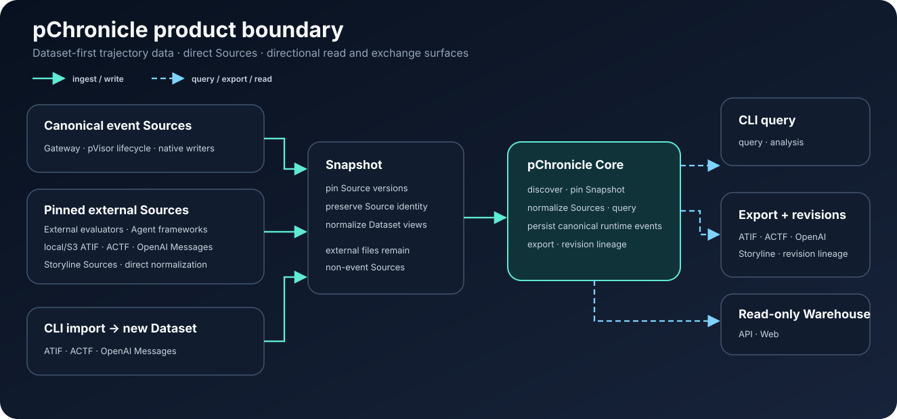

# pChronicle 架构

本文解释 pChronicle 如何把轨迹 Source 变成持久、可查询的历史。用户工作流属于
[Guides](../guides/index.md)，精确命令属于[Reference](../reference/cli.md)，跨产品 ownership
属于 [System Design](../../system-design/architecture.md)。



## 产品边界

pChronicle 是 path-first 的 Agent 历史层。它发现本地目录和对象存储 prefix，固定一次操作
使用的 Source version，规范化支持的表示，并提供有界读取面。

| 形态 | 用途 | 持久状态 |
| --- | --- | --- |
| 直接 Dataset | 检查本地路径或 S3 prefix | Dataset 外无状态 |
| 原生 Dataset | 接收 canonical event 或 create-only import | Dataset manifest 与 version |
| 本地默认 Warehouse | 为一个本地 root 省略 Dataset 参数 | 用户设置中的规范化路径 |
| 只读 Warehouse | 为 Web/API review 静态挂载 Dataset | 配置与可重建 cache |

pChronicle 不是 scheduler、Agent runtime、全局 Dataset 控制面、分布式 SQL 服务或时序数据库。
Loopback server 没有 authentication，也不是生产多租户 endpoint。

## 数据层次与 Ownership

```text
writers and importers
  → canonical events and terminal facts
  → logical Run / Step / ToolCall projections
  → exchange representations
  → lineage-bearing revisions
```

| 层次 | Ownership 规则 |
| --- | --- |
| canonical event | 写入时事实；append-oriented 的事实源 |
| logical projection | 规范化、可重建查询视图 |
| exchange representation | import/export 契约；不会静默升级为全局事实 |
| revision | 带 parent Snapshot 和 transform lineage 的派生输出 |

Storyline 是 session-oriented projection。它的 Lance 布局为完整文档重建优化，因此按 session
replace 不是 canonical 高频 append 路径。

## Dataset 寻址

规范化 Dataset URI 是资源身份。Source path 标识其中一个能独立发现和版本化的表示。外部 ID
保持 Source-local：

```text
(dataset_uri, source_path, entity_kind, original_id)
```

Warehouse mount name 只是 SQL alias。移动到新 URI 后就是不同 Dataset。凭据不得嵌入 URI。

## 读取路径

```text
Dataset URI or static mount
  → bounded discovery
  → immutable Catalog Snapshot
  → Source pruning and lazy open
  → normalized DataFusion relations
  → bounded CLI, API, or Web result
```

一次操作固定每个 Source 的 version reference。本地文件使用 identity 与 fingerprint，Lance
使用发布的 generation 或 manifest，对象存储在可用时使用 version 或条件 ETag。Snapshot
不声称无关 Source 共享全局事务时间。

支持时，规范化关系包括 `sources`、`runs`、`steps`、`tool_calls`、`events` 和
`trajectories`。每个实体关系保留 `source_path`。SQL 只读，并拒绝 DDL、DML、网络函数和
文件函数。

发现与裁剪算法见 [Dataset Catalog 设计](catalog.md)。

## 写入与发布路径

Gateway 和 native writer 先发布 canonical event，再生成派生视图。Snapshot 引用的对象必须
先持久化，最后才能发布可见 pointer。发布失败时，旧 Snapshot 保持可读。

```text
validate event
  → persist payload or content-addressed object
  → append canonical fact
  → publish terminal fact or projection generation
  → expose through a later Catalog Snapshot
```

Writer 并发由具体 store contract 定义。Snapshot compare-and-swap 本身不意味着 merge-and-retry。
未发布 version 与不可达 object 需要显式维护路径。

Canonical/projection 边界见[轨迹存储](trajectory-storage.md)，Storyline 实现见
[Storyline Lance](storyline-lance.md)。

## 只读 Warehouse

Server 静态挂载命名 Dataset。Refresh 先完整构造新 Catalog Snapshot，再切换 reader。
Dataset table 先按 Source 裁剪，再打开命中的固定 version；cache 和 routing index 与 Snapshot
generation 绑定。

Web 与 API 是同一读取模型的 consumer，不形成新事实源。未知 API route 保持 error，不进入
SPA fallback；没有 authentication 时只接受 loopback listener。

用户设置见 [Warehouse 指南](../guides/serve.md)，精确 route 与 Gateway 组合见
[`pchronicle` 参考](../reference/cli.md)。

## 保证与明确不保证

| 领域 | 保证 | 不保证 |
| --- | --- | --- |
| identity | Dataset URI + Source path + original ID 保持可见 | 外部 ID 全局唯一 |
| 读取一致性 | 一次操作内固定 Source reference | 跨 Source 全局事务 |
| 发布 | 新发布成功前旧 Snapshot 保持可读 | 所有 writer 自动 merge retry |
| 查询 | 有界、只读执行 | 任意 mutation 或无界服务查询 |
| projection | 声明范围内的 lineage 与可重建性 | 没有 generation 记录的 freshness |
| 服务 | loopback-only 静态读取面 | 带认证的多租户 Warehouse |

## 相关设计

- [Dataset Catalog](catalog.md)：discovery、Snapshot 构造、惰性 Source resolve 与裁剪。
- [轨迹存储](trajectory-storage.md)：canonical fact、物理表示与写入 ownership。
- [Storyline Lance](storyline-lance.md)：三表 projection、内容层、发布与维护。
- [事实、Projection 与 Revision](../concepts/facts-and-projections.md)：这些层次的用户心智模型。
- [pChronicle Reference](../reference/index.md)：精确 CLI 与格式契约。
