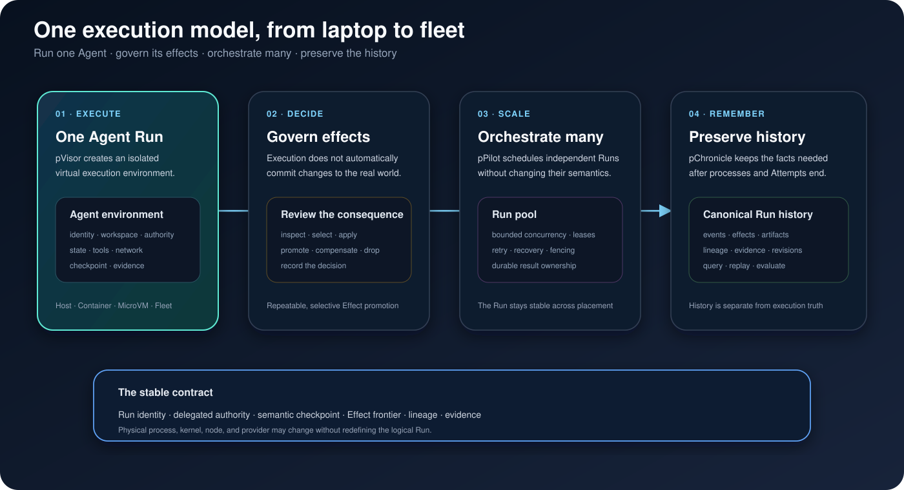

# System Design

Persisting has two primary product domains:

- [pVisor](../pvisor/index.md) virtualizes and governs Agent execution;
- [pChronicle](../pchronicle/index.md) preserves and queries durable Run history.

pPilot extends pVisor from one Run to many. Gateway, OverlayFS, and OverlayNet
are pVisor runtime mechanisms. The products meet at stable Run identity,
captured events, artifacts, terminal results, and lineage.



## Cross-product contract

```text
Agent goal
  → RunSpec
  → pVisor / pPilot own execution and Attempt state
  → EventIngest + Artifact + RunResult
  → pChronicle owns durable history and derived views
```

| Concern | Owner |
| --- | --- |
| One Run's execution boundary | pVisor |
| Planning and recovery of many Runs | pPilot |
| Model, network, and filesystem runtime drivers | pVisor |
| Canonical events and Dataset history | pChronicle |
| Query, exchange, and revision lineage | pChronicle |

## Continue by question

- [Complete architecture and target model](architecture.md)
- [Local-to-fleet continuity](local-to-fleet.md)
- [Security and evidence model](security-evidence.md)
- [pVisor implementation boundaries](../pvisor/design/index.md)
- [pChronicle implementation boundaries](../pchronicle/design/index.md)

Delivery state is reported in the product Design pages and
[Project Engineering Notes](../project/engineering.md). Target architecture is
not evidence that a capability is implemented.
