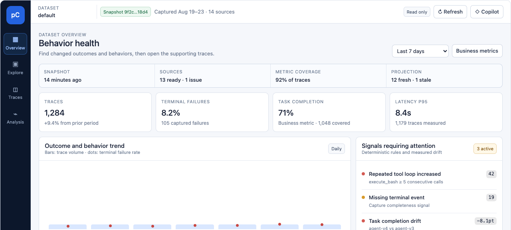
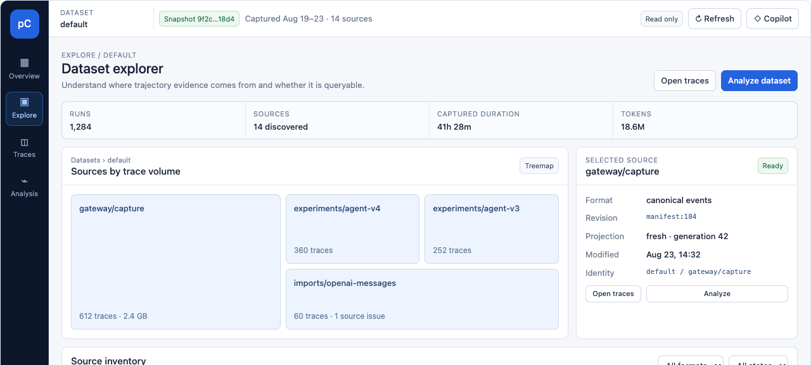
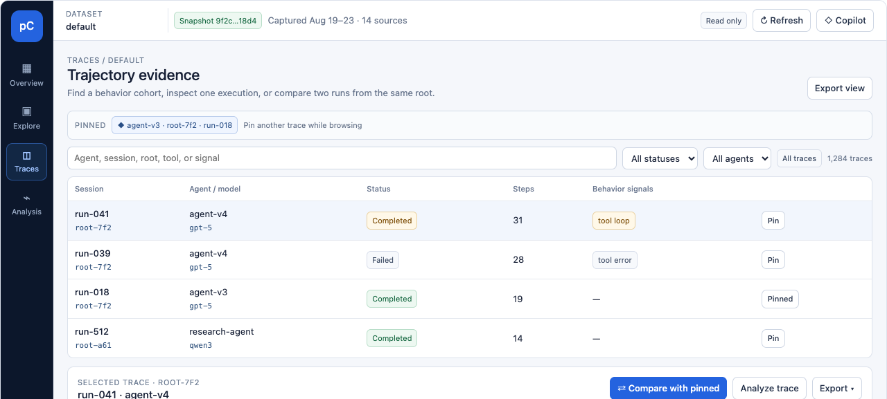
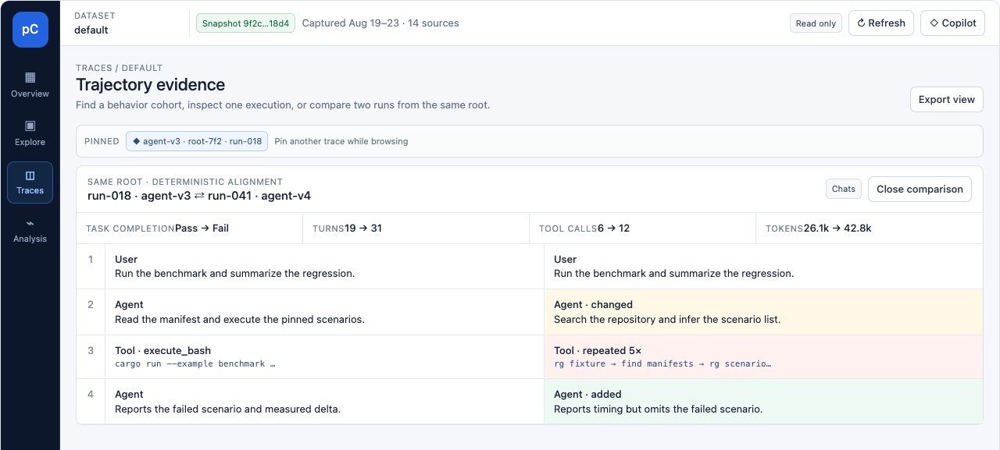
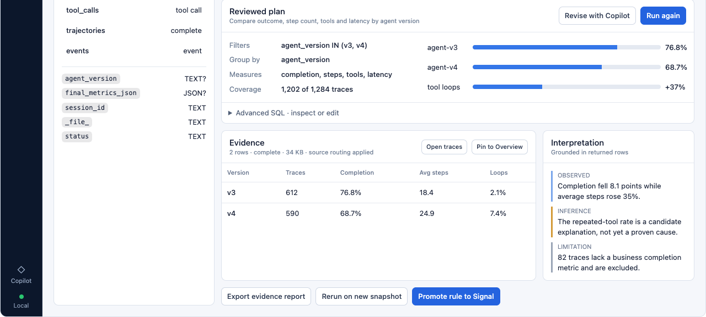

# 四页原型 review：还不理想的地方

> Review 对象：`pchronicle-four-pages.html` 中的 Overview / Explore / Traces / Analysis 四页原型。
> 判断标准：昨天讨论的新品类方向——Agent 的飞行记录仪 + 时间旅行调试器，而不是 observability dashboard。

## 整体判断

这个原型的骨架是对的：dataset snapshot → source → traces → analysis 的主线清晰，pin-to-compare 和 evidence/interpretation/limitation 三段式结论都是好结构。但**它仍然被 observability dashboard 的语言主导**——时间序列 KPI、"Behavior health"、"terminal failures"、"latency P95"——这些词适合监控在线服务，不适合分析离线语料。

如果 pChronicle 要开新品类，最大的一块缺口在 **Trace 页**：它现在还只是"turn 列表 + 摘要"，没有提供"模型在那一刻看到了什么"的状态重建，也没有 scrubber/断点/重放。真正的新形态要在这里发生。

---

## Overview 页

### 做得对的

- Dataset snapshot + sources/projection/coverage 状态条非常好，把"数据就绪性"变成了一等概念。
- Signals 列表直接给出可点击的调查入口（Repeated tool loop / Missing terminal event / Task completion drift），这比图表更接近"调试器"心智。
- Cohort 表格（agent-v3 vs agent-v4）是页面下半部分最值钱的内容，但它被压在了 fold 下面。

### 还不理想

1. **"Outcome and behavior trend" 用日期横轴是错的心智模型**
   - 这批数据是 import 的 corpus / benchmark 结果，不是按天流动的生产流量。日期条形图暗示"服务随时间变化"，但用户真正想问的是"v4 比 v3 差在哪"。
   - 建议：把 cohort 对比做成页面的核心图，按 agent_version / model / source 分组，而不是按日期。

2. **KPI 卡片的语言还是 monitoring 的**
   - "Traces 1,284 +9.4% from prior period"、"Latency P95" 对离线分析没有解释力。
   - 建议：改成"v3 vs v4 完成率差 8.1pt"、" tool loop 影响 42 条 traces"、"82 条 traces 缺业务指标被排除"。每个数字都指向一个可调查的 cohort 或 signal。

3. **Signals 的 badge 颜色语义弱**
   - "3 active" 是 warn 色，但三个 signal 里只有 Missing terminal event 是 capture 问题，另外两个是行为问题。混在一起会让用户误判优先级。

---

## Explore 页

### 做得对的

- Source inventory 表把 format / revision / projection / state 放在一起，符合 data lineage 需求。
- Treemap 给了源规模的直观感受。

### 还不理想

1. **Explore 页缺少"问题意识"**
   - 用户来这一页不是想看方块大小，而是想确认"我的数据能不能回答我想问的问题"。
   - 建议：右侧 selected source 面板除了 metadata，应该列出"基于该 source 可问的典型问题"或"已知限制"（例如 OpenAI messages source 的 60 条 trace 有 1 issue，具体是什么 issue？能不能一键修复？）。

2. **Treemap 颜色无意义**
   - 当前所有 tile 都是同一蓝色，只是按大小分。颜色应该编码 agent_version、format 或 readiness state——让"哪块数据有问题"一眼可见。

3. **"Analyze dataset" 和 "Open traces" 两个按钮没有区别感**
   - 从 Explore 打开 Traces 后用户要干什么？从 Explore 打开 Analysis 后又该问什么？入口需要带默认问题/scope，而不是空跳。

---

## Traces 页

### 做得对的

- Pinbar + "Compare with pinned" 是极好的交互。它让"同一 root 下两个版本对比"变成了显式操作，不再是 power user 的暗能力。
- Diff 视图用 changed / repeated / added 标注，直接对应用户想找的因果线索。

### 还不理想

1. **单条 trace 的详情仍然是事件摘要，不是调试器**
   - 当前详情区只有 user/agent/tool 的简短摘要 + token/latency 条。用户点进来真正想问的是："模型在第 17 步为什么会调用 execute_bash 5 次？"
   - 缺的核心原语：**步进 scrubber + 该步的上下文重建 + 与上一步的 diff 高亮**。这是昨天"时间旅行调试器"形态的关键，原型里完全没有。
   - 建议：详情区至少有两个 tab：Summary（当前）和 Replay/Context（新）。Replay tab 用底部 scrubber，主区域显示模型在该步看到的完整上下文，新增消息高亮。

2. **Behavior signals 列没有链接到具体位置**
   - "tool loop" badge 在列表里只是一枚标签，点击后应该直接跳到 trace 中 loop 发生的 step，并把上下文展开。

3. **Pinbar 的 copy 太弱**
   - "Pin another trace while browsing" 没有说明价值。建议改成"Pin a second trace to diff against"，并自动推荐同一 root 的其他 run。

---

## Analysis 页

### 做得对的

- "Reviewed plan → Evidence → Interpretation" 三段式是核心竞争力。它把 LLM 分析的可验证性做进了界面（Observed / Inference / Limitation）。
- Advanced SQL 可展开，兼顾平民用户和 power user。

### 还不理想

1. **Schema 浏览器占用了左侧主边栏**
   - 分析流程的起点是问题（"Why did task completion fall..."），不是表结构。把 schema 放在默认展开位置，会让首次进入的用户困惑。
   - 建议：左侧边栏默认折叠，或在 question 输入框里提供"schema 提示"（例如 `@` 唤起字段），只在编辑 SQL 时才展开完整 schema。

2. **"Promote rule to Signal" 被埋在底部**
   - 这个动作其实是分析闭环的关键：把一次调查得到的规律变成可复用的检测规则。但它和 "Export evidence report"、"Rerun on new snapshot" 并列，视觉权重相同。
   - 建议：把 "Promote to Signal" 作为 Evidence 卡片的主要 action，甚至可以叫 "Watch this"——让分析产出自动回流到 Overview 的 signals 列表。

3. **Interpretation 的三种状态需要更强的 epistemic 设计**
   - 现在 Observed / Inference / Limitation 只是三个小标题。Limitation（"82 traces excluded"）和 Inference（"candidate explanation"）的置信度差异很大，但视觉上平级。
   - 建议：给每个结论加置信度标识，例如 Observed = 已验证（绿色），Inference = 待验证（黄色，可点击"在 traces 中验证"），Limitation = 已知缺口（灰色）。

---

## 跨页问题

1. **Snapshot 概念很重要，但只在 header 作为 badge 出现**
   - 如果 pChronicle 要往"飞行记录仪"走，snapshot 应该可命名、可比较、可在新 snapshot 上重跑 analysis。现在它像是一个只读时间戳。

2. **Rail 里 "Copilot" 的身份不清晰**
   - 它是全局浮层？是某一页？图标是一颗菱形，用户不知道点开会发生什么。如果 Copilot 是"在任意页问我一个问题"，应该做成 FAB 或右下角面板，而不是和四页并列的 nav item。

3. **"Read only" badge 是防御性文案**
   - 对本地文件系统来说 read-only 是合理的，但 badge 本身没有解释 why 或 what I can do。建议改为更积极的说明："Local snapshot · refresh to update"，并把刷新频率/手动刷新入口放在一起。

4. **Overview / Explore / Traces / Analysis 的命名对新人不够自解释**
   - 尤其是 Explore 和 Overview 容易混淆。如果按新品类重新命名，可以考虑：
     - Overview → Summary（或 Health → 但 avoid monitoring connotation）
     - Explore → Sources（数据血缘）
     - Traces → Inspector（调试器语义）
     - Analysis → Ask（问题驱动）
   - 命名改动有成本，但方向是减少 dashboard 暗示、增加 debugger/lab 暗示。

---

## 与品类方向的对齐

| 新品类方向 | 原型现状 | 下一步 |
|---|---|---|
| 数据：完整录制 = 黑匣子 | snapshot/source lineage 已有 | 让 snapshot 可命名、可比较、可重跑 analysis |
| 回放：任意步的状态重建 | 只有 turn 摘要 | 加 scrubber + context reconstruction + step diff |
| 断点：SQL 即条件 | Signals 列表已出现 | 把 signal 和 SQL plan 打通，signal 从 analysis 一键 promote |
| 实验：fork & rerun | Compare diff 已有 | 从 diff 直接跳到"在 v3 的 prompt/工具结果下重跑 v4"的实验入口 |

---

## 优先级建议

**P0 — 改心智模型，不是改样式**
- Overview 移除日期趋势图，把 cohort 对比（agent-v3 vs v4）提升为核心视图。
- 所有 KPI 文案从"monitoring 指标"改为"调查入口"。

**P1 — 把 Trace 页从"查看器"改成"调试器"**
- 单条 trace 详情增加 Replay/Context tab：scrubber + 上下文重建 + diff 高亮。
- Behavior signals badge 可点击跳转到对应 step。

**P1 — 理顺 Analysis 的入口和信息层级**
- Schema 默认折叠；问题输入区更突出。
- "Promote to Signal" 提升为 Evidence 卡片主 action。
- 给 Interpretation 加置信度/验证状态。

**P2 — 跨页一致**
- Snapshot 可比较、可重跑。
- Copilot 不要放在 rail 里。
- Explore 的 source tile 用颜色编码状态/格式。

---

## 一句话

这个原型已经站在了正确的结构（snapshot → source → traces → analysis）上，但**设计语言还没从"监控大屏"切换到"飞行记录仪/调试器"**。最大的单一改进是：**让 Trace 详情页支持步进 + 上下文重建 + step diff**——做到这一点，整个产品的品类主张才会在界面上成立。
