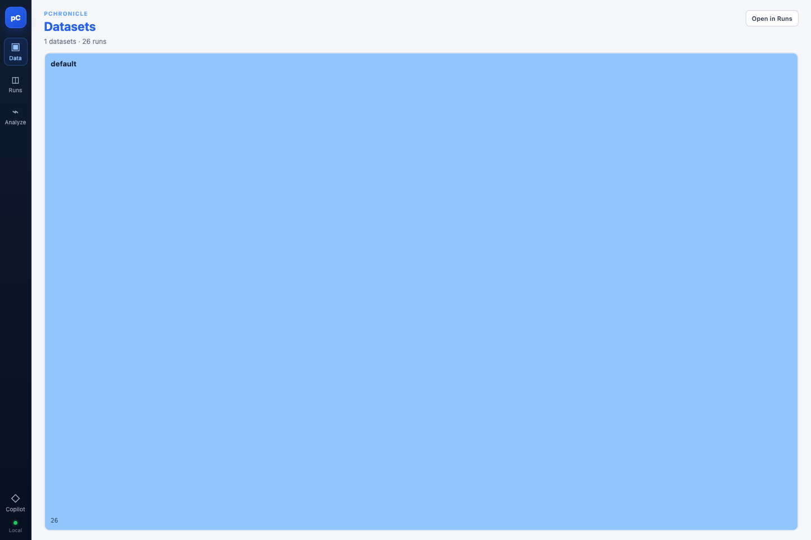
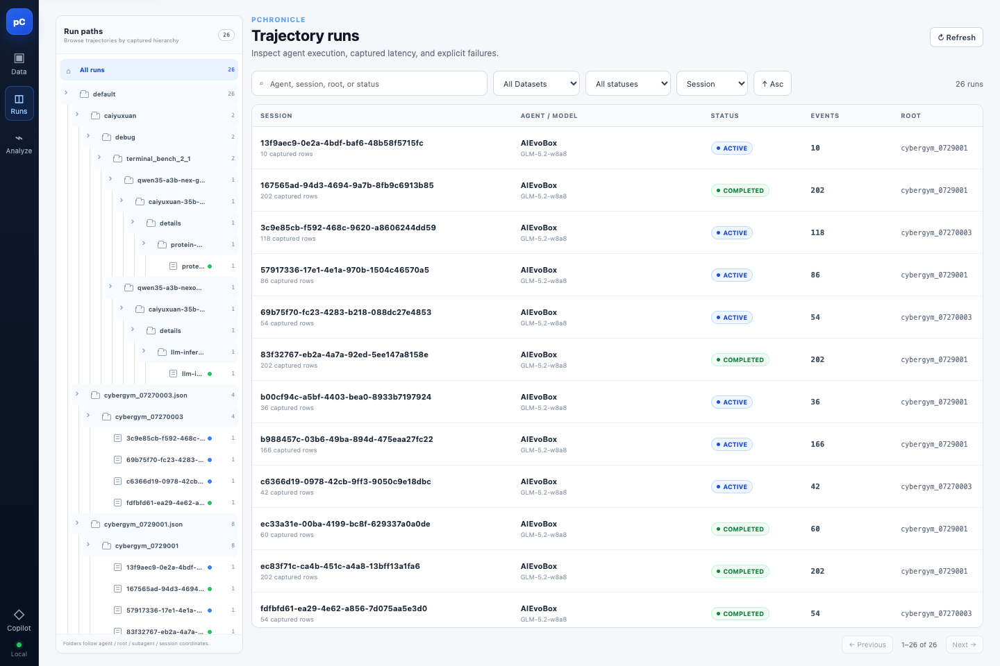
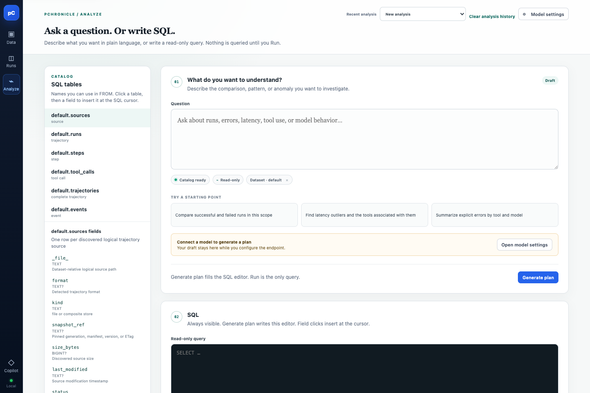
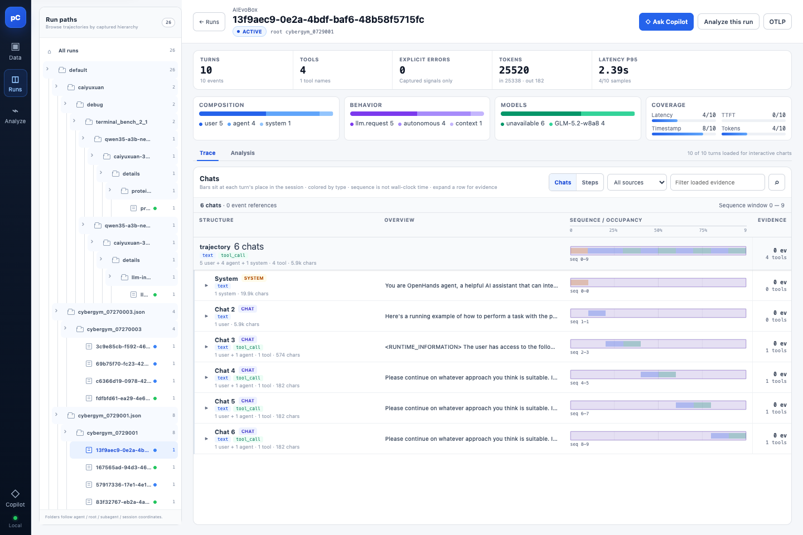
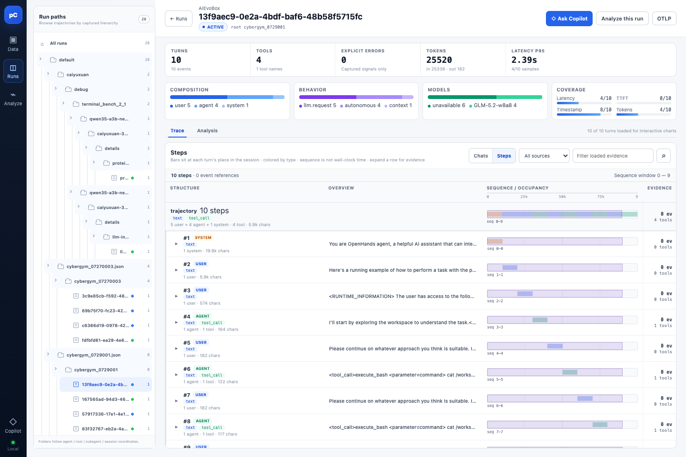
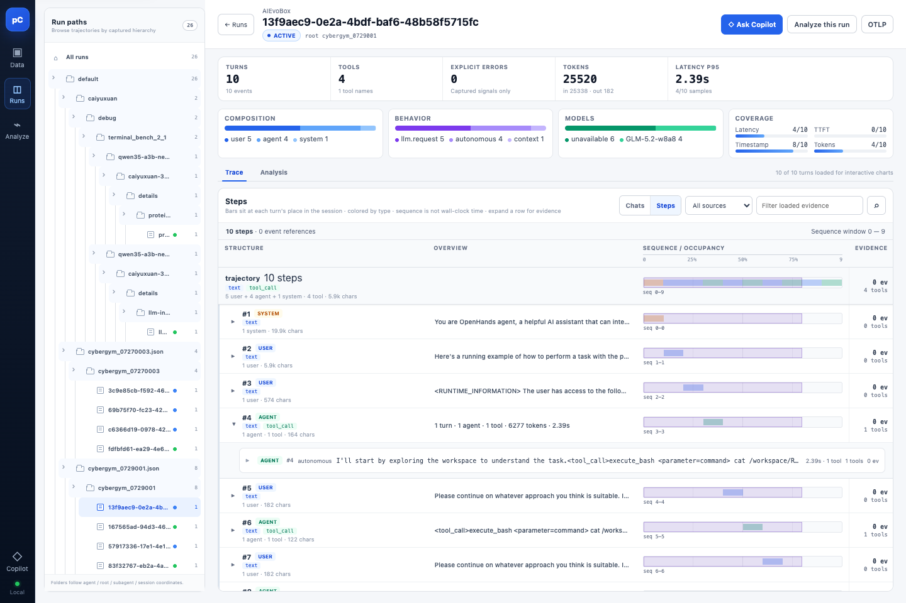
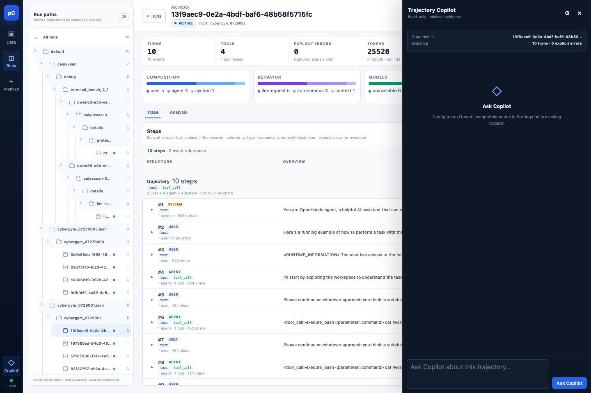
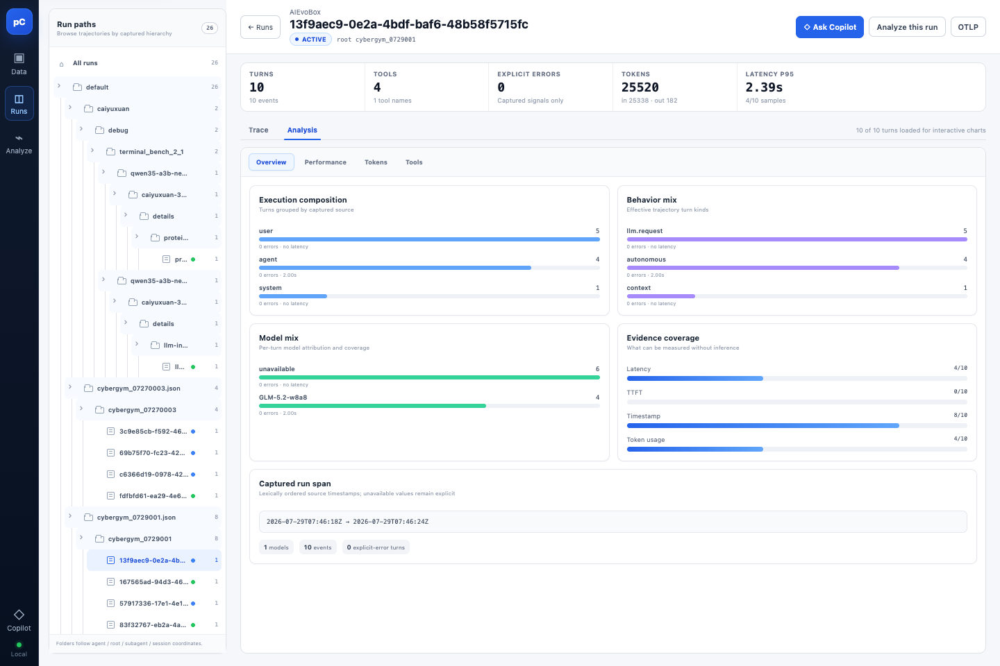

# pChronicle 前端产品整体 review

日期：2026-08-23
范围：运行中的 Dioxus WASM 前端（`pchronicle serve --storage ./data`，26 runs 真实数据）+ 已收敛的产品方向（时间旅行调试器叙事 v2）
方法：agent-browser 逐页实测截图（8 张，存 `assets/2026-08-23-frontend/`）

## 结论摘要

当前前端是一个**完成度不错的 trajectory workbench**：Data / Runs / Analyze 三段式清晰，SQL 工作台扎实，详情页的指标与组成分析信息量大。但它整体讲的是 **observability 语言**（"检查执行、延迟、显式失败"），而不是已经定稿的**时间旅行调试器语言**（"模型在那一刻看到了什么"）。最硬的两处证据：

1. 详情页点开一个 step，展开的只有一行摘要和 "0 ev"——**数据层录了完整上下文，界面上却看不到任何重建**；
2. 详情页第一眼看到的是 UUID 和 ACTIVE 状态——**第一视角是系统，不是模型**。

界面骨架是对的四段（Data → Runs → 详情 → Analyze），但每一段的叙事都还是旧的。

## 现状地图（实测）

| Rail | 页面 | 实测状态 | 截图 |
|---|---|---|---|
| Data | Catalog 数据集树 | 单数据集时 tile 拉伸撑满整屏（视觉破损） | pc-fe-1 |
| Runs | run 列表 + 路径树 | 正常，表格信息完整 | pc-fe-2 |
| Analyze | 问题 + SQL 编辑器 + catalog 侧栏 | 正常，starting points 好 | pc-fe-3 |
| Runs → 详情 | 指标行 + 组成卡 + Trace(Chats/Steps) / Analysis tab | 功能在，叙事旧 | pc-fe-4/5/7/8 |
| Copilot | 抽屉，read-only | 需要配置模型才能用 | pc-fe-6 |

## 发现（P0 / P1 / P2）

### P0 — 直接破损或与新品类主张正面冲突

**P0-1 Catalog 页大蓝块（pc-fe-1）—— ✅ 已修复（2026-08-23）**
`default` 数据集 tile 拉伸占满整个视口，只剩 "default" 字样和角标 "26"。疑似 grid `minmax` + 单卡片时的布局 bug。作为用户进入应用的第一屏（默认 page=catalog），这是门面问题。

修复：根因在 treemap——`children ≤ 2` 时单 tile 必占满 `flex:1` 的容器。`CatalogMosaic` 在子项 ≤2 时切换为 compact 卡片模式（260×120 固定卡片流），`catalog.rs` + `catalog.css`。验证截图 `pc-fix-1-catalog.png`。

**P0-2 详情页看不到"模型所见"（pc-fe-7）—— ✅ 已修复（2026-08-23）**
展开 step #4 得到的只有一行内联摘要（`AGENT #4 autonomous I'll start by exploring…`）+ "0 ev"。warehouse 里明明录着该步完整上下文（evidence SQL 可查），界面却不做重建。这是 v2 叙事的核心原语（"回到那一刻是字面操作"）在现有界面上**完全缺席**——不只是没做，而是当前 UI 结构里没有它的位置。

修复：新增 **Context at this step** 上下文重建面板——打开任一 turn 时，从 `/api/storyline` 拉取完整录制轨迹，按顺序重放该步之前的全部消息（角色 chip + #id + 字数 + 长文可展开），底部标注 "turn #N decided with the context above ↓"。改动：`model.rs`（`StorylineSnapshot`）、`api.rs`（`storyline()`）、`workspace.rs`（独立加载、不阻塞主工作区、失败静默降级）、`components.rs`（`ContextRebuild`/`ContextMessage` + 切片单测）。验证截图 `pc-fix-2-context.png` / `pc-fix-3-context-open.png`（展开 system prompt 全文可见）。

### P1 — 叙事与信息架构偏差

**P1-1 详情页 header 是系统语言（pc-fe-4）**
标题是 session UUID + ACTIVE badge + root id。用户在调试时脑子里想的是"这个 agent 在执行什么任务、哪一步出了问题"，界面却不回答。建议：标题放任务首句（user turn 0），UUID 降级为小字。

**P1-2 EVIDENCE 列全 "0 ev" 无降级（pc-fe-4/5）**
该数据集所有 chat/step 的 evidence 均为 0，列形同虚设但占着宝贵宽度。空态应隐藏列或明确说明"该数据未捕获 events"，而不是让用户面对一列零。

**P1-3 详情页左侧 Run paths 树空间浪费（pc-fe-4）**
已进入单条 run 的详情，左栏仍是完整的路径树（26 个节点），与本页任务无关。这列正是未来 **step 导航 / 时间轴**该在的位置（对应调试器原型的左栏）。空间被导航占用，核心工作面反而没有。

**P1-4 "Analyze this run" 入口关系含糊（pc-fe-4）**
详情页内已有 Analysis tab（pc-fe-8），顶部又有 "Analyze this run" 按钮跳全局 Analyze 页。三个"分析"入口（详情 tab、顶部按钮、rail Analyze）职责边界不清。应明确：详情 Analysis tab = 该 run 的自动画像；按钮 = 携带 scope 跳转到 SQL 工作台。

**P1-5 Copilot 是旁观者，不是现场工具（pc-fe-6）**
Copilot 自述 "Read-only · minimal evidence"，未配置模型时是空抽屉。按 v2 叙事，自然语言入口应该嵌在"现场"里（"在 step N 问为什么"），而不是一个与当前步无关的全局抽屉。现状它与用户选中的 step/turn 没有联动。

### P2 — 打磨项

- **P2-1** 键盘操作只有 `⌘J`（Copilot）。详情页应支持 `←/→` 或 `j/k` 步进——时间旅行的标志性交互目前一个键都没有。
- **P2-2** Runs 表 Session 列是截断 UUID，无可读标识（pc-fe-2）。可加任务首句作为副标题。
- **P2-3** Sequence/Occupancy strip 是时间轴的雏形（pc-fe-4/5），但语义是 "occupancy" 且不可拖——距 scrubber 一步之遥，值得重构成可交互时间轴。
- **P2-4** Coverage 卡片里 "unavailable 6"（MODELS）这类裸词无解释，需 tooltip 或文案说明。
- **P2-5** rail 图标用字符（▣◫⌁◇），与四页原型的 SVG 图标体系不一致，视觉语言有代差。

## 与时间旅行调试器叙事的对齐度

| 叙事主张（v2） | 现有前端最接近的落点 | 差距 |
|---|---|---|
| 回到那一刻是字面操作 | Sequence strip + 展开 step | 无上下文重建，无 scrubber |
| 界面以模型视角为第一视角 | 无 | header/详情全是系统视角 |
| 每个异常是入口 | EXPLICIT ERRORS 指标卡 | 只是数字，不可点 |
| 断点设在条件上 | Analyze 页 SQL | SQL 能力在，但未与轨迹视图联动（查询结果无法"跳到现场"） |
| fork 重演验证因果 | 无 | 全新能力 |

**判断：现有前端与新品类方向不冲突，但还停留在它的"走廊层"。** Data/Runs/Analyze 三段是通往现场的走廊，质量够用（除 P0-1）；真正缺的是"现场"本身——详情页需要从"证据陈列"升级为"时间旅行调试"。这与四页原型 review、调试器原型的结论一致。

## 建议行动序

1. **P0-1**（半天）：修 catalog 单卡片拉伸 bug —— 门面。
2. **P0-2**（核心迭代）：详情页 step 展开 → 上下文重建面板（对齐调试器原型 Context tab）。这是新品类的第一块基石，优先于一切 P1。
3. **P1-3 + P2-3**（同一迭代）：详情页左栏改 step 列表，sequence strip 升级为可拖 scrubber——把调试器原型的左栏和底栏落进真实页面。
4. **P1-1/P1-2/P1-4/P1-5**：叙事与入口清理，随 #3 一起改。
5. P2 项随时穿插。

## 遗留风险

- 详情页改造会触碰 `workspace.rs`（1862 行，单文件巨石）——改 step 列表/scrubber 时建议先拆组件，否则回归面大。
- "0 ev" 数据集说明本地样例数据证据覆盖率低，调试用数据需要一份含完整 events 的样例，否则上下文重建做出来也看不到效果。
