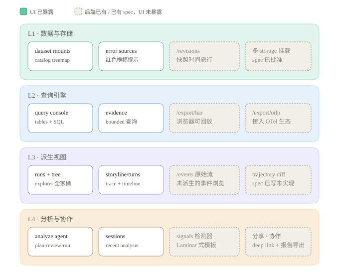
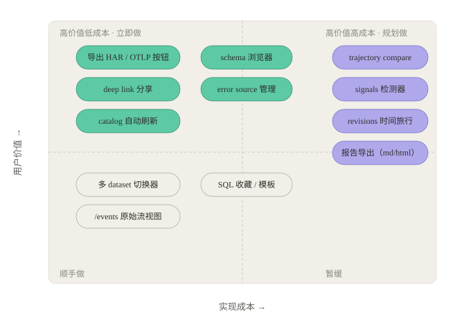
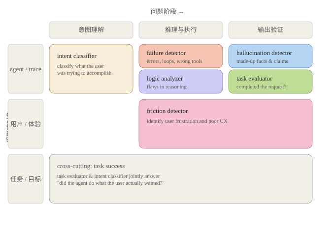

# 产品阶段性 Review：定位、架构与功能暴露路线

## Status

- 评审时间：2026-08-23
- 覆盖范围：pChronicle Web 全部功能面（后端 17 条路由、前端 12 个模块、20 份 spec）、`pchronicle serve` 数据链路、Datasets / Runs / Run Detail / Analyze 四个界面（基于 2026-08-23 实机截图）
- 评审视角：产品定位（PM）+ 分布式系统 / 存储 + Agent 生态竞品（LangSmith、Laminar、Langfuse、Phoenix）
- 性质：项目执行阶段 review，结论供下一阶段排期参考

## 结论摘要

pChronicle 当前的形态是「单二进制本地 Agent 轨迹仓库 + 分析工作台」：files-first、SQL-first、WASM 前端内嵌、Copilot 兜底。三个核心判断：

1. **定位差异化成立**。竞品全是 SaaS pipeline-first，数据在他们云上；pChronicle 数据永远在用户磁盘上。对企业内部数据、科研数据集是刚需，SaaS 方案在这些场景无法进入。
2. **架构是「存储正确」的**。Dataset mount + Warehouse 虚拟根 + `_file_` 前缀是干净的数据湖抽象；Report 错误策略让坏数据降级而不阻塞；bounded query 在引擎层做了资源边界。
3. **最大的杠杆不在建新能力，而在暴露已建成的能力**。后端约一半能力（导出、revisions、events、multi-storage、compare）已建成或已有 spec，但没有 UI 入口，产品回报为零。

## 现状盘点：能力分层与 UI 暴露度

约一半的后端能力已建成（或已有 spec）但没有 UI 入口，产品回报为零。逐项明细：

| 层 | 能力 | UI 暴露状态 |
|---|---|---|
| L1 数据与存储 | dataset mounts、catalog treemap | ✅ 已暴露（Datasets 页） |
| L1 | error sources | ⚠️ 部分暴露（红色横幅，无管理操作） |
| L1 | `/revisions` 数据集快照 | ❌ 后端已有，无 UI |
| L1 | 多 Dataset 挂载 | ❌ spec 已批准（2026-08-23），未实现 |
| L2 查询引擎 | query console（tables + SQL） | ✅ 已暴露 |
| L2 | evidence bounded 查询 | ✅ 已暴露（Analyze agent 消费） |
| L2 | `/export/har`、`/export/otlp` | ❌ 后端已有，无 UI |
| L3 派生视图 | explorer runs / tree / turns、storyline、trace + span timeline | ✅ 已暴露 |
| L3 | `/events` 原始事件流 | ❌ 后端已有，无 UI |
| L3 | trajectory compare | ❌ spec 已写（2026-08-22），未实现 |
| L4 分析与协作 | analyze agent（plan-review-run）、analysis sessions | ✅ 已暴露（Analyze 页） |
| L4 | signals 检测器（Laminar 式） | ❌ 仅有产品讨论，无 spec |
| L4 | deep link / 分享 / 报告导出 | ❌ 未建设 |

## Review 发现

### 产品定位层

- **在「轨迹查看器」与「分析平台」之间摇摆**。Span Timeline、Trace、JSON renderer 是世界级的查看体验；但分析侧（Analyze agent、Query Console）的能力密度没有透出来。用户第一印象会是「好看的 trace viewer」，而非「能回答质量问题的分析平台」。
- **两个 AI 入口的关系没有交代**。Copilot（对话式问答）与 Analyze（plan-review-run 可复算取证）能力重叠，用户不知道何时用哪个。建议明确分工叙事并在两个入口互相引流。
- **Query Console 是埋没的杀手锏**。「对轨迹数据写 SQL」是对 SaaS 竞品最硬的差异，但藏在开发者角落：无 schema 引导、无示例、无保存。

### 架构层（分布式 / 存储）

做对了的：

1. Dataset mount / `_file_` 前缀抽象，天然支持多数据集与路径钻取（catalog treemap 是其直接产物）；multi-storage spec 使其成为 CLI 一等公民。
2. Report 错误策略 + error sources 显式暴露（624MB 超限文件降级为 error source 而非炸掉启动，2026-08-22 修复）——「坏数据不阻塞好数据」。
3. Bounded query（max_rows / max_bytes）引擎层资源上限；SQL 执行错误映射为带详情的 400（2026-08-22 修复），查询路径已工程化成熟。

架构债：

1. **数据新鲜度是手动的且不可见**。`POST /catalog` 刷新存在，但 UI 无「我看到的是哪个快照 / 是否有新文件」的心智模型。分布式系统用户对 staleness 极其敏感。
2. **单用户单进程**。无并发写、无协作故事。短期可接受，产品叙事只能停留在「个人 / 小队工具」。
3. **`/revisions` 已付工程成本但未收产品回报**。

### 界面交互层（基于 2026-08-23 实机截图）

主链路 Datasets → Runs → Run Detail（Trace / Analysis）→ Analyze 通畅，「先看分布再钻取」心智正确。详细交互问题见当日会话记录（P0 loading 反馈缺失、tile 颜色无语义、URL 不反映状态等）。产品层级补充：

- **P1**：Analyze 页首屏价值密度低——大标题 + 空的 Recent analysis 把核心能力（问题输入）推到中下区域。
- **P1**：Run Detail 加载 >10s 仅显示 "Building trajectory evidence…"，需要分阶段 skeleton。
- **P2**：Coverage 卡 0 值行、Duration/Tokens "—" 缺解释，属视觉噪音。

## 行动项

候选功能按「用户价值 × 实现成本」排布如下：

### 立即做（高价值低成本：给已有 API 加 UI）

| ID | 行动项 | 优先级 | 验收标准 |
|---|---|---|---|
| A1 | Run Detail 工具栏增加导出 HAR / OTLP 按钮 | P0 | 任一 run 可一键下载 HAR 与 OTLP 文件 |
| A2 | 全局 URL 状态（page / dataset / run / catalog 路径），刷新与分享不丢状态 | P0 | 复制 URL 打开还原同一视图 |
| A3 | 顶部 catalog 快照状态条：快照时间 + 新文件待扫描提示 + 手动/自动刷新 | P1 | staleness 可见且可操作 |
| A4 | Query Console 侧栏 schema 浏览器：列级说明 + 示例值 + 一键插入 | P1 | 不读文档即可写出正确 SQL |
| A5 | error source 管理面板：失败原因（如超 max_file_bytes）+ 调整上限重试 | P1 | 624MB 文件可通过面板处理后入库 |

### 规划做（高价值高成本：产品叙事下一级台阶）

| ID | 行动项 | 优先级 | 说明 |
|---|---|---|---|
| B1 | trajectory compare 工作区 | P1 | spec 已完成（2026-08-22），Pin + 对齐 diff；A/B 评估前置 |
| B2 | signals 检测器（Failure / Logic / Task / Friction / Hallucination / Intent） | P1 | 参照 Laminar 模板；先落 Failure + Task，Runs 列表加信号列，CompactOverviewStrip 加 risk badges |
| B3 | revisions 时间旅行 UI | P2 | `/revisions` 已有；数据集版本切换，配 B1 可做版本差异审计 |
| B4 | 分析报告导出（Markdown / HTML） | P2 | Analyze 产出脱离 session，完成「取证→结论→交付」闭环 |

### 顺手做

| ID | 行动项 | 说明 |
|---|---|---|
| C1 | 多 dataset 切换器 | 依赖 multi-storage spec 落地 |
| C2 | SQL 收藏 / 模板 | Query Console 增强 |
| C3 | `/events` 原始事件流视图 | power user 排障 |

## 附录：竞品参照——Laminar Signal 角色分工

行动项 B2（signals 检测器）的产品化参照。Laminar 把 agent trace 的自动分析拆成 6 个「专职检测员」，横轴是问题阶段（意图理解 / 推理与执行 / 输出验证），纵轴是受影响对象（agent / 用户 / 任务）。关键启示：**Friction Detector 把 UX 问题从「任务是否完成」中独立出来**——agent 可能完成了任务但用户已被糟糕交互折磨，这是 trajectory 分析工具最容易忽略的维度。pChronicle 落地顺序建议：先 Failure Detector（Behavior 已有基础）与 Task Evaluator（直接回答完成度），再 Friction Detector，LLM judge 类（Hallucination / Logic / Intent）后置。

## 遗留与风险

- 既有失败测试 `status_reports_projection_stale_and_safe_errors`（已验证与近期改动无关），需单独排查。
- 2026-08-22 报告的 WASM panic 疑似卡死状态伴生现象，未复现；若再出现需保留完整控制台堆栈。
- Analyze 页与 Copilot 的双入口叙事未定，影响 B2 的入口设计，需在 signals spec 前决策。
- 单用户架构是有意选择还是过渡状态，影响 B4（报告导出）之后的协作类功能排序，建议下阶段明确。
